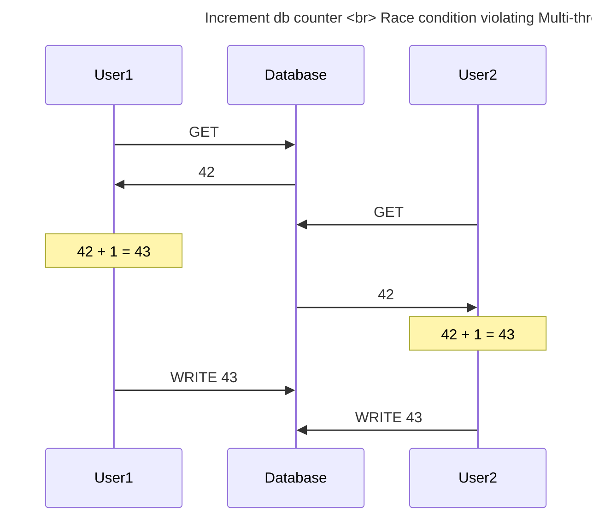

# Distributed algorithm correctness

References based on "Designing data intensive applications"

# DB indexing

-   Mostly uses BTree
    -   Is a general form of binary tree: has $n$ instead of 2 children
    -   After balancing: all leaves are equally far from root
-   Balancing requires multiple writes
    -   That means db can crash during balancing, leaving inconsistent data on disk
    -   To prevent that: [Write-Ahead-Log](#durability) (WAL)

# Replication

## Replica failover

p. 156

## Replication lag

p. 161

# Transactions

## Atomic

-   In multi-threaded apps:
    -   means that other threads see only state before or after an atomic operation
    -   Aka. linearizability
    -   In ACID this same thing is known as _Isolation_
-   In ACID:
    -   if error part-way through transaction, then rollback

## Durability

-   In single-node db:
    -   Means that data is persisted to disk
    -   But: writes can be interrupted by crash before being complete
    -   So you need to make a temporary copy of the target-file, or use a WAL [see also here](#db-indexing)
        -   _Very relevant for offline first apps_[^1]
-   In multi-node db:
    -   means that data has been copied to $n$ nodes before transaction is considered complete
-

[^1]<small>In nodejs, `fs.writeAll` is not transactional, meaning it can be interrupted half-way through. Create a temporary copy of the file during write.</small>

## Transaction concurrency control (weak isolation levels)

p. 233

# Cache invalidation

-   Most common strategy: "cache aside"
-   Invalidating cache entries when db updates:
    -   "write through caching": upon writing to db, delete matching line from cache
        -   make sure this is transactional/atomic
-   Invalidating cache entries for other reasons:
    -   for cookies/sessions: fixed expiry date for each cache-entry
    -   to save memory: remove least-recently-used keys from cache

# Message delivery

-   Prove that exactly-once-delivery is impossible in a faulty network
-   https://blog.bulloak.io/post/20200917-the-impossibility-of-exactly-once/

# Multi-threading

## Linearizability

-   Aka. atomic
-
