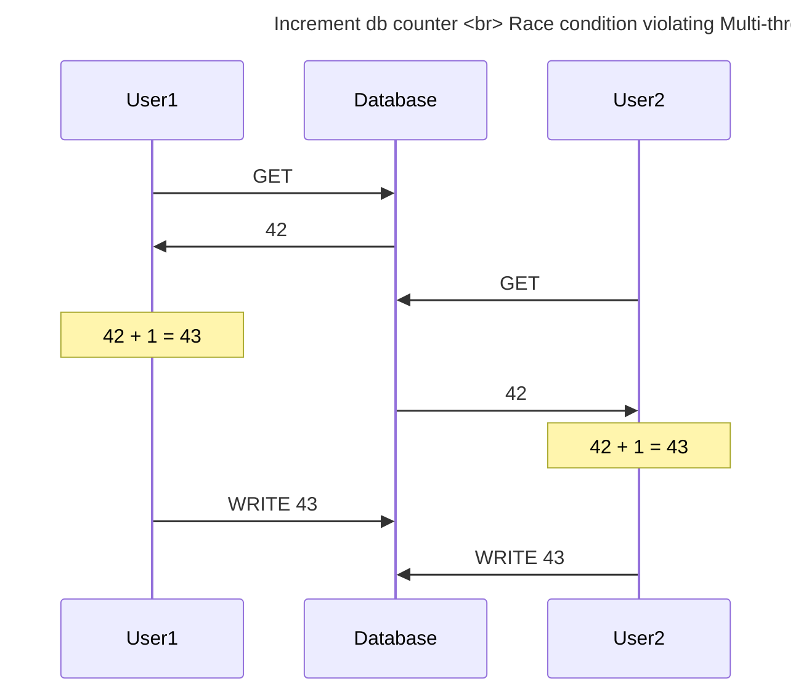

# Distributed algorithm correctness

References based on "Designing data intensive applications"

# Some lingo

-   DB categorization:
    -   optimization:
        -   for OLTP (postgres)
        -   for OLAP (duckdb)
    -   Concurrency
        -   ACID transactions (postgres)
    -   replication: upon partition, you get ...
        -   ... strong consistency, but no availability (postgres)
        -   ... eventuel consistency, but availability (nosql)
-   ETL and data-warehouse
    -   Most of your data will be in an OLTP ACID-RDMBS
    -   You don't want analysts to run large queries on those db's
    -   So you _extract_ data from them and _load_ it into an OLAP-db (like duckdb), known as a data-warehouse
    -

# DB indexing

-   Mostly uses BTree
    -   Is a general form of binary tree: has $n$ instead of 2 children
    -   After balancing: all leaves are equally far from root
-   Balancing requires multiple writes
    -   That means db can crash during balancing, leaving inconsistent data on disk
    -   To prevent that: [Write-Ahead-Log](#durability) (WAL)
-   Multiple threads may access
    -   Thus requires concurrency control (=locks or latches)

# Replication

-   Common pattern:
    -   1 sync follower (we want few sync followers, because one failing follower stops the whole master until timeout has occurred)
    -   many async followers
    -   failover:
        -   promote the single sync follower to leader
        -   turn one async follower into the new sync follower
-   Common issues:
    -   choosing correct timeout to detect leader down
    -   split brain

## Read after write consistency

1. update (goes to leader)
2. refresh page (fetches data from an async follower)
3. updated data should be present

-   Read-after-write consistency happens at the application-level, not the db-level
-   Note that it makes no promises about _other_ users' experience with data that another user has updated

## Replication lag

p. 161

# Transactions

## Atomic

-   In multi-threaded apps:
    -   means that other threads see only state before or after an atomic operation
    -   Aka. linearizability
    -   In ACID this same thing is known as _Isolation_
-   In ACID:
    -   if error part-way through transaction, then rollback
    -   commonly implemented with Write-Ahead-Log



Testing:

```python
# Testing atomic == rollback

import threading
import boto3

def longTransaction():
    db.transaction([
        "short db operation",
        "long db operation"
    ])

def killDb():
    boto3.killDb()

def startDb():
    boto3.startDb()

def assertRolledBack():
    data = db.select()
    assert "long db operation" not in data
        and "short db operation" not in data

threading.thread(longTransaction)
threading.thread(killDb)  # while `longTransaction` is still going on
threading.join()
startDb()
assertRolledBack()
```

## Durability

-   In single-node db:
    -   Means that data is persisted to disk
    -   But: writes can be interrupted by crash before being complete
    -   So you need to make a temporary copy of the target-file, or use a WAL [see also here](#db-indexing)
        -   _Very relevant for offline first apps_[^1]
    -   If app is multi-threaded, you'll also need a lock around the target file
-   In multi-node db:
    -   means that data has been copied to $n$ nodes before transaction is considered complete

Testing:

```python
threading.thread(largeWriteQueryIndx1)
threading.thread(killDb)
threading.join()
assert walPresentOnDb()
startDb()
assert noDataAtIndx1()
```

[^1]<small>In nodejs, `fs.writeAll` is not transactional, meaning it can be interrupted half-way through. Create a temporary copy of the file during write.</small>

## Isolation

-   as already stated in [atomic](#atomic), isolation means that one thread never sees the intermediate states of another thread's operations

### Isolation level: read committed

-   Reads only committed data (no dirty reads)
    -   Implemented like this: new values only swapped into place after commit
-   Overwrites only committed data (no dirty writes)
    -   Commonly implemented using row-level locks.
-   Default mode in Postgres, SQLServer, ...

Testing:

```python
db.execute("insert into table `old-val` where idx=2")

def longWrite():
    db.execute("""
        START TRANSACTION;
        insert into table ("small val") where idx=1;
        insert into table ("large val") where idx=2;
        END TRANSACTION;
    """)

intermedVal = ""
def interruptingRead():
    intermedVal = db.execute("""
        select * from table where idx=2;
    """)

threading.thread(longWrite)
threading.thread(interruptingRead)
threading.join()
assert intermedVal == `old-val`
```

### Isolation level: snapshot isolation

Read-committed is good enough if you only look at a few individual rows. But you might want to make sure that the whole db doesn't change while you run a query.
Examples:

-   during backup
-   during long OLAP query

### Isolation level: serializable

-   Approach 1: simple be single threaded
    -   VoltDB, Redis.
    -   A single thread will be blocked though if you allow long OLAP workloads on it!
-   Approach 2: two-phase-locking (2PL)
-   Approach 3: serializable snapshot isolation (SSI)

# Cache invalidation

-   Most common strategy: "cache aside"
-   Invalidating cache entries when db updates:
    -   "write through caching": upon writing to db, delete matching line from cache
        -   make sure this is transactional/atomic
-   Invalidating cache entries for other reasons:
    -   for cookies/sessions: fixed expiry date for each cache-entry
    -   to save memory: remove least-recently-used keys from cache

# Message delivery

-   Prove that exactly-once-delivery is impossible in a faulty network
-   https://blog.bulloak.io/post/20200917-the-impossibility-of-exactly-once/

# Multi-threading

## Linearizability

-   Aka. atomic
-
