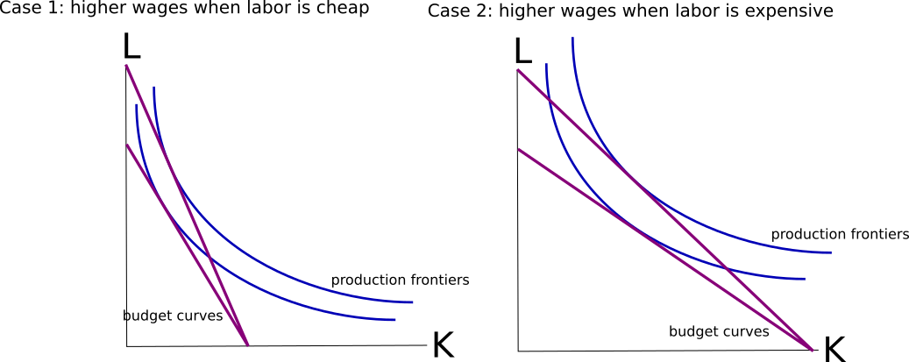

# Economics

## Value, consumer-surplus and demand

- $v(q)$: **marginal value**, i.e. $\frac{\partial \text{happyness}}{\partial q}$
- $cs(q) | p$: **consumer surplus**, defined as $cs(q) | p = \int^{q}v d q - pq$
- $\frac{\partial cs}{\partial q_0} = 0 \to v(q_0) = p$
- $q_0 = v^{-1}(p)$, we call $v^{-1}(p)$ the **demand** $q^{demand}(p)$.

Corollaries
- Increase in usefulness of any one unit: curve moves up
- More units demanded: curve moves right

Special cases:
- *Normal* goods: higher income leads to higher demand
- *Inferior* goods: higher income doesn't lead to higher demand
- *Complementary* goods: higher consumption of *A* leads to higher demand for *B*
    - Example: use of computers increases demand for printers.
- *Substitute* goods
    - Example: cola and pepsi

## Cost, producer-surplus (aka. profit) and supply

- $c(q)$: **marginal costs**, i.e. $\frac{\partial \text{total production costs}}{\partial q}$
- $ps(q) | p$: **producer surplus**, aka. profit, defined as $ps(q) | p = pq - \int^{q}c d q$
- $\frac{\partial ps}{\partial q_0} = 0 \to  p = c(q_0)$
- $c^{-1}(p) = q_0$, we call $c^{-1}$ the **supply** $q^{supply}(p)$.

## Markets

In a free market, we have $p: q^{supply}(p) = q^{demand}(p)$
>
> *Proof*: By contradiction
>
>> *Case 1*: assume that $p: q^{supply}(p) < q^{demand}(p)$
>>
>> This is a market of shortage. $q$ is determined by the producers: producers will be able to produce a quantity such that their producer-surplus is maximal ... whereas the consumer-surplus might not be.
>>

>
>> *Case 2*: assume that $p: q^{supply}(p) > q^{demand}(p)$
>>

In a free market, the market-equilibrium is where *social welfare* (consumer- plus producer-surplus) is maximized.
>
> *Proof*: 
>

## Utility maximization

- $bgt$: budget
- $p_i$: price of good $i$
- $x_i$: quantity of good $i$
- $u(\vec{x})$: utility

Objective: maximize $u$ given $\sum q_i x_i = bgt$ 

### Perfectly substitutable
$$u(a, b) = a + b$$

### Perfectly non-substitutable
$$u(a, b) = min(a, b)$$

### Somewhere in between
Commonly used utility function: Cobb-Douglas:
$$ u(\vec{x}) = \prod x_i^{\lambda_i} $$
where $\lambda_i$ means how much product $i$ contributes.

This is for convenience rewritten to a slightly different functoin $u'$ with:
- $\lambda = \sum \lambda_i$
- $\alpha_i = \lambda_i \lambda$

yielding: 
$$ u'(\vec{x}) = \prod x_i^{\alpha_i}$$

Maximizing this utility function $u'$ subject to the budget-constraint (using constrained optimization) we get:

$$ \forall i: x_i^{opt} = \frac{bgt \cdot \alpha_i}{p_i} $$

### Applied to producers
- $u$ here means "quantity produced", $u'$ is the quantity produced scaled by a convenience factor.
- $x_1$ is labor $L$
- $x_2$ is kapital $K$

Then we get:
$$ L^{opt} = \frac{bgt \cdot \alpha_L}{p_L} $$

How does increase in wages affect employment?
- If labor and kapital are substitutable (*example: workers or machine to build cars*):
    - if labor initially cheap, now a bit more expensive:
        - producers only use labor, not machines
        - producers will reduce employers proportionally to the wage-increase
    - if labor initially expensive, now a bit more expensive:
        - producers never had any workers in the first place, because kaptial was more efficient 
        - so no reduction in employment.
- If labor and kapital are non-substitutable (*example: programmers and computers to build software*):
    - if labor initially cheap, now a bit more expensive:
        - producers use computers and programmers in equal amounts 
        - they also reduce them in equal amounts
        - one unit change in wages means little change in neither employment nor kaptial
    - if labor initially expensive, now a bit more expensive:
        - producers use computers and programmers in equal amounts
        - they also reduce them in equal amounts
        - one unit change in wages means much change in both employment and capital

- if $p_L$ is low, few workers will be fired

### Applied to consumers
