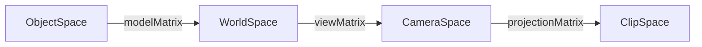

# WebGL

## WebGL-API
```ts
/**
 * This code was first developed [here](https://github.com/michaellangbein/webglexperiments)
 * It has been further developed [here](https://github.com/dlr-eoc/ukis-frontend-libraries) 
 * Since then, modifications have been made to the code. (with this we comply with Apache-2.0 $4.b)
 * The original license from https://github.com/dlr-eoc/ukis-frontend-libraries can be found in this repo as `license.orig.txt` (with this we comply with Apache-2.0 $4.a)
 */


import { isPowerOf, flatten3 } from '../../utils/math';


export type GlDrawingMode = 'triangles' | 'points' | 'lines';

export type WebGLUniformType  = 'bool'  | 'bvec2' | 'bvec3' | 'bvec4'| 'bool[]'  | 'bvec2[]' | 'bvec3[]' | 'bvec4[]'
                              | 'int'   | 'ivec2' | 'ivec3' | 'ivec4'| 'int[]'   | 'ivec2[]' | 'ivec3[]' | 'ivec4[]'
                              | 'float' | 'vec2'  | 'vec3'  | 'vec4' | 'float[]' | 'vec2[]'  | 'vec3[]'  | 'vec4[]'
                                        | 'mat2'  | 'mat3'  | 'mat4';

export type WebGLAttributeType = 'float' | 'vec2' | 'vec3' | 'vec4' | 'mat2' | 'mat3' | 'mat4';

const shaderInputTextureBindPoint = 0;
const textureConstructionBindPoint = 7;


/**
 * Compile shader.
 */
export const compileShader = (gl: WebGL2RenderingContext, typeBit: number, shaderSource: string): WebGLShader => {
    const shader = gl.createShader(typeBit);
    if (!shader) {
        throw new Error('No shader was created');
    }
    gl.shaderSource(shader, shaderSource);
    gl.compileShader(shader);
    if (!gl.getShaderParameter(shader, gl.COMPILE_STATUS)) {
        gl.deleteShader(shader);
        throw new Error(`An error occurred compiling the shader: ${gl.getShaderInfoLog(shader)}.    \n\n Shader code: ${shaderSource}`);
    }
    return shader;
};


/**
 * Note that every program *must* have one and only one vertex-shader
 * and one and only one fragment shader.
 * That means you cannot add multiple fragment-shaders in one program. Instead, either load them in consecutively as part of different programs,
 * or generate an über-shader that contains both codes.
 */
export const createShaderProgram = (gl: WebGL2RenderingContext, vertexShaderSource: string, fragmentShaderSource: string): WebGLProgram => {

    const program = gl.createProgram();
    if (!program) {
        throw new Error('No program was created');
    }

    const vertexShader = compileShader(gl, gl.VERTEX_SHADER, vertexShaderSource);
    const fragmentShader = compileShader(gl, gl.FRAGMENT_SHADER, fragmentShaderSource);
    gl.attachShader(program, vertexShader);
    gl.attachShader(program, fragmentShader);

    gl.linkProgram(program);

    gl.detachShader(program, vertexShader);
    gl.detachShader(program, fragmentShader);
    gl.deleteShader(vertexShader);
    gl.deleteShader(fragmentShader);

    if (!gl.getProgramParameter(program, gl.LINK_STATUS)) {
        gl.deleteProgram(program);
        throw new Error('Unable to initialize the shader program: ' + gl.getProgramInfoLog(program));
    }

    return program;
};


/**
 * Important: the blend-equation has an effect on data-textures.
 * If you have a pixel with values [125, 42, 255, 0], this pixel might get blended in the background,
 * causing you to lose that data in the rgb channels of the pixel.
 *
 * Auszug aus Chat mit Kollegen:
 * [16:21, 4.11.2020] Michael: Ich hab das Problem gefunden
 * [16:22, 4.11.2020] Michael: Sagen wir ich habe ein Objekt mit id 781
 * [16:22, 4.11.2020] Michael: In base 256 ist das
 * [16:22, 4.11.2020] Michael: (16, 3, 0, 0)
 * [16:23, 4.11.2020] Michael: Diese Daten habe ich als Pixelwert in meiner Textur gespeichert, als rgba
 * [16:23, 4.11.2020] Michael: Mit anderen Worten: a = 0
 * [16:24, 4.11.2020] Michael: Außerdem aber war die gl_blendEquation(gl_FuncAdd) gesetzt
 * [16:24, 4.11.2020] Michael: Das bedeutet, Pixel mit Transparenz werden mit dem Hintergrund verblendet
 * [16:24, 4.11.2020] Michael: Dadurch wurden meine Daten mit dem Hintergrund verwaschen, und dadurch haben sich meine ids geändert
 * [16:25, 4.11.2020] Michael: Das Problem war stärker bei niedrigen ids, weil da die opazität besonders gering war
 * [16:25, 4.11.2020] Michael: Hah!
 */
export const setup3dScene = (gl: WebGL2RenderingContext): void => {
    // gl.viewport(0, 0, gl.canvas.width, gl.canvas.height);

    // allowing depth-testing
    gl.enable(gl.DEPTH_TEST);
    gl.depthFunc(gl.LEQUAL);
    gl.cullFace(gl.BACK);

    // allowing for transparent objects
    gl.enable(gl.BLEND);
    gl.blendEquation( gl.FUNC_ADD );
    gl.blendFunc( gl.SRC_ALPHA, gl.ONE_MINUS_SRC_ALPHA );

    clearBackground(gl, [0, 0, 0, 1]);
};

export const updateViewPort = (gl: WebGL2RenderingContext, x0: number, y0: number, x1: number, y1: number): void => {
    gl.viewport(x0, y0, x1, y1);
};


export const bindProgram = (gl: WebGL2RenderingContext, program: WebGLProgram): void => {
    gl.useProgram(program);
};


export const clearBackground = (gl: WebGL2RenderingContext, color: number[]): void => {
    gl.clearColor(color[0], color[1], color[2], color[3]);
    gl.clearDepth(1.0);
    gl.clear(gl.COLOR_BUFFER_BIT | gl.DEPTH_BUFFER_BIT);
};


 /**
  * A generic buffer, together with it's metadata.
  *
  * Really, a buffer is only a array, with no information about count, length, stride, offset etc.
  * It is up to the vertex-array to interpret the buffer as having any of these properties.
  * However, in reality we rarely have a case where two vertex-array entries interpret the same buffer in different ways.
  * So we store the dimensions of a buffer together with the buffer here, so that it can be
  * consistently interpreted everywhere.
  */
export interface BufferObject {
    buffer: WebGLBuffer;
    dataPointType: number;
    staticOrDynamicDraw: number;
    attributeType: WebGLAttributeType;
}


/**
 * Create buffer. Creation is slow! Do *before* render loop.
 */
export const createBuffer = (gl: WebGL2RenderingContext, datatype: WebGLAttributeType, data: Float32Array, changesOften = false): BufferObject => {

    const buffer = gl.createBuffer();
    if (!buffer) {
        throw new Error('No buffer was created');
    }
    gl.bindBuffer(gl.ARRAY_BUFFER, buffer);
    gl.bufferData(gl.ARRAY_BUFFER, data, changesOften ? gl.DYNAMIC_DRAW : gl.STATIC_DRAW);
    gl.bindBuffer(gl.ARRAY_BUFFER, null);  // unbinding

    const bufferObject: BufferObject = {
        buffer: buffer,
        dataPointType: gl.FLOAT,   // the data is 32bit floats
        staticOrDynamicDraw: changesOften ? gl.DYNAMIC_DRAW : gl.STATIC_DRAW,
        attributeType: datatype
    };


    return bufferObject;
};


export interface VertexArrayObject {
    buffers: BufferObject[];
    vao: WebGLVertexArrayObject;
}

export const createVertexArray = (gl: WebGL2RenderingContext): VertexArrayObject => {
    const o = gl.createVertexArray();
    return {
        buffers: [],
        vao: o
    };
};


export const drawArray = (gl: WebGL2RenderingContext, drawingMode: GlDrawingMode, vectorCount: number, offset = 0): void => {
    let glDrawingMode: number;
    switch (drawingMode) {
        case 'lines':
            glDrawingMode = gl.LINES;
            break;
        case 'points':
            glDrawingMode = gl.POINTS;
            break;
        case 'triangles':
            glDrawingMode = gl.TRIANGLES;
            break;
    }
    gl.drawArrays(glDrawingMode, offset, vectorCount);
};

export const drawArrayInstanced = (gl: WebGL2RenderingContext, drawingMode: GlDrawingMode, vectorCount: number, offset = 0, nrLoops: number): void => {
    let glDrawingMode: number;
    switch (drawingMode) {
        case 'lines':
            glDrawingMode = gl.LINES;
            break;
        case 'points':
            glDrawingMode = gl.POINTS;
            break;
        case 'triangles':
            glDrawingMode = gl.TRIANGLES;
            break;
    }
    gl.drawArraysInstanced(glDrawingMode, offset, vectorCount, nrLoops);
};


export const updateBufferData = (gl: WebGL2RenderingContext, bo: BufferObject, newData: Float32Array): BufferObject => {

    gl.bindBuffer(gl.ARRAY_BUFFER, bo.buffer);
    gl.bufferData(gl.ARRAY_BUFFER, newData, bo.staticOrDynamicDraw);
    gl.bindBuffer(gl.ARRAY_BUFFER, null);  // unbinding

    const newBufferObject: BufferObject = {
        buffer: bo.buffer,
        dataPointType: gl.FLOAT,   // the data is 32bit floats
        staticOrDynamicDraw: bo.staticOrDynamicDraw,
        attributeType: bo.attributeType
    };

    return newBufferObject;
};


/**
 * Fetch attribute's location (attribute declared in some shader). Slow! Do *before* render loop.
 */
export const getAttributeLocation = (gl: WebGL2RenderingContext, program: WebGLProgram, attributeName: string): number => {
    const loc = gl.getAttribLocation(program, attributeName);
    if (loc === -1) {
        throw new Error(`Couldn't find attribute ${attributeName} in program.`);
    }
    return loc;
};


/**
 * Returns size of type in bytes.
 * type: gl.FLOAT | gl.BYTE | gl.SHORT | gl.UNSIGNED_BYTE | gl.UNSIGNED_SHORT
 */
const sizeOf = (gl: WebGL2RenderingContext, type: number): number => {
    switch (type) {
        case gl.FLOAT:
            return 4;
        case gl.BYTE:
        case gl.SHORT:
        case gl.UNSIGNED_BYTE:
        case gl.UNSIGNED_SHORT:
        default:
            throw new Error(`Unknown type ${type}`);
    }
};


/**
 * If nrInstances !== 0: binding with vertexAttribDivisor(loc, nrInstances)
 */
export const bindBufferToAttribute = (gl: WebGL2RenderingContext, attributeLocation: number, bo: BufferObject, nrInstances = 0): void => {
    // Bind buffer to global-state ARRAY_BUFFER
    gl.bindBuffer(gl.ARRAY_BUFFER, bo.buffer);
    // Enable editing of vertex-array-location
    gl.enableVertexAttribArray(attributeLocation);

    // Bind the buffer currently at global-state ARRAY_BUFFER to a vertex-array-location.
    const byteSize = sizeOf(gl, bo.dataPointType);
    switch (bo.attributeType) {
        /**
         * https://developer.mozilla.org/en-US/docs/Web/API/WebGLRenderingContext/vertexAttribPointer
         * index: A GLuint specifying the index of the vertex attribute that is to be modified.
         * size: A GLint specifying the number of components per vertex attribute. Must be 1, 2, 3, or 4.
         * type: A GLenum specifying the data type of each component in the array.
         * normalized: A GLboolean specifying whether integer data values should be normalized into a certain range when being cast to a float.
         * stride: A GLsizei specifying the offset in bytes between the beginning of consecutive vertex attributes. Cannot be larger than 255. If stride is 0, the attribute is assumed to be tightly packed, that is, the attributes are not interleaved but each attribute is in a separate block, and the next vertex' attribute follows immediately after the current vertex.
         * offset: A GLintptr specifying an offset in bytes of the first component in the vertex attribute array. Must be a multiple of the byte length of type.
         */
        //                             index,              size, type,             norml, stride,        offset
        case 'float':
            gl.enableVertexAttribArray(attributeLocation);
            gl.vertexAttribPointer(    attributeLocation,     1, bo.dataPointType, false, 1 * byteSize,  0               );
            if (nrInstances) gl.vertexAttribDivisor(attributeLocation, nrInstances);
            break;
        case 'vec2':
            gl.enableVertexAttribArray(attributeLocation);
            gl.vertexAttribPointer(    attributeLocation,     2, bo.dataPointType, false, 2 * byteSize,  0               );
            if (nrInstances) gl.vertexAttribDivisor(attributeLocation, nrInstances);
            break;
        case 'vec3':
            gl.enableVertexAttribArray(attributeLocation);
            gl.vertexAttribPointer(    attributeLocation,     3, bo.dataPointType, false, 3 * byteSize,  0               );
            if (nrInstances) gl.vertexAttribDivisor(attributeLocation, nrInstances);
            break;
        case 'vec4':
            gl.enableVertexAttribArray(attributeLocation);
            gl.vertexAttribPointer(    attributeLocation,     4, bo.dataPointType, false, 4 * byteSize,  0               );
            if (nrInstances) gl.vertexAttribDivisor(attributeLocation, nrInstances);
            break;
        case 'mat2':
            gl.enableVertexAttribArray(attributeLocation + 0);
            gl.vertexAttribPointer(    attributeLocation + 0, 2, bo.dataPointType, false, 4 * byteSize,  0 * 2 * byteSize);
            if (nrInstances) gl.vertexAttribDivisor(attributeLocation, nrInstances);
            gl.enableVertexAttribArray(attributeLocation + 1);
            gl.vertexAttribPointer(    attributeLocation + 1, 2, bo.dataPointType, false, 4 * byteSize,  1 * 2 * byteSize);
            if (nrInstances) gl.vertexAttribDivisor(attributeLocation + 1, nrInstances);
            break;
        case 'mat3':
            gl.enableVertexAttribArray(attributeLocation + 0);
            gl.vertexAttribPointer(    attributeLocation + 0, 3, bo.dataPointType, false, 9 * byteSize,  0 * 3 * byteSize);
            if (nrInstances) gl.vertexAttribDivisor(attributeLocation, nrInstances);
            gl.enableVertexAttribArray(attributeLocation + 1);
            gl.vertexAttribPointer(    attributeLocation + 1, 3, bo.dataPointType, false, 9 * byteSize,  1 * 3 * byteSize);
            if (nrInstances) gl.vertexAttribDivisor(attributeLocation + 1, nrInstances);
            gl.enableVertexAttribArray(attributeLocation + 2);
            gl.vertexAttribPointer(    attributeLocation + 2, 3, bo.dataPointType, false, 9 * byteSize,  2 * 3 * byteSize);
            if (nrInstances) gl.vertexAttribDivisor(attributeLocation + 2, nrInstances);
            break;
        case 'mat4':
            gl.enableVertexAttribArray(attributeLocation + 0);
            gl.vertexAttribPointer(    attributeLocation + 0, 4, bo.dataPointType, false, 16 * byteSize, 0 * 4 * byteSize); // col 0
            if (nrInstances) gl.vertexAttribDivisor(attributeLocation, nrInstances);
            gl.enableVertexAttribArray(attributeLocation + 1);
            gl.vertexAttribPointer(    attributeLocation + 1, 4, bo.dataPointType, false, 16 * byteSize, 1 * 4 * byteSize); // col 1
            if (nrInstances) gl.vertexAttribDivisor(attributeLocation + 1, nrInstances);
            gl.enableVertexAttribArray(attributeLocation + 2);
            gl.vertexAttribPointer(    attributeLocation + 2, 4, bo.dataPointType, false, 16 * byteSize, 2 * 4 * byteSize); // col 2
            if (nrInstances) gl.vertexAttribDivisor(attributeLocation + 2, nrInstances);
            gl.enableVertexAttribArray(attributeLocation + 3);
            gl.vertexAttribPointer(    attributeLocation + 3, 4, bo.dataPointType, false, 16 * byteSize, 3 * 4 * byteSize); // col 3
            if (nrInstances) gl.vertexAttribDivisor(attributeLocation + 3, nrInstances);
            break;
    }
};


export const bindBufferToAttributeVertexArray = (gl: WebGL2RenderingContext, attributeLocation: number, bufferObject: BufferObject, va: VertexArrayObject): VertexArrayObject => {
    gl.bindVertexArray(va.vao);
    bindBufferToAttribute(gl, attributeLocation, bufferObject);
    va.buffers.push(bufferObject);
    return va;
};


/**
 * Number of instances that will be rotated through before moving along one step of this buffer.
 * I.e. each entry in this buffer remains the same for `nrInstances` instances,
 * that is, for `nrInstances * data.length` vertices.
 */
export const bindBufferToAttributeInstanced = (gl: WebGL2RenderingContext, attributeLocation: number, bufferObject: BufferObject, nrInstances: number): void => {
    bindBufferToAttribute(gl, attributeLocation, bufferObject, nrInstances);
};


export const bindBufferToAttributeInstancedVertexArray = (gl: WebGL2RenderingContext, attributeLocation: number, bufferObject: BufferObject, nrInstances: number, va: VertexArrayObject): VertexArrayObject => {
    gl.bindVertexArray(va.vao);
    bindBufferToAttributeInstanced(gl, attributeLocation, bufferObject, nrInstances);
    va.buffers.push(bufferObject);
    return va;
};

export const bindVertexArray = (gl: WebGL2RenderingContext, va: VertexArrayObject): void => {
    gl.bindVertexArray(va.vao);
};


export interface IndexBufferObject {
    buffer: WebGLBuffer;
    count: number;
    type: number; // must be gl.UNSIGNED_SHORT
    offset: number;
    staticOrDynamicDraw: number; // gl.DYNAMIC_DRAW or gl.STATIC_DRAW
}

export const createIndexBuffer = (gl: WebGL2RenderingContext, indices: Uint32Array, changesOften = false): IndexBufferObject => {

    const buffer = gl.createBuffer();
    if (!buffer) {
        throw new Error('No buffer was created');
    }
    gl.bindBuffer(gl.ELEMENT_ARRAY_BUFFER, buffer);
    gl.bufferData(gl.ELEMENT_ARRAY_BUFFER, indices, changesOften ? gl.DYNAMIC_DRAW : gl.STATIC_DRAW);
    gl.bindBuffer(gl.ELEMENT_ARRAY_BUFFER, null);

    // Back in WebGl 1, index-buffers were restricted to UShort (max allowed value inside `indicesFlattened`: 65535).
    // That was for also supporting very low-end devices.
    // Thank god we now also have UInt indices (max allowed value inside `indicesFlattened`: 4294967296).
    const bufferObject: IndexBufferObject = {
        buffer: buffer,
        count: indices.length,
        type: gl.UNSIGNED_INT,
        offset: 0,
        staticOrDynamicDraw: changesOften ? gl.DYNAMIC_DRAW : gl.STATIC_DRAW
    };

    return bufferObject;
};

export const bindIndexBuffer = (gl: WebGL2RenderingContext, ibo: IndexBufferObject) => {
    gl.bindBuffer(gl.ELEMENT_ARRAY_BUFFER, ibo.buffer);
};

export const drawElements = (gl: WebGL2RenderingContext, ibo: IndexBufferObject, drawingMode: GlDrawingMode): void => {
    let glDrawingMode: number;
    switch (drawingMode) {
        case 'lines':
            glDrawingMode = gl.LINES;
            break;
        case 'points':
            glDrawingMode = gl.POINTS;
            break;
        case 'triangles':
            glDrawingMode = gl.TRIANGLES;
            break;
    }
    gl.drawElements(glDrawingMode, ibo.count, ibo.type, ibo.offset);
};

export const drawElementsInstanced = (gl: WebGL2RenderingContext, ibo: IndexBufferObject, drawingMode: GlDrawingMode, nrLoops: number): void => {
    let glDrawingMode: number;
    switch (drawingMode) {
        case 'lines':
            glDrawingMode = gl.LINES;
            break;
        case 'points':
            glDrawingMode = gl.POINTS;
            break;
        case 'triangles':
            glDrawingMode = gl.TRIANGLES;
            break;
    }
    gl.drawElementsInstanced(glDrawingMode, ibo.count, ibo.type, ibo.offset, nrLoops);
};


export interface TextureObject {
    textureType: TextureType;
    texture: WebGLTexture;
    width: number;
    height: number;
    level: number;
    internalformat: number;
    format: number;
    type: number;
    border: number;
}

export type TextureType = 'ubyte4' | 'float1' | 'float4';


/**
 * Note that float-textures are not renderable. They may be inputs, but they cannot be outputs.
 * (At least, not without extensions).
 * Table from here: https://stackoverflow.com/questions/45571488/webgl-2-readpixels-on-framebuffers-with-float-textures
 *
 *
 * | Internal Format    | Format          | Type                           | Source Bytes Per Pixel | Can be rendered to | Requires gl.NEAREST |
 * |--------------------|-----------------|--------------------------------|------------------------|--------------------|---------------------|
 * | RGBA               | RGBA            | UNSIGNED_BYTE                  | 4                      | t                  | f                   |
 * | RGB	            | RGB             | UNSIGNED_BYTE                  | 3                      | t                  | f                   |
 * | RGBA               | RGBA            | UNSIGNED_SHORT_4_4_4_4         | 2                      | t                  | f                   |
 * | RGBA               | RGBA            | UNSIGNED_SHORT_5_5_5_1	       | 2                      | t                  | f                   |
 * | RGB                | RGB             | UNSIGNED_SHORT_5_6_5           | 2                      | t                  | f                   |
 * | LUMINANCE_ALPHA    | LUMINANCE_ALPHA | UNSIGNED_BYTE	               | 2                      | t                  | f                   |
 * | LUMINANCE          | LUMINANCE       | UNSIGNED_BYTE                  | 1                      | t                  | f                   |
 * | ALPHA              | ALPHA           | UNSIGNED_BYTE                  | 1                      | t                  | f                   |
 * |--------------------|-----------------|--------------------------------|------------------------|--------------------|---------------------|
 * | RGBA8              | RGBA            | UNSIGNED_BYTE                  | 4                      |                    |                     |
 * | RGB5_A1            |                 |                                |                        |                    |                     |
 * | RGBA4              |                 |                                |                        |                    |                     |
 * | SRGB8_ALPHA8       |                 |                                |                        |                    |                     |
 * | RGBA8_SNORM        | RGBA            | BYTE                           | 4                      |                    |                     |
 * | RGBA4              | RGBA            | UNSIGNED_SHORT_4_4_4_4         | 2                      |                    |                     |
 * | RGB5_A1            | RGBA            | UNSIGNED_SHORT_5_5_5_1         | 2                      |                    |                     |
 * | RGB10_A2           | RGBA            | UNSIGNED_INT_2_10_10_10_REV    | 4                      |                    |                     |
 * | RGB5_A1            |                 |                                |                        |                    |                     |
 * | RGBA16F            | RGBA            | HALF_FLOAT                     | 8                      |                    |                     |
 * | RGBA32F            | RGBA            | FLOAT                          | 16                     |                    |                     |
 * | RGBA16F            |                 |                                |                        |                    |                     |
 * | RGBA8UI            | RGBA_INTEGER    | UNSIGNED_BYTE                  | 4                      |                    |                     |
 * | RGBA8I             | RGBA_INTEGER    | BYTE                           | 4                      |                    |                     |
 * | RGBA16UI           | RGBA_INTEGER    | UNSIGNED_SHORT                 | 8                      |                    |                     |
 * | RGBA16I            | RGBA_INTEGER    | SHORT                          | 8                      |                    |                     |
 * | RGBA32UI           | RGBA_INTEGER    | UNSIGNED_INT                   | 16                     |                    |                     |
 * | RGBA32I            | RGBA_INTEGER    | INT                            | 16                     |                    |                     |
 * | RGB10_A2UI         | RGBA_INTEGER    | UNSIGNED_INT_2_10_10_10_REV    | 4                      |                    |                     |
 * | RGB8               | RGB             | UNSIGNED_BYTE                  | 3                      |                    |                     |
 * | RGB565             |                 |                                |                        |                    |                     |
 * | SRGB8              |                 |                                |                        |                    |                     |
 * | RGB8_SNORM         | RGB             | BYTE                           | 3                      |                    |                     |
 * | RGB565             | RGB             | UNSIGNED_SHORT_5_6_5           | 2                      |                    |                     |
 * | R11F_G11F_B10F     | RGB             | UNSIGNED_INT_10F_11F_11F_REV   | 4                      |  f                 |                     |
 * | RGB9_E5            | RGB             | UNSIGNED_INT_5_9_9_9_REV       | 4                      |  f                 |                     |
 * | RGB16F             | RGB             | HALF_FLOAT                     | 6                      |                    |                     |
 * | R11F_G11F_B10F     |                 |                                |                        |  f                 |                     |
 * | RGB9_E5            |                 |                                |                        |                    |                     |
 * | RGB32F             | RGB             | FLOAT                          | 12                     |  f                 |                     |
 * | RGB16F             |                 |                                |                        |  f                 |                     |
 * | R11F_G11F_B10F     |                 |                                |                        |                    |                     |
 * | RGB9_E5            |                 |                                |                        |                    |                     |
 * | RGB8UI             | RGB_INTEGER     | UNSIGNED_BYTE                  | 3                      |                    |                     |
 * | RGB8I              | RGB_INTEGER     | BYTE                           | 3                      |                    |                     |
 * | RGB16UI            | RGB_INTEGER     | UNSIGNED_SHORT                 | 6                      |                    |                     |
 * | RGB16I             | RGB_INTEGER     | SHORT                          | 6                      |                    |                     |
 * | RGB32UI            | RGB_INTEGER     | UNSIGNED_INT                   | 12                     |                    |                     |
 * | RGB32I             | RGB_INTEGER     | INT                            | 12                     |                    |                     |
 * | RG8                | RG              | UNSIGNED_BYTE                  | 2                      |                    |                     |
 * | RG8_SNORM          | RG              | BYTE                           | 2                      |                    |                     |
 * | RG16F              | RG              | HALF_FLOAT                     | 4                      |   f                |                     |
 * | RG32F              | RG              | FLOAT                          | 8                      |   f                |                     |
 * | RG16F              |                 |                                |                        |   f                |                     |
 * | RG8UI              | RG_INTEGER      | UNSIGNED_BYTE                  | 2                      |                    |                     |
 * | RG8I               | RG_INTEGER      | BYTE                           | 2                      |                    |                     |
 * | RG16UI             | RG_INTEGER      | UNSIGNED_SHORT                 | 4                      |                    |                     |
 * | RG16I              | RG_INTEGER      | SHORT                          | 4                      |                    |                     |
 * | RG32UI             | RG_INTEGER      | UNSIGNED_INT                   | 8                      |                    |                     |
 * | RG32I              | RG_INTEGER      | INT                            | 8                      |                    |                     |
 * | R8                 | RED             | UNSIGNED_BYTE                  | 1                      |                    |                     |
 * | R8_SNORM           | RED             | BYTE                           | 1                      |                    |                     |
 * | R16F               | RED             | HALF_FLOAT                     | 2                      |                    |                     |
 * | R32F               | RED             | FLOAT                          | 4                      |                    |                     |
 * | R16F               |                 |                                |                        |                    |                     |
 * | R8UI               | RED_INTEGER     | UNSIGNED_BYTE                  | 1                      |                    |                     |
 * | R8I                | RED_INTEGER     | BYTE                           | 1                      |                    |                     |
 * | R16UI              | RED_INTEGER     | UNSIGNED_SHORT                 | 2                      |                    |                     |
 * | R16I               | RED_INTEGER     | SHORT                          | 2                      |                    |                     |
 * | R32UI              | RED_INTEGER     | UNSIGNED_INT                   | 4                      |                    |                     |
 * | R32I               | RED_INTEGER     | INT                            | 4                      |                    |                     |
 * | DEPTH_COMPONENT16  | DEPTH_COMPONENT | UNSIGNED_SHORT                 | 2                      |                    |                     |
 * | DEPTH_COMPONENT24  | DEPTH_COMPONENT | UNSIGNED_INT                   | 4                      |                    |                     |
 * | DEPTH_COMPONENT16  |                 |                                |                        |                    |                     |
 * | DEPTH_COMPONENT32F | DEPTH_COMPONENT | FLOAT                          | 4                      |                    |                     |
 * | DEPTH24_STENCIL8   | DEPTH_STENCIL   | UNSIGNED_INT_24_8              | 4                      |                    |                     |
 * | DEPTH32F_STENCIL8  | DEPTH_STENCIL   | FLOAT_32_UNSIGNED_INT_24_8_REV | 8                      |                    |                     |
 * | RGBA               | RGBA            | UNSIGNED_BYTE                  | 4                      |                    |                     |
 * | RGBA               | RGBA            | UNSIGNED_SHORT_4_4_4_4         | 2                      |                    |                     |
 * | RGBA               | RGBA            | UNSIGNED_SHORT_5_5_5_1         | 2                      |                    |                     |
 * | RGB                | RGB             | UNSIGNED_BYTE                  | 3                      |                    |                     |
 * | RGB                | RGB             | UNSIGNED_SHORT_5_6_5           | 2                      |                    |                     |
 * | LUMINANCE_ALPHA    | LUMINANCE_ALPHA | UNSIGNED_BYTE                  | 2                      |                    |                     |
 * | LUMINANCE          | LUMINANCE       | UNSIGNED_BYTE                  | 1                      |                    |                     |
 * | ALPHA              | ALPHA           | UNSIGNED_BYTE                  | 1                      |                    |                     |
 **/

export const getTextureParas = (gl: WebGL2RenderingContext, t: TextureType, data: number[]) => {
    switch (t) {
        case 'ubyte4':
            return {
                internalFormat: gl.RGBA,
                format: gl.RGBA,
                type: gl.UNSIGNED_BYTE,
                binData: new Uint8Array(data),
            };
        case 'float1':
            return {
                internalFormat: gl.R32F,
                format: gl.RED,
                type: gl.FLOAT,
                binData: new Float32Array(data),
            };
        case 'float4':
            return {
                internalFormat: gl.RGBA32F,
                format: gl.RGBA,
                type: gl.FLOAT,
                binData: new Float32Array(data),
            };
    }
};

export const inferTextureType = (gl: WebGL2RenderingContext, to: TextureObject): TextureType => {
    if (to.internalformat === gl.RGBA && to.type === gl.UNSIGNED_BYTE) {
        return 'ubyte4';
    } else if (to.internalformat === gl.R32F && to.type === gl.FLOAT) {
        return 'float1';
    } else if (to.internalformat === gl.RGBA32F && to.type === gl.FLOAT) {
        return 'float4';
    } else {
        throw new Error(`Unknown texture-object-paras: internalformat ${to.internalformat}, type: ${to.type}`);
    }
};

/**
 * A shader's attributes get their buffer-values from the VERTEX_ARRAY, but they are constructed in the ARRAY_BUFFER.
 * Textures analogously are served from the TEXTURE_UNITS, while for construction they are bound to ACTIVE_TEXTURE.
 *
 * There is a big difference, however. Contrary to buffers which receive their initial value while still outside the ARRAY_BUFFER,
 * a texture does already have to be bound into the TEXTURE_UNITS when it's being created.
 * Since it'll always be bound into the slot that ACTIVE_TEXTURE points to, you can inadvertently overwrite another texture that is
 * currently in this place. To avoid this, we provide a dedicated `textureConstructionBindPoint`.
 *
 * Buffers are easier in this, since with vertexAttribPointer we are guaranteed to get a slot in the VERTEX_ARRAY that is not
 * already occupied by another buffer.
 */
export const createTexture = (gl: WebGL2RenderingContext, image: HTMLImageElement | HTMLCanvasElement): TextureObject => {

    const texture = gl.createTexture();  // analog to createBuffer
    if (!texture) {
        throw new Error('No texture was created');
    }
    gl.activeTexture(gl.TEXTURE0 + textureConstructionBindPoint); // so that we don't overwrite another texture in the next line.
    gl.bindTexture(gl.TEXTURE_2D, texture);  // analog to bindBuffer. Binds texture to currently active texture-bindpoint (aka. texture unit).

    const level = 0;
    const internalFormat = gl.RGBA;
    const format = gl.RGBA;
    const type = gl.UNSIGNED_BYTE;

    gl.texImage2D(gl.TEXTURE_2D, level, internalFormat, format, type, image);  // analog to bufferData
    gl.generateMipmap(gl.TEXTURE_2D); // mipmaps are mini-versions of the texture.
    gl.texParameteri(gl.TEXTURE_2D, gl.TEXTURE_WRAP_S, gl.CLAMP_TO_EDGE); // when accessing texture2D(u_tex, vec2(1.2, 0.3)), this becomes  texture2D(u_tex, vec2(1.0, 0.3))
    gl.texParameteri(gl.TEXTURE_2D, gl.TEXTURE_WRAP_T, gl.CLAMP_TO_EDGE); // when accessing texture2D(u_tex, vec2(0.2, 1.3)), this becomes  texture2D(u_tex, vec2(0.2, 1.0))
    gl.texParameteri(gl.TEXTURE_2D, gl.TEXTURE_MIN_FILTER, gl.NEAREST_MIPMAP_LINEAR);
    gl.texParameteri(gl.TEXTURE_2D, gl.TEXTURE_MAG_FILTER, gl.LINEAR);
    gl.bindTexture(gl.TEXTURE_2D, null);  // unbinding

    let w, h: number;
    if (image instanceof HTMLImageElement) {
        w = image.naturalWidth;
        h = image.naturalHeight;
    } else {
        w = image.width;
        h = image.height;
    }

    const textureObj: TextureObject = {
        textureType: 'ubyte4',
        texture: texture,
        level: level,
        internalformat: internalFormat,
        format: format,
        type: type,
        width: w,
        height: h,
        border: 0
    };

    return textureObj;
};


/**
 * This is just another texture, but optimized for carrying data, not for display.
 *
 */
export const createDataTexture = (gl: WebGL2RenderingContext, data: number[][][], t: TextureType = 'ubyte4'): TextureObject => {
    const height = data.length;
    const width = data[0].length;
    const channels = data[0][0].length;
    // if ( channels !== 4) {
    //     // @todo: remove this when we implement non-rgba data-textures.
    //     throw new Error(`Expecting 4 channels, but ${channels} provided`);
    // }

    const texture = gl.createTexture();  // analog to createBuffer
    if (!texture) {
        throw new Error('No texture was created');
    }
    gl.activeTexture(gl.TEXTURE0 + textureConstructionBindPoint); // so that we don't overwrite another texture in the next line.
    gl.bindTexture(gl.TEXTURE_2D, texture);  // analog to bindBuffer. Binds texture to currently active texture-bindpoint (aka. texture unit).

    // to be used for data. we want no interpolation of data, so disallow mipmap and interpolation.
    const level = 0;
    const border = 0;
    const paras = getTextureParas(gl, t, flatten3(data));

    if (channels !== 4) {
        // have WebGL digest data one byte at a time.
        // (Per default tries 4 bytes at a time, which causes errors when our data is not a mulitple of 4).
        const alignment = 1; // valid values are 1, 2, 4, and 8.
        gl.pixelStorei(gl.UNPACK_ALIGNMENT, alignment);
    }

    gl.texImage2D(gl.TEXTURE_2D, level, paras.internalFormat, width, height, border, paras.format, paras.type, paras.binData); // analog to bufferData
    gl.texParameteri(gl.TEXTURE_2D, gl.TEXTURE_WRAP_S, gl.CLAMP_TO_EDGE); // when accessing texture2D(u_tex, vec2(1.2, 0.3)), this becomes  texture2D(u_tex, vec2(1.0, 0.3))
    gl.texParameteri(gl.TEXTURE_2D, gl.TEXTURE_WRAP_T, gl.CLAMP_TO_EDGE); // when accessing texture2D(u_tex, vec2(0.2, 1.3)), this becomes  texture2D(u_tex, vec2(0.2, 1.0))
    gl.texParameteri(gl.TEXTURE_2D, gl.TEXTURE_MIN_FILTER, gl.NEAREST);
    gl.texParameteri(gl.TEXTURE_2D, gl.TEXTURE_MAG_FILTER, gl.NEAREST);
    gl.bindTexture(gl.TEXTURE_2D, null);  // unbinding


    const textureObj: TextureObject = {
        textureType: t,
        texture: texture,
        level: level,
        internalformat: paras.internalFormat,
        format: paras.format,
        type: paras.type,
        width: width,
        height: height,
        border: border
    };

    return textureObj;
};

/**
 * @TODO: unify this method with createTexture and createDataTexture
 */
export const createEmptyTexture = (gl: WebGL2RenderingContext, width: number, height: number, type: TextureType = 'ubyte4', use: 'data' | 'display' = 'data'): TextureObject => {
    if (width <= 0 || height <= 0) {
        throw new Error('Width and height must be positive.');
    }
    const texture = gl.createTexture();
    if (!texture) {
        throw new Error('No texture was created');
    }

    const paras = getTextureParas(gl, type, []);

    gl.activeTexture(gl.TEXTURE0 + textureConstructionBindPoint); // so that we don't overwrite another texture in the next line.
    gl.bindTexture(gl.TEXTURE_2D, texture);
    gl.texImage2D(gl.TEXTURE_2D, 0, paras.internalFormat, width, height, 0, paras.format, paras.type, null);
    gl.texParameteri(gl.TEXTURE_2D, gl.TEXTURE_WRAP_S, gl.CLAMP_TO_EDGE);  // when accessing texture2D(u_tex, vec2(1.2, 0.3)), this becomes  texture2D(u_tex, vec2(1.0, 0.3))
    gl.texParameteri(gl.TEXTURE_2D, gl.TEXTURE_WRAP_T, gl.CLAMP_TO_EDGE);  // when accessing texture2D(u_tex, vec2(0.2, 1.3)), this becomes  texture2D(u_tex, vec2(0.2, 1.0))
    if (use === 'data') {
        gl.texParameteri(gl.TEXTURE_2D, gl.TEXTURE_MIN_FILTER, gl.NEAREST);
        gl.texParameteri(gl.TEXTURE_2D, gl.TEXTURE_MAG_FILTER, gl.NEAREST);
    } else {
        gl.texParameteri(gl.TEXTURE_2D, gl.TEXTURE_MIN_FILTER, gl.LINEAR);
        gl.texParameteri(gl.TEXTURE_2D, gl.TEXTURE_MAG_FILTER, gl.LINEAR);
    }
    gl.bindTexture(gl.TEXTURE_2D, null);

    const textureObj: TextureObject = {
        textureType: type,
        texture: texture,
        level: 0,
        internalformat: paras.internalFormat,
        format: paras.format,
        type: paras.type,
        width: width,
        height: height,
        border: 0
    };

    return textureObj;
};


/**
 * Even though we reference textures as uniforms in a fragment shader, assigning an actual texture-value to that uniform works differently from normal uniforms.
 * Normal uniforms have a concrete value.
 * Texture uniforms, on the other hand, are just an integer-index that points to a special slot in the GPU memory (the bindPoint) where the actual texture value lies.
 */
export const bindTextureToUniform = (gl: WebGL2RenderingContext, texture: WebGLTexture, bindPoint: number, uniformLocation: WebGLUniformLocation): void =>  {
    if (bindPoint > gl.getParameter(gl.MAX_COMBINED_TEXTURE_IMAGE_UNITS)) {
        throw new Error(`There are only ${gl.getParameter(gl.MAX_COMBINED_TEXTURE_IMAGE_UNITS)} texture bind points, but you tried to bind to point nr. ${bindPoint}.`);
    }
    if (bindPoint === textureConstructionBindPoint) {
        console.error(`You are about to bind to the dedicated texture-construction bind point (nr. ${bindPoint}).
        If after this call another texture is built, your shader will now use that new texture instead of this one!
        Consider using another bind point.`);
    }
    gl.activeTexture(gl.TEXTURE0 + bindPoint);  // pick active texture-slot. analog to enableVertexAttribArray
    gl.bindTexture(gl.TEXTURE_2D, texture);  // analog to bindBuffer. Binds texture to currently active texture-bindpoint (aka. texture unit).
    gl.uniform1i(uniformLocation, bindPoint); // tell program where to find texture-uniform. analog to vertexAttribPointer
};


export const updateTexture = (gl: WebGL2RenderingContext, to: TextureObject, newData: HTMLImageElement | HTMLCanvasElement | number[][][]): TextureObject => {

    gl.activeTexture(gl.TEXTURE0 + textureConstructionBindPoint); // so that we don't overwrite another texture in the next line.
    gl.bindTexture(gl.TEXTURE_2D, to.texture);  // analog to bindBuffer. Binds texture to currently active texture-bindpoint (aka. texture unit).
    if (newData instanceof HTMLImageElement || newData instanceof HTMLCanvasElement) {
        gl.texImage2D(gl.TEXTURE_2D, 0, to.internalformat, to.format, to.type, newData);  // analog to bufferData
        gl.generateMipmap(gl.TEXTURE_2D); // mipmaps are mini-versions of the texture. 
    } else {
        const width = newData[0].length;
        const height = newData.length;
        if ( !isPowerOf(width, 2) || !isPowerOf(height, 2) ) {
            throw new Error(`Texture-data-dimensions must be a power of two, but are ${height} x ${width}`);
        }

        const paras = getTextureParas(gl, to.textureType, flatten3(newData));
        gl.texImage2D(gl.TEXTURE_2D, to.level, to.internalformat, to.width, to.height, to.border, to.format, to.type, paras.binData);
    }
    gl.bindTexture(gl.TEXTURE_2D, null);  // unbinding

    if (newData instanceof HTMLImageElement) {
        to.width = newData.naturalWidth;
        to.height = newData.naturalHeight;
    } else if (newData instanceof HTMLCanvasElement) {
        to.width = newData.width;
        to.height = newData.height;
    } else {
        to.width = newData[0].length;
        to.height = newData.length;
    }

    return to;
};


export interface FramebufferObject {
    framebuffer: WebGLFramebuffer;
    texture: TextureObject;
    width: number;
    height: number;
}


export const createFramebuffer = (gl: WebGL2RenderingContext): WebGLFramebuffer => {
    const fb = gl.createFramebuffer();  // analog to createBuffer
    if (!fb) {
        throw new Error(`Error creating framebuffer`);
    }
    return fb;
};

export const createEmptyFramebufferObject = (gl: WebGL2RenderingContext, width: number, height: number, type: TextureType, use: 'data' | 'display'): FramebufferObject => {
    if (use === 'display' && type !== 'ubyte4') {
        throw new Error('When using a texture for "display", it must have type "ubyte4". Float-textures are not renderable. They may be inputs, but they cannot be outputs.');
    }
    const fb = createFramebuffer(gl);
    const fbTexture = createEmptyTexture(gl, width, height, type, use);
    const fbo = bindTextureToFramebuffer(gl, fbTexture, fb);
    return fbo;
};


/**
 * The operations `clear`, `drawArrays` and `drawElements` only affect the currently bound framebuffer.
 *
 * Note that binding the framebuffer does *not* mean binding its texture.
 * In fact, if there is a bound texture, it must be the *input* to a shader, not the output.
 * Therefore, a framebuffer's texture must not be bound when the framebuffer is.
 */
export const bindFramebuffer = (gl: WebGL2RenderingContext, fbo: FramebufferObject, manualViewport?: [number, number, number, number]) => {
    gl.bindFramebuffer(gl.FRAMEBUFFER, fbo.framebuffer);
    // It's EXTREMELY IMPORTANT to remember to call gl.viewport and set it to the size of the thing your rendering to.
    // https://webglfundamentals.org/webgl/lessons/webgl-render-to-texture.html
    if (manualViewport) {
        if ((fbo.width / fbo.height) !== (manualViewport[2] / manualViewport[3])) {
            console.warn(`Your viewport-aspect is different from the framebuffer-aspect.`);
        }
        gl.viewport(...manualViewport);
    } else {
        gl.viewport(0, 0, fbo.width, fbo.height);
    }
};

/**
 * Webgl renders to the viewport, which is relative to canvas.width * canvas.height.
 * (To be more precise, only *polygons* are clipped to the viewport.
 * Operations like `clearColor()` et.al., will still draw to the *full* canvas.width * height!
 * If you want to also constrain clearColor, use `scissor` instead of viewport.)
 * That canvas.width * canvas.height then gets stretched to canvas.clientWidth * canvas.clientHeight.
 * (Note: the full canvas.width gets stretched to clientWidth, not just the viewport!)
 */
export const bindOutputCanvasToFramebuffer = (gl: WebGL2RenderingContext, manualViewport?: [number, number, number, number]) => {
    gl.bindFramebuffer(gl.FRAMEBUFFER, null);
    // It's EXTREMELY IMPORTANT to remember to call gl.viewport and set it to the size of the thing your rendering to.
    // https://webglfundamentals.org/webgl/lessons/webgl-render-to-texture.html
    if (manualViewport) {
        if ((gl.canvas.width / gl.canvas.height) !== (manualViewport[2] / manualViewport[3])) {
            console.warn(`Your viewport-aspect is different from the canvas-aspect.`);
        }
        gl.viewport(...manualViewport);
    } else {
        // Note: don't use clientWidth here.
        gl.viewport(0, 0, gl.canvas.width, gl.canvas.height);
    }
};


/**
 * A framebuffer can have a texture - that is the bitmap that the shader-*out*put is drawn on.
 * Shaders may also have one or more *in*put texture(s), which must be provided to the shader as a uniform sampler2D.
 * Only the shader needs to know about any potential input texture, the framebuffer will always only know about it's output texture.
 */
export const bindTextureToFramebuffer = (gl: WebGL2RenderingContext, texture: TextureObject, fb: WebGLFramebuffer): FramebufferObject => {
    gl.bindFramebuffer(gl.FRAMEBUFFER, fb);
    gl.framebufferTexture2D(gl.FRAMEBUFFER, gl.COLOR_ATTACHMENT0, gl.TEXTURE_2D, texture.texture, 0); // analog to bufferData

    if (gl.checkFramebufferStatus(gl.FRAMEBUFFER) !== gl.FRAMEBUFFER_COMPLETE) {
        throw new Error(`Error creating framebuffer: framebuffer-status: ${gl.checkFramebufferStatus(gl.FRAMEBUFFER)} ; error-code: ${gl.getError()}`);
    }

    gl.bindFramebuffer(gl.FRAMEBUFFER, null);

    const fbo: FramebufferObject = {
        framebuffer: fb,
        texture: texture,
        width: texture.width,
        height: texture.height
    };

    return fbo;
};


/**
 * Fetch uniform's location (uniform declared in some shader). Slow! Do *before* render loop.
 */
export const getUniformLocation = (gl: WebGL2RenderingContext, program: WebGLProgram, uniformName: string): WebGLUniformLocation => {
    const loc = gl.getUniformLocation(program, uniformName);
    if (loc === null) {
        throw new Error(`Couldn't find uniform ${uniformName} in program.`);
    }
    return loc;
};


/**
 * Contrary to attributes, uniforms don't need to be stored in a buffer. (Note: in WebGL 2.0, however, there *are* uniform buffers!)
 *
 * 'v' is not about the shader, but how you provide data from the js-side.
 * uniform1fv(loc, [3.19]) === uniform1f(loc, 3.19)
 *
 * |js                                      |          shader                  |
 * |----------------------------------------|----------------------------------|
 * |uniform1f(loc, 3.19)                    |  uniform float u_pi;             |
 * |uniform2f(loc, 3.19, 2.72)              |  uniform vec2 u_constants;       |
 * |uniform2fv(loc, [3.19, 2.72])           |  uniform vec2 u_constants;       |
 * |uniform1fv(loc, [1, 2, 3, 4, 5, 6])     |  uniform float u_kernel[6];      |
 * |uniform2fv(loc, [1, 2, 3, 4, 5, 6])     |  uniform vec2 u_observations[3]; |
 * |uniformMatrix3fv(loc, [[...], [...]])   |  uniform mat3 u_matrix;          |
 *
 * A note about `structs`. A shader code like this:
 * ```glsl
 * struct LightInfo {
 *    vec4 Position;
 *    vec3 La;
 * };
 * uniform LightInfo Light;
 * ```
 * ... is accessed like that:
 * ```js
 * const lightPosLoc = gl.getUniformLocation(program, "Light.Position");
 * const lightLaLoc = gl.getUniformLocation(program, "Light.La");
 * gl.uniform4fv(lightPosLoc, [1, 2, 3, 4]);
 * gl.uniform3fv(lightLaLoc, [1, 2, 3]);
 * ```
 *
 */
export const bindValueToUniform = (gl: WebGL2RenderingContext, uniformLocation: WebGLUniformLocation, type: WebGLUniformType, values: number[]): void => {
    switch (type) {
        case 'bool':
            gl.uniform1i(uniformLocation, values[0]);
            break;
        case 'bvec2':
            gl.uniform2i(uniformLocation, values[0], values[1]);
            break;
        case 'bvec3':
            gl.uniform3i(uniformLocation, values[0], values[1], values[2]);
            break;
        case 'bvec4':
            gl.uniform4i(uniformLocation, values[0], values[1], values[2], values[3]);
            break;
        case 'bool[]':
            gl.uniform1iv(uniformLocation, values);
            break;
        case 'bvec2[]':
            gl.uniform2iv(uniformLocation, values);
            break;
        case 'bvec3[]':
            gl.uniform3iv(uniformLocation, values);
            break;
        case 'bvec4[]':
            gl.uniform4iv(uniformLocation, values);
            break;

        case 'int':
            gl.uniform1i(uniformLocation, values[0]);
            break;
        case 'ivec2':
            gl.uniform2i(uniformLocation, values[0], values[1]);
            break;
        case 'ivec3':
            gl.uniform3i(uniformLocation, values[0], values[1], values[2]);
            break;
        case 'ivec4':
            gl.uniform4i(uniformLocation, values[0], values[1], values[2], values[3]);
            break;
        case 'int[]':
            gl.uniform1iv(uniformLocation, values);
            break;
        case 'ivec2[]':
            gl.uniform2iv(uniformLocation, values);
            break;
        case 'ivec3[]':
            gl.uniform3iv(uniformLocation, values);
            break;
        case 'ivec4[]':
            gl.uniform4iv(uniformLocation, values);
            break;

        case 'float':
            gl.uniform1f(uniformLocation, values[0]);
            break;
        case 'vec2':
            gl.uniform2f(uniformLocation, values[0], values[1]);
            break;
        case 'vec3':
            gl.uniform3f(uniformLocation, values[0], values[1], values[2]);
            break;
        case 'vec4':
            gl.uniform4f(uniformLocation, values[0], values[1], values[2], values[3]);
            break;
        case 'float[]':
            gl.uniform1fv(uniformLocation, values);
            break;
        case 'vec2[]':
            gl.uniform2fv(uniformLocation, values);
            break;
        case 'vec3[]':
            gl.uniform3fv(uniformLocation, values);
            break;
        case 'vec4[]':
            gl.uniform4fv(uniformLocation, values);
            break;

        // In the following *matrix* calls, the 'transpose' parameter must always be false.
        // Quoting the OpenGL ES 2.0 spec:
        // If the transpose parameter to any of the UniformMatrix* commands is
        // not FALSE, an INVALID_VALUE error is generated, and no uniform values are
        // changed.
        case 'mat2':
            gl.uniformMatrix2fv(uniformLocation, false, values);
            break;

        case 'mat3':
            gl.uniformMatrix3fv(uniformLocation, false, values);
            break;

        case 'mat4':
            gl.uniformMatrix4fv(uniformLocation, false, values);
            break;

        default:
            throw Error(`Type ${type} not implemented.`);
    }
};


/**
 * (From https://hacks.mozilla.org/2013/04/the-concepts-of-webgl/ and https://stackoverflow.com/questions/56303648/webgl-rendering-buffers:)
 * Ignoring handmade framebuffers, WebGl has two framebuffers that are always in use: the `frontbuffer/displaybuffer` and the `backbuffer/drawingbuffer`.
 * WebGl per default renders to the `drawingbuffer`, aka. the `backbuffer`.
 * There is also the currently displayed buffer, named the `frontbuffer` aka. the `displaybuffer`.
 * the WebGL programmer has no explicit access to the frontbuffer whatsoever.
 *
 * Once you called `clear`, `drawElements` or `drawArrays`, the browser marks the canvas as `needs to be composited`.
 * Assuming `preserveDrawingBuffer == false` (the default): Immediately before compositing, the browser
 *  - swaps the back- and frontbuffer
 *  - clears the new backbuffer.
 * If `preserveDrawingBuffer === true`: Immediately before compositing, the browser
 *  - copies the drawingbuffer to the frontbuffer.
 *
 * As a consequence, if you're going to use canvas.toDataURL or canvas.toBlob or gl.readPixels or any other way of getting data from a WebGL canvas,
 * unless you read it in the same event it will likely have been cleared when you try to read it.
 *
 * In the past, old games always preserved the drawing buffer, so they'd only have to change those pixels that have actually changed. Nowadays preserveDrawingBuffer is false by default.
 *
 * A (almost brutal) workaround to get the canvas to preserve the drawingBuffer can be found here: https://stackoverflow.com/questions/26783586/canvas-todataurl-returns-blank-image
 *
 *
 *
 * glReadPixels returns pixel data from the frame buffer, starting with the pixel whose lower left corner is at location (x, y),
 * into client memory starting at location data. The GL_PACK_ALIGNMENT parameter, set with the glPixelStorei command,
 * affects the processing of the pixel data before it is placed into client memory.
 * glReadPixels returns values from each pixel with lower left corner at x + i y + j for 0 <= i < width and 0 <= j < height .
 * This pixel is said to be the ith pixel in the jth row. Pixels are returned in row order from the lowest to the highest row,
 * left to right in each row.
 * Return values are placed in memory as follows. If format is GL_ALPHA, a single value is returned and the data for the ith pixel
 * in the jth row is placed in location j ⁢ width + i . GL_RGB returns three values and GL_RGBA returns four values for each pixel,
 * with all values corresponding to a single pixel occupying contiguous space in data. Storage parameter GL_PACK_ALIGNMENT,
 * set by glPixelStorei, affects the way that data is written into memory. See glPixelStorei for a description.
 *
 * @TODO: WebGL2 allows to use `drawBuffer` and `readBuffer`, so that we are no longer limited to only the current framebuffer.
 */
export const getCurrentFramebuffersPixels = (canvas: HTMLCanvasElement): ArrayBuffer  => {
    const gl = canvas.getContext('webgl2') as WebGL2RenderingContext;
    if (!gl) {
        throw new Error('no context');
    }

    const format = gl.getParameter(gl.IMPLEMENTATION_COLOR_READ_FORMAT);
    const type = gl.getParameter(gl.IMPLEMENTATION_COLOR_READ_TYPE);

    let pixels;
    if (type === gl.UNSIGNED_BYTE) {
        pixels = new Uint8Array(gl.drawingBufferWidth * gl.drawingBufferHeight * 4);
    } else if (type === gl.UNSIGNED_SHORT_5_6_5 || type === gl.UNSIGNED_SHORT_4_4_4_4 || type === gl.UNSIGNED_SHORT_5_5_5_1) {
        pixels = new Uint16Array(gl.drawingBufferWidth * gl.drawingBufferHeight * 4);
    } else if (type === gl.FLOAT) {
        pixels = new Float32Array(gl.drawingBufferWidth * gl.drawingBufferHeight * 4);
    } else {
        throw new Error(`Did not understand pixel data type ${type} for format ${format}`);
    }

    // Just like `toDataURL` or `toBlob`, `readPixels` does not access the frontbuffer.
    // It accesses the backbuffer or any other currently active framebuffer.
    gl.readPixels(0, 0, canvas.width, canvas.height, format, type, pixels);

    return pixels;
};

export const getDebugInfo = (gl: WebGL2RenderingContext): object => {
    const baseInfo = {
        renderer: gl.getParameter(gl.RENDERER),
        currentProgram: gl.getParameter(gl.CURRENT_PROGRAM),
        arrayBuffer: gl.getParameter(gl.ARRAY_BUFFER_BINDING),
        elementArrayBuffer: gl.getParameter(gl.ELEMENT_ARRAY_BUFFER_BINDING),
        frameBuffer: gl.getParameter(gl.FRAMEBUFFER_BINDING),
        renderBuffer: gl.getParameter(gl.RENDERBUFFER_BINDING),
        texture: gl.getParameter(gl.TEXTURE_BINDING_2D),
        viewPort: gl.getParameter(gl.VIEWPORT)
    };
    const programInfo = {
        infoLog: gl.getProgramInfoLog(baseInfo.currentProgram)
    };
    return {
        baseInfo, programInfo
    };
};
```

## Simple engine based on API

```ts
/**
 * This code was first developed [here](https://github.com/michaellangbein/webglexperiments)
 * It has been further developed [here](https://github.com/dlr-eoc/ukis-frontend-libraries) 
 * Since then, modifications have been made to the code. (with this we comply with Apache-2.0 $4.b)
 * The original license from https://github.com/dlr-eoc/ukis-frontend-libraries can be found in this repo as `license.orig.txt` (with this we comply with Apache-2.0 $4.a)
 */


import { bindIndexBuffer, bindProgram, bindTextureToUniform, bindValueToUniform, BufferObject, createBuffer,
    createIndexBuffer, createShaderProgram, createTexture, drawArray, drawElements, getAttributeLocation,
    getUniformLocation, IndexBufferObject, TextureObject, WebGLUniformType, drawElementsInstanced, drawArrayInstanced,
    GlDrawingMode, bindVertexArray, createVertexArray, VertexArrayObject, bindBufferToAttributeVertexArray,
    bindBufferToAttributeInstancedVertexArray, updateBufferData, updateTexture, FramebufferObject,
    bindOutputCanvasToFramebuffer, bindFramebuffer, clearBackground, WebGLAttributeType, createFramebuffer,
    bindTextureToFramebuffer, createEmptyTexture, createDataTexture, TextureType} from './webgl2';


// dead-simple hash function - not intended to be secure in any way.
const hash = function(s: string): string {
    let h = 0;
    for (const c of s) {
        h += c.charCodeAt(0);
    }
    return `${h}`;
};


function parseProgram(program: Program): [string[], string[], string[], string[]] {
    // @TODO: adjust this to use WebGL2 syntax.
    const attributeRegex = /^\s*attribute (int|float|vec2|vec3|vec4|mat2|mat3|mat4) (\w*);/gm;
    const uniformRegex = /^\s*uniform (int|float|vec2|vec3|vec4|mat2|mat3|mat4) (\w*)(\[\d\])*;/gm;
    const textureRegex = /^\s*uniform sampler2D (\w*);/gm;
    const precisionRegex = /^\s*precision (\w*) float;/gm;

    const shaderCode = program.fragmentShaderSource + '\n\n\n' + program.vertexShaderSource;

    const attributeNames = [];
    let attributeMatches;
    while ((attributeMatches = attributeRegex.exec(shaderCode)) !== null) {
        attributeNames.push(attributeMatches[2]);
    }
    const uniformNames = [];
    let uniformMatches;
    while ((uniformMatches = uniformRegex.exec(shaderCode)) !== null) {
        uniformNames.push(uniformMatches[2]);
    }
    const textureNames = [];
    let textureMatches;
    while ((textureMatches = textureRegex.exec(shaderCode)) !== null) {
        textureNames.push(textureMatches[1]);
    }

    const precisions = [];
    let precisionMatches;
    while ((precisionMatches = precisionRegex.exec(shaderCode)) !== null) {
        precisions.push(precisionMatches[1]);
    }

    return [attributeNames, uniformNames, textureNames, precisions];
}

function checkDataProvided(
    program: Program,
    attributes: {[k: string]: AttributeData},
    uniforms: {[k: string]: UniformData},
    textures: {[k: string]: TextureData},
    ) {
    const [attributeNames, uniformNames, textureNames, precisions] = parseProgram(program);
    // for (const attrName of attributeNames) {
    //     if (!attributes[attrName]) {
    //         throw new Error(`Provided no values for shader's attribute ${attrName}.`);
    //     }
    // }
    // for (const uniformName of uniformNames) {
    //     if (!uniforms[uniformName]) {
    //         throw new Error(`Provided no values for shader's uniform ${uniformName}.`);
    //     }
    // }
    // for (const texName of textureNames) {
    //     if (!textures[texName]) {
    //         throw new Error(`Provided no values for shader's texture ${texName}.`);
    //     }
    // }
    // if (precisions.length === 1) {
    //     console.warn(`You have only provided one precision qualifier.
    //     This can cause issues when you want to use a uniform in both the vertex- and the fragment-shader.`);
    // }
    // @TODO: the below code does not account for instanced attributes.
    // const lengths = Object.values(attributes).map(a => a.data.length);
    // if (Math.min(...lengths) !== Math.max(...lengths)) {
    //     throw new Error(`Your attributes are not of the same length!`);
    // }
}

interface IAttributeData {
    hash: string;
    changesOften: boolean;
    attributeType: WebGLAttributeType;
    data: Float32Array;
    buffer: BufferObject;
    upload (gl: WebGL2RenderingContext): void;
    bind (gl: WebGL2RenderingContext, location: number, va: VertexArrayObject): VertexArrayObject;
    update (gl: WebGL2RenderingContext, newData: Float32Array): void;
}


/**
 * Data container.
 * Abstracts all webgl-calls to attribute-api.
 * Maintains copy of data locally, so it can be up- and unloaded by context
 * without losing the original data.
 */
export class AttributeData implements IAttributeData {

    readonly hash: string;
    changesOften: boolean;
    attributeType: WebGLAttributeType;
    data: Float32Array;      // raw data, user-provided
    buffer: BufferObject;  // buffer on gpu
    constructor(data: Float32Array, attrType: WebGLAttributeType, changesOften: boolean) {
        this.data = data;
        this.attributeType = attrType;
        this.changesOften = changesOften;
        this.hash = hash(data + '' + attrType + changesOften + Math.random());
    }

    upload(gl: WebGL2RenderingContext) {
        this.buffer = createBuffer(gl, this.attributeType, this.data, this.changesOften);
    }

    bind(gl: WebGL2RenderingContext, location: number, va: VertexArrayObject) {
        if (!this.buffer) {
            throw Error(`No value set for AttributeData`);
        }
        va = bindBufferToAttributeVertexArray(gl, location, this.buffer, va);
        return va;
    }

    update(gl: WebGL2RenderingContext, newData: Float32Array) {
        this.data = newData;
        this.buffer = updateBufferData(gl, this.buffer, this.data);
    }

}

export class InstancedAttributeData implements IAttributeData {

    readonly hash: string;
    attributeType: WebGLAttributeType;
    changesOften: boolean;
    data: Float32Array;      // raw data, user-provided
    buffer: BufferObject;  // buffer on gpu
    /**
     * Number of instances that will be rotated through before moving along one step of this buffer.
     * I.e. each entry in this buffer remains the same for `nrInstances` instances,
     * that is, for `nrInstances * data.length` vertices.
     */
    nrInstances: number;
    constructor(data: Float32Array, attrType: WebGLAttributeType, changesOften: boolean, nrInstances: number) {
        this.data = data;
        this.attributeType = attrType;
        this.changesOften = changesOften;
        this.nrInstances = nrInstances;
        this.hash = hash(data + '' + attrType + changesOften + nrInstances);
    }

    upload(gl: WebGL2RenderingContext) {
        this.buffer = createBuffer(gl, this.attributeType, this.data, this.changesOften);
    }

    bind(gl: WebGL2RenderingContext, location: number, va: VertexArrayObject) {
        if (!this.buffer) {
            throw Error(`No value set for AttributeData`);
        }
        va = bindBufferToAttributeInstancedVertexArray(gl, location, this.buffer, this.nrInstances, va);
        return va;
    }

    update(gl: WebGL2RenderingContext, newData: Float32Array) {
        this.data = newData;
        this.buffer = updateBufferData(gl, this.buffer, this.data);
    }
}


/**
 * Data container.
 * Abstracts all webgl-calls to uniform-api.
 * Maintains copy of data locally, so it can be up- and unloaded by context
 * without losing the original data.
 */
export class UniformData {

    hash: string;
    value: number[];
    uniformType: WebGLUniformType;
    constructor(type: WebGLUniformType, value: number[]) {
        this.uniformType = type;
        this.value = value;
        this.hash = hash(value + '' + type);
    }

    upload(gl: WebGL2RenderingContext) {
        // uniforms are always uploaded directly, without a buffer.
        // (In WebGL2, however, there *are* uniform-buffers!)
    }

    bind(gl: WebGL2RenderingContext, location: WebGLUniformLocation) {
        bindValueToUniform(gl, location, this.uniformType, this.value);
    }

    update(gl: WebGL2RenderingContext, newData: number[], location: WebGLUniformLocation) {
        this.value = newData;
        this.bind(gl, location);
    }
}

export type TextureDataValue = TextureObject | HTMLImageElement | HTMLCanvasElement | number[][][];

/**
 * Data container.
 * Abstracts all webgl-calls to texture-api.
 * Maintains copy of data locally, so it can be up- and unloaded by context
 * without losing the original data.
 */
export class TextureData {

    hash: string;
    data: TextureDataValue;            // raw data, user-provided
    texture: TextureObject;                      // buffer on gpu
    textureDataType: TextureType;
    constructor(im: TextureDataValue, textureDataType?: TextureType) {
        this.data = im;
        this.hash = hash(Math.random() * 1000 + ''); // @TODO: how do you hash textures?
        this.textureDataType = textureDataType;
    }

    upload(gl: WebGL2RenderingContext) {
        if (this.data instanceof HTMLImageElement || this.data instanceof  HTMLCanvasElement) {
            this.texture = createTexture(gl, this.data);
        } else if (this.data instanceof Array) {
            this.texture = createDataTexture(gl, this.data, this.textureDataType);
        } else {
            this.texture = this.data;
        }
    }

    bind(gl: WebGL2RenderingContext, location: WebGLUniformLocation, bindPoint: number) {
        if (!this.texture) {
            throw new Error(`No texture for TextureData`);
        }
        bindTextureToUniform(gl, this.texture.texture, bindPoint, location);
    }

    /**
     * In case you're passing a new `TextureObject`: don't forget to call `TextureData.bind(gl, location, bp)`
     */
     update(gl: WebGL2RenderingContext, newData: TextureDataValue): TextureObject {
        this.data = newData;
        const oldTo = this.texture;
        if ((newData as TextureObject).texture) { // if (newData instanceof TextureObject) {
            this.texture = newData as TextureObject;
        } else {
            this.texture = updateTexture(gl, this.texture, newData as HTMLImageElement | HTMLCanvasElement | number[][][]);
        }
        return oldTo;
    }
}

/**
 * Data container.
 * Abstracts all webgl-calls to index-api.
 * Maintains copy of data locally, so it can be up- and unloaded by context
 * without losing the original data.
 */
export class Index {

    data: Uint32Array;             // raw data, user-provided
    index: IndexBufferObject;     // buffer on gpu
    constructor(indices: Uint32Array) {
        this.data = indices;
    }

    upload(gl: WebGL2RenderingContext) {
        this.index = createIndexBuffer(gl, this.data);
    }

    bind(gl: WebGL2RenderingContext) {
        if (!this.index) {
            throw new Error(`Index: indexBufferObject has not yet been uploaded.`);
        }
        bindIndexBuffer(gl, this.index);
    }

    update(data: Uint32Array) {
        this.data = data;
    }
}


export class Program {

    program: WebGLProgram;
    readonly hash: string;
    uniformLocations: {[uName: string]: WebGLUniformLocation};
    attributeLocations: {[aName: string]: number};

    constructor(
        readonly vertexShaderSource: string,
        readonly fragmentShaderSource: string) {
            this.attributeLocations = {};
            this.uniformLocations = {};
            this.hash = hash(vertexShaderSource + fragmentShaderSource);
    }

    upload(gl: WebGL2RenderingContext) {
        this.program = createShaderProgram(gl, this.vertexShaderSource, this.fragmentShaderSource);
    }

    bind(gl: WebGL2RenderingContext) {
        if (!this.program) {
            this.upload(gl);
        }
        bindProgram(gl, this.program);
    }

    getUniformLocation(gl: WebGL2RenderingContext, uName: string) {
        if (!this.uniformLocations[uName]) {
            const location = getUniformLocation(gl, this.program, uName);
            this.uniformLocations[uName] = location;
        }
        return this.uniformLocations[uName];
    }

    getAttributeLocation(gl: WebGL2RenderingContext, aName: string) {
        if (!this.attributeLocations[aName]) {
            const location = getAttributeLocation(gl, this.program, aName);
            this.attributeLocations[aName] = location;
        }
        return this.attributeLocations[aName];
    }

    getTextureLocation(gl: WebGL2RenderingContext, tName: string) {
        return this.getUniformLocation(gl, tName);
    }
}


/**
 * Context: a wrapper around WebGL2RenderingContext.
 * Intercepts calls to upload, bind etc.
 * and checks if the data is *already* uploaded, bound, etc.
 * Saves on calls.
 *
 * @TODO: also wrap around bind-calls and vertex-arrays.
 * @TODO: check for overloading too many textures.
 */
export class Context {

    private loadedPrograms: string[] = [];
    private loadedAttributes: string[] = [];
    private loadedUniforms: string[] = [];
    private loadedTextures: string[] = [];

    constructor(readonly gl: WebGL2RenderingContext, private verbose = false) {}

    uploadProgram(prog: Program): void {
        if (!this.loadedPrograms.includes(prog.hash)) {
            prog.upload(this.gl);
            this.loadedPrograms.push(prog.hash);
            if (this.verbose) console.log(`Context: uploaded program ${prog.hash}`);
        } else {
            if (this.verbose) console.log(`Context: did not need to upload program ${prog.hash}`);
        }
    }

    uploadAttribute(data: AttributeData): void {
        if (!this.loadedAttributes.includes(data.hash)) {
            data.upload(this.gl);
            this.loadedAttributes.push(data.hash);
            if (this.verbose) console.log(`Context: uploaded attribute ${data.hash}`);
        } else {
            if (this.verbose) console.log(`Context: did not need to upload attribute ${data.hash}`);
        }
    }

    uploadUniform(data: UniformData): void {
        if (!this.loadedUniforms.includes(data.hash)) {
            data.upload(this.gl);
            this.loadedUniforms.push(data.hash);
            if (this.verbose) console.log(`Context: uploaded uniform ${data.hash}`);
        } else {
            if (this.verbose) console.log(`Context: did not need to upload uniform ${data.hash}`);
        }
    }

    uploadTexture(data: TextureData): void {
        if (!this.loadedTextures.includes(data.hash)) {
            data.upload(this.gl);
            this.loadedTextures.push(data.hash);
            if (this.verbose) console.log(`Context: uploaded texture ${data.hash}`);
        } else {
            if (this.verbose) console.log(`Context: did not need to upload texture ${data.hash}`);
        }
    }

    bindFramebuffer(fbo: FramebufferObject): void {
        throw new Error('Not yet implemented');
    }
}


export abstract class Bundle {
    program: Program;
    attributes: {[k: string]: IAttributeData};
    uniforms: {[k: string]: UniformData};
    textures: {[k: string]: TextureData};
    va: VertexArrayObject;
    drawingMode: GlDrawingMode;

    constructor(
        program: Program,
        attributes: {[k: string]: AttributeData},
        uniforms: {[k: string]: UniformData},
        textures: {[k: string]: TextureData},
        drawingMode: GlDrawingMode = 'triangles'
    ) {
        this.program = program;
        this.attributes = attributes;
        this.uniforms = uniforms;
        this.textures = textures;
        this.drawingMode = drawingMode;
        checkDataProvided(program, attributes, uniforms, textures);
    }

    public upload (context: Context): void {
        context.uploadProgram(this.program);

        for (const attributeName in this.attributes) {
            const data = this.attributes[attributeName];
            context.uploadAttribute(data);
        }

        for (const uniformName in this.uniforms) {
            const data = this.uniforms[uniformName];
            context.uploadUniform(data);
        }

        for (const textureName in this.textures) {
            const data = this.textures[textureName];
            context.uploadTexture(data);
        }
    }

    public initVertexArray(context: Context) {
        this.va = createVertexArray(context.gl);
        bindVertexArray(context.gl, this.va);

        for (const attributeName in this.attributes) {
            const data = this.attributes[attributeName];
            const loc = this.program.getAttributeLocation(context.gl, attributeName);
            this.va = data.bind(context.gl, loc, this.va);
        }
    }

    public bind (context: Context): void {
        bindProgram(context.gl, this.program.program);

        bindVertexArray(context.gl, this.va);

        for (const uniformName in this.uniforms) {
            const data = this.uniforms[uniformName];
            const loc = this.program.getUniformLocation(context.gl, uniformName);
            data.bind(context.gl, loc);
        }

        let bp = 1;
        for (const textureName in this.textures) {
            bp += 1;
            const data = this.textures[textureName];
            const loc = this.program.getTextureLocation(context.gl, textureName);
            data.bind(context.gl, loc, bp);
        }
    }


    public updateAttributeData(context: Context, variableName: string, newData: Float32Array): void {
        const attribute = this.attributes[variableName];
        if (!attribute) {
            throw new Error(`No such attribute ${variableName} to be updated.`);
        }
        attribute.update(context.gl, newData);
    }

    public updateUniformData(context: Context, variableName: string, newData: number[]): void {
        const uniform = this.uniforms[variableName];
        if (!uniform) {
            throw new Error(`No such uniform ${variableName} to be updated.`);
        }
        const location = this.program.getUniformLocation(context.gl, variableName);
        uniform.update(context.gl, newData, location);
    }

    public updateTextureData(context: Context, variableName: string, newImage: TextureDataValue): void {
        const original = this.textures[variableName];
        if (!original) {
            throw new Error(`No such texture ${variableName} to be updated.`);
        }
        original.update(context.gl, newImage);
        this.bind(context);   // @TODO: not sure if this is required here.
    }

    public draw (context: Context, background?: number[], frameBuffer?: FramebufferObject, viewport?: [number, number, number, number]): void {
        if (!frameBuffer) {
            bindOutputCanvasToFramebuffer(context.gl, viewport);
        } else {
            bindFramebuffer(context.gl, frameBuffer, viewport);
        }
        if (background) {
            clearBackground(context.gl, background);
        }
    }

}

export class ArrayBundle extends Bundle {
    constructor(
        program: Program,
        attributes: {[k: string]: AttributeData},
        uniforms: {[k: string]: UniformData},
        textures: {[k: string]: TextureData},
        drawingMode: GlDrawingMode = 'triangles',
        readonly nrAttributes: number
    ) {
        super(program, attributes, uniforms, textures, drawingMode);
    }


    draw(context: Context, background?: number[], frameBuffer?: FramebufferObject, viewport?: [number, number, number, number]): void {
        super.draw(context, background, frameBuffer, viewport);
        drawArray(context.gl, this.drawingMode, this.nrAttributes, 0);
    }
}

export class ElementsBundle extends Bundle {
    constructor(
        program: Program,
        attributes: {[k: string]: AttributeData},
        uniforms: {[k: string]: UniformData},
        textures: {[k: string]: TextureData},
        drawingMode: GlDrawingMode = 'triangles',
        public index: Index,
    ) {
        super(program, attributes, uniforms, textures, drawingMode);
    }

    upload(context: Context): void {
        super.upload(context);
        this.index.upload(context.gl);
    }

    bind(context: Context): void {
        super.bind(context);
        this.index.bind(context.gl);
    }

    draw(context: Context, background?: number[], frameBuffer?: FramebufferObject, viewport?: [number, number, number, number]): void {
        super.draw(context, background, frameBuffer, viewport);
        this.index.bind(context.gl);
        drawElements(context.gl, this.index.index, this.drawingMode);
    }


    public updateIndex(context: Context, newData: Uint32Array): void {
        this.index.data = newData;

    }
}

export class InstancedArrayBundle extends Bundle {
    constructor(
        program: Program,
        attributes: {[k: string]: IAttributeData},
        uniforms: {[k: string]: UniformData},
        textures: {[k: string]: TextureData},
        drawingMode: GlDrawingMode = 'triangles',
        readonly nrAttributes: number,
        public nrInstances: number
    ) {
        super(program, attributes, uniforms, textures, drawingMode);
    }

    draw(context: Context, background?: number[], frameBuffer?: FramebufferObject, viewport?: [number, number, number, number]): void {
        super.draw(context, background, frameBuffer, viewport);
        drawArrayInstanced(context.gl, this.drawingMode, this.nrAttributes, 0, this.nrInstances);
    }
}

export class InstancedElementsBundle extends Bundle {
    constructor(
        program: Program,
        attributes: {[k: string]: IAttributeData},
        uniforms: {[k: string]: UniformData},
        textures: {[k: string]: TextureData},
        drawingMode: GlDrawingMode = 'triangles',
        public index: Index,
        public nrInstances: number
    ) {
        super(program, attributes, uniforms, textures, drawingMode);
    }

    upload(context: Context): void {
        super.upload(context);
        this.index.upload(context.gl);
    }

    bind(context: Context): void {
        super.bind(context);
        this.index.bind(context.gl);
    }

    draw(context: Context, background?: number[], frameBuffer?: FramebufferObject, viewport?: [number, number, number, number]): void {
        super.draw(context, background, frameBuffer, viewport);
        this.index.bind(context.gl);
        drawElementsInstanced(context.gl, this.index.index, this.drawingMode, this.nrInstances);
    }
}
```


# Threejs


## Custom multi-pass renderers

Runge-Kutta
```ts
import { ShaderMaterial, WebGLRenderTarget, WebGLRenderer, DataTexture, ClampToEdgeWrapping, RepeatWrapping, NearestFilter, RGBAFormat, FloatType } from "three";
import { GPUComputationRenderer } from "three/examples/jsm/misc/GPUComputationRenderer";

export class RungeKuttaRenderer {

    private w: number;
    private h: number;
    private differentialShader: ShaderMaterial;
    private summarizeShader: ShaderMaterial;
    private k1Target: WebGLRenderTarget;
    private k2Target: WebGLRenderTarget;
    private k3Target: WebGLRenderTarget;
    private k4Target: WebGLRenderTarget;
    private summaryTarget1: WebGLRenderTarget;
    private summaryTarget2: WebGLRenderTarget;
    private gpgpu: GPUComputationRenderer;
    private i = 0;

    constructor(renderer: WebGLRenderer, w: number, h: number, data0: Float32Array, differentialCode: string, private textures: {[key: string]: DataTexture} = {}) {
        this.w = w;
        this.h = h;

        const differentialShaderCode = `
            uniform sampler2D dataTexture;
            uniform sampler2D kTexture;
            uniform float dk;

            ${Object.keys(textures).map(t => `uniform sampler2D ${t};`).join(' ')}

            void main() {
                vec2 position = gl_FragCoord.xy / resolution.xy;
                vec2 deltaX = vec2(1.0 / resolution.x, 0.0);
                vec2 deltaY = vec2(0.0, 1.0 / resolution.y);

                float dt = 0.005;

                vec4 data    = texture2D(dataTexture, position          ) + dt * dk * texture2D(kTexture, position          );
                vec4 data_px = texture2D(dataTexture, position + deltaX ) + dt * dk * texture2D(kTexture, position + deltaX );
                vec4 data_mx = texture2D(dataTexture, position - deltaX ) + dt * dk * texture2D(kTexture, position - deltaX );
                vec4 data_py = texture2D(dataTexture, position + deltaY ) + dt * dk * texture2D(kTexture, position + deltaY );
                vec4 data_my = texture2D(dataTexture, position - deltaY ) + dt * dk * texture2D(kTexture, position - deltaY );

                ${differentialCode}
            }
        `;

        const summarizeShaderCode = `
            uniform sampler2D dataTexture;
            uniform sampler2D k1Texture;
            uniform sampler2D k2Texture;
            uniform sampler2D k3Texture;
            uniform sampler2D k4Texture;

            void main() {
                vec2 position = gl_FragCoord.xy / resolution.xy;

                float dt = 0.005;

                vec4 data = texture2D(dataTexture, position);
                vec4 k1   = texture2D(k1Texture,   position);
                vec4 k2   = texture2D(k2Texture,   position);
                vec4 k3   = texture2D(k3Texture,   position);
                vec4 k4   = texture2D(k4Texture,   position);

                vec4 weightedAverage = data + dt * (k1 + 2.0 * k2 + 2.0 * k3 + k4) / 6.0;

                gl_FragColor = vec4(weightedAverage.xyz, 1.0);
            }
        `;

        this.gpgpu = new GPUComputationRenderer(w, h, renderer);


        this.differentialShader = this.gpgpu.createShaderMaterial(differentialShaderCode, { dataTexture: { value: null }, kTexture: { value: null }, dk: { value: null } });
        this.summarizeShader = this.gpgpu.createShaderMaterial(summarizeShaderCode, { dataTexture: { value: null }, k1Texture: { value: null }, k2Texture: { value: null }, k3Texture: { value: null }, k4Texture: { value: null } });
        this.k1Target = this.gpgpu.createRenderTarget(w, h, ClampToEdgeWrapping, ClampToEdgeWrapping, NearestFilter, NearestFilter);
        this.k2Target = this.gpgpu.createRenderTarget(w, h, ClampToEdgeWrapping, ClampToEdgeWrapping, NearestFilter, NearestFilter);
        this.k3Target = this.gpgpu.createRenderTarget(w, h, ClampToEdgeWrapping, ClampToEdgeWrapping, NearestFilter, NearestFilter);
        this.k4Target = this.gpgpu.createRenderTarget(w, h, ClampToEdgeWrapping, ClampToEdgeWrapping, NearestFilter, NearestFilter);
        this.summaryTarget1 = this.gpgpu.createRenderTarget(w, h, ClampToEdgeWrapping, ClampToEdgeWrapping, NearestFilter, NearestFilter);
        this.summaryTarget2 = this.gpgpu.createRenderTarget(w, h, ClampToEdgeWrapping, ClampToEdgeWrapping, NearestFilter, NearestFilter);

        this.initTextures(data0);
    }

    getOutputTexture() {
        const { dataSource, dataSink } = this.getCurrentSourceAndSink(this.i);
        return dataSource.texture;
    }

    updateInputTexture(data: Float32Array) {
        // const {dataSource, dataSink} = this.getCurrentSourceAndSink(this.i);
        // const texture = new DataTexture(data, this.w, this.h, RGBAFormat, FloatType);
        // texture.needsUpdate = true;
        // dataSource.setTexture(texture);
        // return texture;
        this.destroyTextures();
        this.initTextures(data);
        this.i = 0;
        return this.getOutputTexture();
    }

    update() {
        const { dataSource, dataSink } = this.getCurrentSourceAndSink(this.i);

        this.differentialShader.uniforms.dataTexture.value = dataSource.texture;
        this.differentialShader.uniforms.dk.value = 0.0;
        this.gpgpu.doRenderTarget(this.differentialShader, this.k1Target);
        this.differentialShader.uniforms.dk.value = 0.5;
        this.differentialShader.uniforms.kTexture.value = this.k1Target.texture;
        this.gpgpu.doRenderTarget(this.differentialShader, this.k2Target);
        this.differentialShader.uniforms.dk.value = 0.5;
        this.differentialShader.uniforms.kTexture.value = this.k2Target.texture;
        this.gpgpu.doRenderTarget(this.differentialShader, this.k3Target);
        this.differentialShader.uniforms.dk.value = 1.0;
        this.differentialShader.uniforms.kTexture.value = this.k3Target.texture;
        this.gpgpu.doRenderTarget(this.differentialShader, this.k4Target);
        this.summarizeShader.uniforms.dataTexture.value = dataSource.texture;
        this.summarizeShader.uniforms.k1Texture.value = this.k1Target.texture;
        this.summarizeShader.uniforms.k2Texture.value = this.k2Target.texture;
        this.summarizeShader.uniforms.k3Texture.value = this.k3Target.texture;
        this.summarizeShader.uniforms.k4Texture.value = this.k4Target.texture;
        this.gpgpu.doRenderTarget(this.summarizeShader, dataSink);

        this.i += 1;
    }

    private getCurrentSourceAndSink(i: number) {
        let dataSource, dataSink;
        if (i % 2 === 0) {
            dataSource = this.summaryTarget1;
            dataSink = this.summaryTarget2;
        } else {
            dataSource = this.summaryTarget2;
            dataSink = this.summaryTarget1;
        }
        return { dataSource, dataSink };
    }

    private initTextures(data: Float32Array) {
        const data0Texture = new DataTexture(data, this.w, this.h, RGBAFormat, FloatType);
        this.differentialShader.uniforms.dataTexture.value = data0Texture;
        for (const key in this.textures) {
            this.differentialShader.uniforms[key] = {value: this.textures[key] };
        }
        this.differentialShader.uniforms.dk.value = 0.0;
        this.gpgpu.doRenderTarget(this.differentialShader, this.k1Target);
        this.differentialShader.uniforms.dk.value = 0.5;
        this.differentialShader.uniforms.kTexture.value = this.k1Target.texture;
        this.gpgpu.doRenderTarget(this.differentialShader, this.k2Target);
        this.differentialShader.uniforms.dk.value = 0.5;
        this.differentialShader.uniforms.kTexture.value = this.k2Target.texture;
        this.gpgpu.doRenderTarget(this.differentialShader, this.k3Target);
        this.differentialShader.uniforms.dk.value = 1.0;
        this.differentialShader.uniforms.kTexture.value = this.k3Target.texture;
        this.gpgpu.doRenderTarget(this.differentialShader, this.k4Target);
        this.summarizeShader.uniforms.dataTexture.value = data0Texture;
        this.summarizeShader.uniforms.k1Texture.value = this.k1Target.texture;
        this.summarizeShader.uniforms.k2Texture.value = this.k2Target.texture;
        this.summarizeShader.uniforms.k3Texture.value = this.k3Target.texture;
        this.summarizeShader.uniforms.k4Texture.value = this.k4Target.texture;
        this.gpgpu.doRenderTarget(this.summarizeShader, this.summaryTarget1);
    }

    private destroyTextures() {
        this.k1Target.texture.dispose();
        this.k2Target.texture.dispose();
        this.k3Target.texture.dispose();
        this.k4Target.texture.dispose();
        this.summaryTarget1.texture.dispose();
        this.summaryTarget2.texture.dispose();
        // @TODO: also dispose frame-buffers here? How about user-provided textures?
    }
}
```


Water-refraction
```ts
import { WebGLRenderer, Texture, ShaderMaterial, Mesh, PlaneBufferGeometry, DataTexture, Raycaster } from "three";
import { EngineObject } from "..";
import { RungeKuttaRenderer } from "./rungeKutta";


export class WaterObject extends EngineObject {
    
    private fluidSim: RungeKuttaRenderer;
    private plane: Mesh<PlaneBufferGeometry, ShaderMaterial>;
    private wPixels: number;
    private hPixels: number;
    private wMeter: number;
    private hMeter: number;
    private huvData: Float32Array;
    private groundTexture: Texture;
    private depthTexture: DataTexture;
    rayCaster: Raycaster;

    constructor(
        renderer: WebGLRenderer,
        wPixels: number,
        hPixels: number,
        wMeter: number,
        hMeter: number,
        huvData: Float32Array,
        groundTexture: Texture,
        depthTexture: DataTexture,
        maxDepthMeter: number,
        depthTextureValueMaxDepth: number,
        depthTextureValue00: number
    ) {

        //------------------------ Step 1: fluid-motion compute-shader -------------------------------------------
        const fluidShader = `
            float h   = data[0];
            float u   = data[1];
            float v   = data[2];
            float hpx = data_px[0];
            float upx = data_px[1];
            float vpx = data_px[2];
            float hmx = data_mx[0];
            float umx = data_mx[1];
            float vmx = data_mx[2];
            float hpy = data_py[0];
            float upy = data_py[1];
            float vpy = data_py[2];
            float hmy = data_my[0];
            float umy = data_my[1];
            float vmy = data_my[2];

            float H_tex = texture2D(HData, position).x;
            float H_max = ${maxDepthMeter.toFixed(2)};
            float H_min = 0.0;
            float tex_max = ${depthTextureValueMaxDepth.toFixed(2)} / 255.0;
            float tex_min = ${depthTextureValue00.toFixed(2)} / 255.0;
            float alpha = (H_max - H_min) / (tex_max - tex_min);
            float beta = H_min - alpha * tex_min;
            float H = alpha * H_tex + beta;
            H = max(H, 0.0);

            float dx = 0.05;
            float dy = 0.05;
            float f = 0.001;
            float b = 0.003;
            float g = 9.831;

            float dudx = (upx - umx) / (2.0 * dx);
            float dvdy = (vpy - vmy) / (2.0 * dy);
            float dhdx = (hpx - hmx) / (2.0 * dx);
            float dhdy = (hpy - hmy) / (2.0 * dy);

            float dhdt =      - H * ( dudx + dvdy );
            float dudt = ( + f*v - b*u - g * dhdx );
            float dvdt = ( - f*u - b*v - g * dhdy );
            
            // float easing = 0.03;
            // dhdt = (1.0 - easing) * dhdt - easing * h;
            // dudt = (1.0 - easing) * dhdt - easing * u;
            // dvdt = (1.0 - easing) * dhdt - easing * v;


            float d = 1.5 * 1.0 / resolution.x;
            if(position.x <= d || position.x > 1.0 - d ||
                position.y <= d || position.y > 1.0 - d    ) {
                    dhdt = 0.0;
                    dudt = 0.0;
                    dvdt = 0.0;
            }


            gl_FragColor = vec4(dhdt, dudt, dvdt, 1.0);
        `;
        const fluidSim = new RungeKuttaRenderer(renderer, wPixels, hPixels, huvData, fluidShader, { 'HData': depthTexture });
        //--------------------------------------------------------------------------------------------------------


        //---------------------- Step 2: water material ---------------------------------------------------------
        /**
         * MS: modelSpace
         * WS: worldSpace
         * CS: cameraSpace
         * SS: screenSpace = clippingSpace
         */
        const vertexShader = `
            uniform sampler2D huvData;
            varying vec3 v_normalWS;
            varying vec3 v_positionWS;
            varying vec2 v_uv;
            uniform vec2 huvDataSize;
            uniform vec2 groundTextureDataSize;

            vec3 surfaceNormal(vec3 a, vec3 b) {
                return normalize(cross(a, b));
            }

            void main()	{
                float dx = 1.0 / huvDataSize.x;
                float dy = 1.0 / huvDataSize.y;
                vec2 deltaX = vec2(dx, 0.0);
                vec2 deltaY = vec2(0.0, dy);

                float h    = texture2D(huvData, uv          ).x;
                float h_px = texture2D(huvData, uv + deltaX ).x;
                float h_py = texture2D(huvData, uv + deltaY ).x;

                vec3 sx = vec3(dx, 0.0, h_px - h);
                vec3 sy = vec3(0.0, dy, h_py - h);
                vec3 normalMS = surfaceNormal(sx, sy);
                

                vec4 adjustedPositionMS = vec4(position.xy, h, 1.0);
                vec4 adjustedPositionWS = modelMatrix * adjustedPositionMS; 
                vec4 adjustedPositionCS = viewMatrix * adjustedPositionWS;
                vec4 adjustedPositionSS = projectionMatrix * adjustedPositionCS;
                gl_Position = adjustedPositionSS;
                

                v_uv = uv;
                v_positionWS = adjustedPositionWS.xyz;
                v_normalWS = normalize ( (modelMatrix * vec4(normalMS, 1.0)).xyz );
            }
        `;
        const fragmentShader = `
            uniform sampler2D HData;
            uniform sampler2D huvData;
            uniform sampler2D groundTexture;
            uniform vec2 huvDataSize;
            uniform vec2 groundTextureSize;
            uniform vec2 fieldDimensionsMeter;
            varying vec3 v_normalWS;
            varying vec3 v_positionWS;
            varying vec2 v_uv;

            float angle(vec3 a, vec3 b) {
                return acos( dot(a, b) / (length(a) * length(b)) );
            }

            void main() {
                vec3 baseColor = vec3(0.0, 0.8, 1.0);

                vec3 cameraPositionWS = cameraPosition;

                vec3 viewDirectionWS = v_positionWS - cameraPositionWS;
                
                float refractiveIndexAir = 1.0;
                float refractiveIndexWater = 1.333;
                
                vec3 upWS             = vec3( 0.0, 1.0, 0.0 );
                float angleAir        = angle( -viewDirectionWS, v_normalWS );
                float angleWater      = asin( sin(angleAir) * refractiveIndexAir / refractiveIndexWater );
                float angleNormal     = angle( v_normalWS, upWS );
                float totalAngleWater = angleWater + angleNormal;
                
                float h     = texture2D(huvData, v_uv).x;


                float H_tex = texture2D(HData, v_uv).x;
                float H_max = ${maxDepthMeter.toFixed(2)};
                float H_min = 0.0;
                float tex_max = ${depthTextureValueMaxDepth.toFixed(2)} / 255.0;
                float tex_min = ${depthTextureValue00.toFixed(2)} / 255.0;
                float alpha = (H_max - H_min) / (tex_max - tex_min);
                float beta = H_min - alpha * tex_min;
                float H = alpha * H_tex + beta;
                H = max(H, 0.0);

                float depth = h + H;
                float lengthRayInWater              = depth / cos(totalAngleWater);                   // <-- assumes that depth on touch-point is the same as here ... which is good enough, I guess.
                float distanceOnGround              = lengthRayInWater * sin(totalAngleWater);
                float distanceOnGroundNormalized    = distanceOnGround / max(fieldDimensionsMeter.x, fieldDimensionsMeter.y);
                vec2 viewDirectionGroundNormalized  = normalize((viewDirectionWS).xz);
                vec2 duv = viewDirectionGroundNormalized * distanceOnGroundNormalized;
                duv.y = - duv.y;                                                        // <-- texture-coordinates have (0/0) at the top left: https://webglfundamentals.org/webgl/lessons/webgl-3d-textures.html

                vec3 camData = texture2D(groundTexture, v_uv + duv).xyz;

                float transparency = 0.5;
                vec3 color = transparency * camData + (1.0 - transparency) * baseColor;

                float heightFactor = (h / H) * 1.0;
                color = (1.0 - heightFactor) * color + heightFactor * vec3(1.0, 1.0, 1.0);
                gl_FragColor = vec4(color, 1.0);
            }
        `;
        const customMaterial = new ShaderMaterial({
            fragmentShader,
            vertexShader,
            uniforms: {
                'HData': { value: depthTexture },
                'huvData': { value: fluidSim.getOutputTexture()},
                'huvDataSize': { value: [wPixels, hPixels]},
                'groundTexture': { value: groundTexture },
                'groundTextureSize': { value: [groundTexture.image.width, groundTexture.image.height] },
                'fieldDimensionsMeter': { value: [wMeter, hMeter] }
            }
        });
        const plane = new Mesh(
            new PlaneBufferGeometry(wMeter, hMeter, wPixels, hPixels),
            customMaterial
        );

        //--------------------------------------------------------------------------------------------------------

        //--------------- Step 3: positioning and grouping -------------------------------------------------------
        plane.position.set(0, 0, 0);
        plane.lookAt(0, 10, 0);
        //--------------------------------------------------------------------------------------------------------

        super(plane);

        this.fluidSim = fluidSim;
        this.plane = plane;
        this.rayCaster = new Raycaster();
        this.wPixels = wPixels;
        this.hPixels = hPixels;
        this.wMeter = wMeter;
        this.hMeter = hMeter;
        this.huvData = huvData;
        this.groundTexture = groundTexture;
        this.depthTexture = depthTexture;
    }

    update(time: number): void {
        this.fluidSim.update();
    }

    handleClick(evt: any) {

        const canvas = this.engine.options.canvas;
        const rect = canvas.getBoundingClientRect();
        const x_ = (evt.clientX - rect.left) * canvas.width  / rect.width;
        const y_ = (evt.clientY - rect.top ) * canvas.height / rect.height;
        const x = (x_ / canvas.width ) * 2 - 1;
        const y = (y_ / canvas.height) * -2 + 1;
        this.rayCaster.setFromCamera({x, y}, this.engine.camera);
        const intersections = this.rayCaster.intersectObject(this.plane);
        if (intersections && intersections[0]) {

            const intersection = intersections[0];
            const fracW = 0.5 + (0.5 * 2 / this.wMeter) * intersection.point.x;
            const fracH = 0.5 - (0.5 * 2 / this.hMeter) * intersection.point.z;
            const cc = this.wPixels * fracW;
            const cr = this.hPixels * fracH;
            
            const newData: number[][][] = [];
            // const oldData = this.fluidSim.getOutputTexture().image;
            for (let r = 0; r < this.hPixels; r++) {
                newData.push([]);
                for (let c = 0; c < this.wPixels; c++) {
                    // const oldH = oldData[r * 256 * 4 + c * 4 + 0];
                    // const oldU = oldData[r * 256 * 4 + c * 4 + 1];
                    // const oldV = oldData[r * 256 * 4 + c * 4 + 2];
                    const oldH = 0;
                    const oldU = 0.0;
                    const oldV = 0.0;
                    if (Math.abs(r - cr) < 5 && Math.abs(c - cc) < 5) {
                        newData[r].push([oldH + 50, oldU, oldV, 1]);
                    } else {
                        newData[r].push([oldH, oldU, oldV, 1]);
                    }
                }
            }
            const newHuvBuffer = new Float32Array(newData.flat().flat());
            this.plane.material.uniforms['huvData'].value = this.fluidSim.updateInputTexture(newHuvBuffer);
            this.plane.material.needsUpdate = true;
        }
    }

}
```


# Projection matrices
https://developer.mozilla.org/en-US/docs/Web/API/WebGL_API/WebGL_model_view_projection#view_matrix




 - **ObjectSpace**
    - Could be anything. Often just as exported from blender.
- -> *ModelMatrix* (4x4) ->
 - **WorldSpace**
    - $\Reals^4$
    - right-handed: $x$ to right, $y$ up, $z$ towards viewer
    - $w$ for augmentation to homogeneous coordinates. 
    - Where things are in the "physical" world
 - -> *ViewMatrix* (4x4) ... simply the inverse of the camera's model-matrix. ->
 - **ViewSpace** aka. CameraSpace
    - $\Reals^4$
    - Where things are relative to the camera
    - Camera now sits at origin $[0, 0, 0, 0]^T$
    - Two common cameras: Perspective and Orthonormal.
 - -> *ProjectionMatrix*. Depends on perspective (then called a *PerspectiveMatrix*) or orthonormal camera. ->
 - **ClipSpace**
    - $[-1, 1]^3$
    - WebGL's understanding of the world
    - Everything higher than 1 is being clipped away
    - The third dimension is not a cartesian z-axis, but only serves to simulate rendering order
    - The remaining two dimensions are known as NDC: normalized device coordinates
- **ScreenSpace**
    - xResolution * yResolution


## Typical model-matrix, bringing a model to it's position in the word:
The 4d matrix guarantees that inverses always do exist.

$$
\begin{bmatrix}
 \text{scale} & \text{rotation} & \text{rotation} & \text{translation} \\
 \text{rotation} & \text{scale} & \text{rotation} & \text{translation} \\
 \text{rotation} & \text{rotation} & \text{scale} & \text{translation} \\
 0 & 0 & 0 & 1 \\
\end{bmatrix}
$$

## Typical view-matrix, bringing a word-object to it's position relative to the camera:
Simply the inverse of the camera's model-matrix.

## Typical projection-matrix, bringing objects into clipspace
**Orthonormal**:
Cam-width and cam-height are by default simply 1.
$$
\begin{bmatrix}
    \frac{1}{\text{cam-width}} && 0 && 0 && 0 \\
    0 && \frac{1}{\text{cam-height}} && 0 && 0 \\
    0 && 0 && \frac{1}{\text{far - near}} && 0 \\
    0 && 0 && -1 && 1 \\
\end{bmatrix}
$$
Followed by removal of the $w$ dimension.


**Perspective**:
$$ f = \text{focal distance} = \frac{1}{\tan(\text{field-of-view} / 2)} $$
$$ ar = \text{aspect-ratio} = \frac{w}{h} $$
$$
\begin{bmatrix}
    \text{f / ar} &&  0 && 0 && 0 \\
    0 && f && 0 && 0 \\
    0 && 0 && \frac{z_f + z_n}{z_f - z_n} && \frac{2 z_f z_n}{z_n - z_f}  \\
    0 && 0 && -1 && 0 \\
\end{bmatrix}
$$
Followed by removal of the $w$ dimension.


**Three-JS/WebGL matrix names**
| JS                                             | -> GLSL               |            
|------------------------------------------------|-----------------------|
| `obj.matrixWorld`                              | -> modelMatrix        |
| `cam.matrixWorldInverse`                       | -> viewMatrix         |
| `cam.projectionMatrix`                         | -> projectionMatrix   |
| `cam.matrixWorldInverse * object.matrixWorld`  | -> modelViewMatrix    |

**Scene-Kit/Metal matrix names**
Note that SceneKit-matrices use OpenGL's column-first ordering.

| Swift                                        | -> Metal              |            
|--------------------------------------------- |-----------------------|
| `obj.transform` (4x4)                        | -> modelMatrix        |
| `obj.worldTransform` (4x4)                   | -> modelMatrix, recursively applied to also parent, parent's parent, ...        |
| `SCNMatrix4Invert(cam.transform)`            | -> viewMatrix         |
| `cam.projectionTransform` (4x4)              | -> projectionMatrix (but doesn't account for aspect-ratio)   |
| 


# Making projections easier: Homogeneous coordinates

## Lingo
In the literature, the metaphors we use here have other names.
 - Cinema-screen-space = Cartesian space
    - Equals clipping-space in the matrix-notations above.
 - Real-world-space = Euclidian space
    - More general than euclidian space: affine space
    - Assumes camera is at origin. Equivalent to camera-space in the matrix-notations above
 - Projective space = affine space + directions

## Motivation
Also known as projective or barycentric coordinates. Resources from [here](https://wordsandbuttons.online/interactive_guide_to_homogeneous_coordinates.html).

This projection makes you look at things from the perspective of a cinema-goer.
You look at the screen, which is at distance $1$ from you (we'll call the axis towards the screen $w$).
A point is located on the screen at screen-coordinates $[2, 1]$.

But you know that is has been projected there from somewhere in the world.
It might really be at $[2, 1]$ (if it's $1w$ away from you), but it might also be at $[4, 2]$ (if it's actually $2w$ away from you) or at $[6, 3]$ (if it's really $3w$ away from you).

## Homogeneous coordinates to screen-coordinates
So the three points $[x, y, w]: [2, 1, 1], [4, 2, 2], [6, 3, 3]$ are all equivalent as far as your cinema-point-of-view goes. Note how you can get back the screen-coordinates from any of those points simply by dividing by $w$.

## Directions
If $w$ is very big, the point will be projected pretty close to the center of the screen.
If $w$ is very small, it'll move far out to the edges of the screen.
If $w$ is $0$, it'll move off the screen, infinitely far away out of the cinema.

That is: when you have a vector directly in your eye-ball and then project it out onto the screen, it'll be infinitely far off the edges of the screen (except if the vector in your eye points at exactly $[0, 0]$). In fact, we consider $[1, 2, 0]$ not to be a point in real-world-space but much rather a *direction*.


### Getting to a point by adding a direction to a point
- point - point = direction
- point + direction = point
- direction + direction = direction

$$ d_p^\alpha = (p - [0, 0, 0, 1]^T) \frac{1}{\alpha} \text{ for some } \alpha $$ 
$$ p = [0, 0, 0, 1]^T + \alpha d_p^\alpha $$
$$ c = a + b \to d_c = d_a + d_b \text{ only if all directions use the same } \alpha $$

### Getting to a point by adding its direction to the origin


## In 3d-engines
In games, the screen is 4-dimensional - it has three spatial dimensions and $w=1$ is the fourth.
So in games, objects are already moving on the plane of the cinema-screen.

Still, games have a projection-matrix that moves objects from camera-space to clipping space. It's purpose is
 - to allow for translations as matrices 
 - to divide all coords by $z$ in the projection-phase

## In homogeneous coordinates, translations on the screen are matrix-multiplications, too.
Scaling and translating a point on the screen to another place on the screen:
$$
\begin{bmatrix}
 \text{x-scale} & 0 & \text{x-trans} \\
 0 & \text{y-scale} & \text{y-trans} \\
 0 & 0 & 1
\end{bmatrix}
\begin{bmatrix}
    x \\ y \\ 1
\end{bmatrix}
$$
Moving a point on the screen further away in real-world space:
$$
\begin{bmatrix}
 1 & 0 & 0 \\
 0 & 1 & 0 \\
 0 & 0 & 3 
\end{bmatrix}
\begin{bmatrix} 2 \\ 1 \\ 1 \end{bmatrix}
= 
\begin{bmatrix} 2 \\ 1 \\ 3 \end{bmatrix}
==
\begin{bmatrix} 2/3 \\ 1/3 \\ 1 \end{bmatrix}
$$

## Using homogeneous coordinates to make a projection-matrix
That is, a matrix transforming points from camera-space $\Reals^4$ to clipping-space $[-1, 1]^3$.
We'll find out that using homogeneous coordinates, central projection and parallel projection are the same (in so far as you get a parallel-projection-matrix from a perspective-projection-matrix by letting the focal point be very far away - here we let it be infinitely far away).

Really, a projection matrix is simply:
$$
\begin{bmatrix}
    1 & 0 & 0 & 0 \\
    0 & 1 & 0 & 0 \\
    0 & 0 & 1 & 0 \\
    0 & 0 & 1 & 0 \\
\end{bmatrix}
\begin{bmatrix}
    x \\ y \\ z \\ 1
\end{bmatrix}
= 
\begin{bmatrix}
    x \\ y \\ z \\ z
\end{bmatrix}
==
\begin{bmatrix}
    x/z \\ y/z \\ 1
\end{bmatrix}
$$
This is - as far as I know - the only time we divide by a $w \neq 1$ in 3d-engines.
Note how $[x, y, z, z]$ is still in camera-space. Only after dividing by $w$ does the point end up in the clipping-space unit-qube.


Commonly, the camera has a focal length $f \neq 1$. (See [here](https://www.mathematik.uni-marburg.de/~thormae/lectures/graphics1/graphics_6_1_eng_web.html#1))
$$
\begin{bmatrix}
    f & 0 & 0 & 0 \\
    0 & f & 0 & 0 \\
    0 & 0 & f & 0 \\
    0 & 0 & 1 & 0 \\
\end{bmatrix}
$$
Also, in OpenGL, the z-Axis acutally goes into the screen, not out of it:
$$
\begin{bmatrix}
    f & 0 & 0 & 0 \\
    0 & f & 0 & 0 \\
    0 & 0 & f & 0 \\
    0 & 0 & -1 & 0 \\
\end{bmatrix}
$$
Accounting for near and far planes: We're stretching the points between $z_{\text{near}}$ and $z_{\text{far}}$ onto $-1$ and $1$, respectively.
$$
\begin{bmatrix}
    f & 0 & 0 & 0 \\
    0 & f & 0 & 0 \\
    0 & 0 & \frac{z_f + z_n}{z_f - z_n} & \frac{2 z_f z_n}{z_n - z_f} \\
    0 & 0 & -1 & 0 \\
\end{bmatrix}
$$
Finally, accounting for aspect ratio. Assume that our screen is broader than it is high. We then squish x toghether such that it takes the same length as y does. In other words: a screen's aspect-ratio does *not* lead to cutoff-losses ... it's all squished together.
$$
\begin{bmatrix}
    \frac{f}{ar} & 0 & 0 & 0 \\
    0 & f & 0 & 0 \\
    0 & 0 & \frac{z_f + z_n}{z_f - z_n} & \frac{2 z_f z_n}{z_n - z_f} \\
    0 & 0 & -1 & 0 \\
\end{bmatrix}
$$

Demo: 
```python
#%%

f = 0.02
ar = 4/3
zn = 0.01
zf = 1000
projm = np.asarray([
    [ f/ar,   0,   0,                     0                        ],
    [ 0,      f,   0,                     0                        ],
    [ 0,      0,   (zf + zn) / (zf - zn), 2 * zf * zn / (zn - zf)  ],
    [ 0,      0,   1,                     0                        ]
])

points = [
    np.asarray([1, 1, 2, 1]),
    np.asarray([2, 1, 2, 1]),
    np.asarray([2, 2, 2, 1]),
    np.asarray([1, 2, 2, 1]),
    np.asarray([1, 2, 3, 1]),
    np.asarray([2, 2, 3, 1]),
    np.asarray([2, 1, 3, 1]),
    np.asarray([1, 1, 3, 1])
]

projected = [projm @ p for p in points]
normalized = [p / p[3] for p in projected]
normalized
```

There is something interesting happening here.
The (simulated) pyhsical screen of the camera may be 4 wide and 3 high. One will almost always deliberately set that aspect ratio to be identical to that of the phone's physical screen.
The projection-matrix then squishes the screens contents together to a 2 by 2 field - without cutting off anything that wasn't on the pyhsical screen before.
Once the image goes out of OpenGL, it is stretched out to 4 by 3 again.


<svg
   width="664.57147"
   height="577.1109"
   viewBox="0 0 175.83457 152.69392"
   version="1.1"
   id="svg5"
   inkscape:version="1.1.1 (3bf5ae0d25, 2021-09-20)"
   sodipodi:docname="drawing.svg"
   xmlns:inkscape="http://www.inkscape.org/namespaces/inkscape"
   xmlns:sodipodi="http://sodipodi.sourceforge.net/DTD/sodipodi-0.dtd"
   xmlns="http://www.w3.org/2000/svg"
   xmlns:svg="http://www.w3.org/2000/svg">
  <sodipodi:namedview
     id="namedview7"
     pagecolor="#ffffff"
     bordercolor="#111111"
     borderopacity="1"
     inkscape:pageshadow="0"
     inkscape:pageopacity="0"
     inkscape:pagecheckerboard="1"
     inkscape:document-units="px"
     showgrid="false"
     inkscape:snap-text-baseline="true"
     inkscape:zoom="1.2810466"
     inkscape:cx="282.19114"
     inkscape:cy="318.09929"
     inkscape:window-width="1920"
     inkscape:window-height="1136"
     inkscape:window-x="0"
     inkscape:window-y="27"
     inkscape:window-maximized="1"
     inkscape:current-layer="layer1"
     units="px"
     width="1213.2577px"
     lock-margins="true" />
  <defs
     id="defs2" />
  <g
     inkscape:label="Layer 1"
     inkscape:groupmode="layer"
     id="layer1"
     transform="translate(109.22172,-51.61746)">
    <rect
       style="fill:none;stroke:#000000;stroke-width:0.309483;stroke-miterlimit:4;stroke-dasharray:none;stroke-opacity:1"
       id="rect31"
       width="72.189186"
       height="32.961174"
       x="-5.7316909"
       y="59.725483" />
    <rect
       style="fill:none;stroke:#000000;stroke-width:0.476567;stroke-miterlimit:4;stroke-dasharray:none;stroke-opacity:1"
       id="rect31-9"
       width="115.71313"
       height="48.760342"
       x="-108.98344"
       y="155.31277" />
    <rect
       style="fill:none;stroke:#000000;stroke-width:0.309483;stroke-miterlimit:4;stroke-dasharray:none;stroke-opacity:1"
       id="rect1070"
       width="27.763998"
       height="27.763998"
       x="-25.414207"
       y="107.39562" />
    <path
       style="fill:none;stroke:#000000;stroke-width:0.449275;stroke-linecap:butt;stroke-linejoin:miter;stroke-miterlimit:4;stroke-dasharray:0.449275, 0.449275;stroke-dashoffset:0;stroke-opacity:1"
       d="M -5.7316911,59.725495 -25.414209,107.39561 v 0 0 0"
       id="path1138" />
    <path
       style="fill:none;stroke:#000000;stroke-width:0.562465;stroke-linecap:butt;stroke-linejoin:miter;stroke-miterlimit:4;stroke-dasharray:0.562465, 0.562465;stroke-dashoffset:0;stroke-opacity:1"
       d="M 66.457498,92.686665 2.3497861,135.15961 v 0 0 0"
       id="path1138-9" />
    <text
       xml:space="preserve"
       style="font-style:normal;font-weight:normal;font-size:5.79709px;line-height:1.25;font-family:sans-serif;fill:#000000;fill-opacity:1;stroke:none;stroke-width:0.144927"
       x="29.130188"
       y="64.916069"
       id="text7673"><tspan
         sodipodi:role="line"
         id="tspan7671"
         style="stroke-width:0.144927"
         x="29.130188"
         y="64.916069">w</tspan></text>
    <text
       xml:space="preserve"
       style="font-style:normal;font-weight:normal;font-size:5.79709px;line-height:1.25;font-family:sans-serif;fill:#000000;fill-opacity:1;stroke:none;stroke-width:0.144927"
       x="61.796867"
       y="77.359383"
       id="text10317"><tspan
         sodipodi:role="line"
         id="tspan10315"
         style="stroke-width:0.144927"
         x="61.796867"
         y="77.359383">h</tspan></text>
    <text
       xml:space="preserve"
       style="font-style:normal;font-weight:normal;font-size:5.79709px;line-height:1.25;font-family:sans-serif;fill:#000000;fill-opacity:1;stroke:none;stroke-width:0.144927"
       x="-26.160732"
       y="140.20432"
       id="text15007"><tspan
         sodipodi:role="line"
         id="tspan15005"
         style="stroke-width:0.144927"
         x="-26.160732"
         y="140.20432">-1</tspan></text>
    <text
       xml:space="preserve"
       style="font-style:normal;font-weight:normal;font-size:5.79709px;line-height:1.25;font-family:sans-serif;fill:#000000;fill-opacity:1;stroke:none;stroke-width:0.144927"
       x="-1.390841"
       y="140.42084"
       id="text17651"><tspan
         sodipodi:role="line"
         id="tspan17649"
         style="stroke-width:0.144927"
         x="-1.390841"
         y="140.42084">1</tspan></text>
    <text
       xml:space="preserve"
       style="font-style:normal;font-weight:normal;font-size:5.79709px;line-height:1.25;font-family:sans-serif;fill:#000000;fill-opacity:1;stroke:none;stroke-width:0.144927"
       x="-30.284184"
       y="111.69572"
       id="text21329"><tspan
         sodipodi:role="line"
         id="tspan21327"
         style="stroke-width:0.144927"
         x="-30.284184"
         y="111.69572">1</tspan></text>
    <text
       xml:space="preserve"
       style="font-style:normal;font-weight:normal;font-size:5.79709px;line-height:1.25;font-family:sans-serif;fill:#000000;fill-opacity:1;stroke:none;stroke-width:0.144927"
       x="-32.112305"
       y="134.07947"
       id="text23155"><tspan
         sodipodi:role="line"
         id="tspan23153"
         style="stroke-width:0.144927"
         x="-32.112305"
         y="134.07947">-1</tspan></text>
    <text
       xml:space="preserve"
       style="font-style:normal;font-weight:normal;font-size:3.86474px;line-height:1.25;font-family:sans-serif;fill:#000000;fill-opacity:1;stroke:none;stroke-width:0.144927"
       x="39.327858"
       y="114.30625"
       id="text27737"><tspan
         sodipodi:role="line"
         id="tspan27735"
         style="font-size:3.86474px;stroke-width:0.144927"
         x="39.327858"
         y="114.30625">f * h/w  0  0 0</tspan><tspan
         sodipodi:role="line"
         style="font-size:3.86474px;stroke-width:0.144927"
         x="39.327858"
         y="119.13718"
         id="tspan27739">0           f  0 0</tspan><tspan
         sodipodi:role="line"
         style="font-size:3.86474px;stroke-width:0.144927"
         x="39.327858"
         y="123.9681"
         id="tspan30353">0           0  f 0</tspan><tspan
         sodipodi:role="line"
         style="font-size:3.86474px;stroke-width:0.144927"
         x="39.327858"
         y="128.79903"
         id="tspan30355">0           0 -1 0</tspan><tspan
         sodipodi:role="line"
         style="font-size:3.86474px;stroke-width:0.144927"
         x="39.327858"
         y="133.62994"
         id="tspan27741" /></text>
    <path
       style="fill:none;stroke:#000000;stroke-width:0.449275;stroke-linecap:butt;stroke-linejoin:miter;stroke-miterlimit:4;stroke-dasharray:0.449275, 0.449275;stroke-dashoffset:0;stroke-opacity:1"
       d="m -25.414209,107.39561 -83.569231,47.91716"
       id="path33521"
       sodipodi:nodetypes="cc" />
    <path
       style="fill:none;stroke:#000000;stroke-width:0.434783;stroke-linecap:butt;stroke-linejoin:miter;stroke-miterlimit:4;stroke-dasharray:0.434783, 0.434783;stroke-dashoffset:0.56522;stroke-opacity:1"
       d="m 2.3497906,107.39562 4.3799063,47.91714"
       id="path33556"
       sodipodi:nodetypes="cc" />
    <text
       xml:space="preserve"
       style="font-style:normal;font-weight:normal;font-size:5.79709px;line-height:1.25;font-family:sans-serif;fill:#000000;fill-opacity:1;stroke:none;stroke-width:0.144927"
       x="8.7259054"
       y="54.86417"
       id="text35232"><tspan
         sodipodi:role="line"
         id="tspan35230"
         style="stroke-width:0.144927"
         x="8.7259054"
         y="54.86417">camera screen</tspan></text>
    <text
       xml:space="preserve"
       style="font-style:normal;font-weight:normal;font-size:5.79709px;line-height:1.25;font-family:sans-serif;fill:#000000;fill-opacity:1;stroke:none;stroke-width:0.144927"
       x="-68.554901"
       y="106.35891"
       id="text39448"><tspan
         sodipodi:role="line"
         id="tspan39446"
         style="stroke-width:0.144927"
         x="-68.554901"
         y="106.35891">clipping space</tspan></text>
    <text
       xml:space="preserve"
       style="font-style:normal;font-weight:normal;font-size:5.79709px;line-height:1.25;font-family:sans-serif;fill:#000000;fill-opacity:1;stroke:none;stroke-width:0.144927"
       x="-86.153893"
       y="202.31274"
       id="text45428"><tspan
         sodipodi:role="line"
         id="tspan45426"
         style="stroke-width:0.144927"
         x="-86.153893"
         y="202.31274">phone image screen</tspan></text>
  </g>
</svg>


## Camera-matrix projecting to x-y-w?
Honestly, I think things might be easier if the camera-matrix projected objects from x-y-z-world-space to x-y-w, where w is the distance to the camera.
This would make things a lot more intuitive...


## Placing an object in 3d if only its projection is known
... well, its projection *and* its dimensions. 

```swift
/// Calculate world-coordinates of head
/// - parameter w: width of head in meters
/// - parameter h: height of head in meters
/// - parameter ar: aspect ratio. Assumed to be the same for SCNScene and UIImage.
/// - parameter projectionT: transforms from camera-space into clipping-space
/// - parameter viewT: transforms from world-space into camera-space
/// - parameter (top, right, bottom, left)Img: [0, 1]^2, x from left to right, y from bottom to top
func getHeadPosition(
    w: Float, h: Float, ar: Float,
    topImg: Float, rightImg: Float, bottomImg: Float, leftImg: Float,
    projectionTransform: SCNMatrix4, viewTransform: SCNMatrix4
) -> SCNVector4 {
    
    //----------------------------
    // Calculating head-position
    //----------------------------
    
    
    // SceneKit handles aspect-ratio not inside the projection-matrix,
    // but only outside in the SCNScene.
    // But we need the complete projection-matrix here.
    var updatedProjectionTransform = projectionTransform
    if (updatedProjectionTransform.m11 == updatedProjectionTransform.m22) {
        print("accounting for aspect ratio")
        updatedProjectionTransform.m11 = updatedProjectionTransform.m11 / ar
    }
    
    // Face-bbox: from relative-image-coordinates to clipspace-x and y.
    let top     =  2.0 * topImg     - 1.0
    let bottom  =  2.0 * bottomImg  - 1.0
    let right   =  2.0 * rightImg   - 1.0
    let left    =  2.0 * leftImg    - 1.0
    
    // Placing face-bbox in clip-space [x, y, 1, 1]
    let tl = imageSpace2ClipSpace(left, top)
    let tr = imageSpace2ClipSpace(right, top)
    let br = imageSpace2ClipSpace(right, bottom)
    let bl = imageSpace2ClipSpace(left, bottom)
    
    // Getting central point c. A ray will be cast through c to the head's actual position
    let aClip = midpoint(tl, bl)
    let bClip = midpoint(tr, br)
    let cClip = midpoint(aClip, bClip)
    let dClip = midpoint(tl, tr)
    let eClip = midpoint(bl, br)
    let fClip = midpoint(dClip, eClip)
    
    // Projecting out of clipping space into camera space.
    // Accounts for focal length, near and far.
    // Results are not points, but directions (their w == 0)
    let projectionInverse = SCNMatrix4Invert(updatedProjectionTransform)
    let a = matMul(projectionInverse, aClip)  // direction towards point a
    let b = matMul(projectionInverse, bClip)  // direction towards point b
    let c = matMul(projectionInverse, cClip)  // direction towards point c
    
    let magA = magnitude(a)
    let magB = magnitude(b)
    let magC = magnitude(c)
    
    // Angle between a and b.
    // Used to calculate at what distance from origin the head must be.
    // Assumes that the head-bounding-box is orthogonal to the ray towards c.
    let sigma = acos( dot(a, b) / (magA * magB) )
    let l = w / (2.0 * tan(sigma / 2.0))
    
    // Scaling normalized c by l
    let cNorm = scalarProd(1.0 / magC, c)
    var cCam = scalarProd(l, cNorm)
    
    // transforming direction into actual position again,
    // so that transformation-matrices work (translation, rotation, etc)
    cCam.w = 1.0
    
    // Transforming out of camera-space into world-space
    let viewInverse = SCNMatrix4Invert(viewTransform)
    let cWorld = matMul(viewInverse, cCam)
    
    return cWorld
}

func matMul(_ matrix: SCNMatrix4, _ vector: SCNVector4) -> SCNVector4 {
    
    // matrices in Scenekit are OpenGL-oriented ... that is: column/row
    let row1 = SCNVector4(x: matrix.m11, y: matrix.m21, z: matrix.m31, w: matrix.m41)
    let row2 = SCNVector4(x: matrix.m12, y: matrix.m22, z: matrix.m32, w: matrix.m42)
    let row3 = SCNVector4(x: matrix.m13, y: matrix.m23, z: matrix.m33, w: matrix.m43)
    let row4 = SCNVector4(x: matrix.m14, y: matrix.m24, z: matrix.m34, w: matrix.m44)
    
    let x = dot(row1, vector)
    let y = dot(row2, vector)
    let z = dot(row3, vector)
    let w = dot(row4, vector)

    return SCNVector4(
        x: x, y: y, z: z, w: w
    )
}

func imageSpace2ClipSpace(_ x: Float, _ y: Float) -> SCNVector4 {
    return SCNVector4(
        x: x,
        y: y,
        z: 1,
        w: 1
    )
}
```

# General geometric math

## Angle between vectors
$$ \theta = \cos^{-1}{ \frac{a^Tb}{|a||b|} }$$

## Extended euclidian equation
$$|x| := \sqrt{x^Tx}$$
$$|a + b| = \sqrt(|a|^2 + 2 a^Tb + |b|^2)$$

Let $c = a + b$. Then:
$$ |c|^2 = |a|^2 + |b|^2 + 2 a^Tb$$
