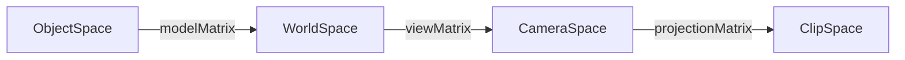

# WebGL

## Nomenclature

| Notes      | Global CPU state           | Intermediate | Data    |
| ---------- | -------------------------- | ------------ | ------- |
|            | Program                    |              |         |
| current    | Vertex-Array-Binding       | VAO          | Buffer  |
| shader-in  | Textures                   |              | Texture |
| shader-in  | Array-Buffer-Binding       |              | Buffer  |
| shader-out | Draw-Framebuffer-Binding   | Framebuffer  | Texture |
| shader-out | Transform-Feedback-Binding | TFO          | Buffer  |

## Multi pass rendering

Often you want to not immediately save some output to the canvas, but rather modify it again in a second pass.
Here's the basic principle:


## Framebuffers with multiple textures

Framebuffers can have more than one texture attached. This comes in handy for e.g. depth buffers or object-id-picking.

## Instanced drawing

> https://stackoverflow.com/questions/78343262/transformfeedback-with-instanced-drawing

> // https://registry.khronos.org/OpenGL/specs/es/3.0/es_spec_3.0.pdf#nameddest=subsection.2.9.3 :
> Those attributes that have non-zero values for divisor, as specified by
> VertexAttribDivisor, advance once every divisor instances

Normal rendering:

```python
nrVertices = 3

positionBuffer = {
    "data": [0,1,2],
}

colorBuffer = {
    "data": [0,1,2],
}

for v in range(nrVertices):
    pos = positionBuffer["data"][v]
    col = colorBuffer["data"][v]
    print(f"pos {pos} col {col}")
```

Instanced rendering:

```python
import numpy as np

nrInstances = 5
nrVertices = 3

positionBuffer = {
    "data": np.array([[0,1],   [2,3],   [4,5],  [5,6],  [6,7]], dtype=np.float32), # nrInstances / this.nrInstances * type entries
    "nrInstances": 1
}

colorBuffer = {
    "data": np.array([0,1,2], dtype=np.float32),   # nrVertices entries
}

# transform feedback
positionNewBuffer = {
    "data": np.array([[0, 0]] * nrInstances * nrVertices, dtype=np.float32),
    # can never be instanced?
}


def getDataIn(i, v, buffer):
    index = 0
    if "nrInstances" in buffer:
        # https://registry.khronos.org/OpenGL/specs/es/3.0/es_spec_3.0.pdf#nameddest=subsection.2.9
        # If an enabled vertex attribute array is instanced (it has a non-zero
        # divisor), the element that is transferred to the GL, for
        # all vertices, is given by:
        # floor(instance / divisor)
        index = int(i / buffer["nrInstances"])   # independent of v!
    else:
        index = v                                # independent of i!
    data = buffer["data"][index]
    return data


def setDataOut(value, i, v, buffer):
    # https://registry.khronos.org/OpenGL/specs/es/3.0/es_spec_3.0.pdf#nameddest=subsection.2.15.2
    # When an individual point, line, or triangle primitive reaches the
    # transform feedback stage [..], the values of the specified output
    # variables of the vertex are appended to the buffer objects bound to the
    # transform feedback binding points.
    # The output variables of the first vertex received after
    # BeginTransformFeedback are written at the starting offsets of the bound
    # buffer objects set by BindBufferRange, and subsequent output variables
    # are appended to the buffer object.
    # When capturing line and triangle primitives, all
    # output variables of the first vertex are written first, followed by
    # output variables of the subsequent vertices.
    indexOut = i * nrVertices + v
    buffer["data"][indexOut] = value


for i in range(nrInstances):
    for v in range(nrVertices):

        valPos = getDataIn(i, v, positionBuffer)
        valCol = getDataIn(i, v, colorBuffer)

        newVal = valPos + 0.05

        setDataOut(newVal, i, v, positionNewBuffer)


print(positionBuffer["data"])
print(positionNewBuffer["data"])

```

If you want to render many similar looking objects, with normal rendering you'd have to make a lot of `setAttribute` and `draw` calls.
Instanced rendering saves your GPU that work. - theres only one `draw` call for all objects - theres only one `setAttribute` call for each attribute of all objects - Not all attributes have to be the same lengths: if the same attribute applies to half of the objects, give it a `nrInstances` of `nrInstancesTotal / 2`

## Transform feedback switching


## Transform feedback for particle systems

https://www.youtube.com/watch?v=ro4bDXcISms
https://webgl2fundamentals.org/webgl/lessons/resources/webgl-state-diagram.html?exampleId=transform-feedback#no-help

- from vertex shader
  - for every vertex in draw call
- to specified outputs
  - into buffer
  - with specified order

Vertex shader:

- `out vec4 output1; out float output2;`
  JS:

```js
// -------------------------------------
// Phase 0: program with custom outputs

// program with custom outputs defined. must happen before linking the program. order matters.
gl.transformFeedbackVaryings(program, ['output1', 'output2'], gl.INTERLEAVED_ATTRIBS);
// gl.SEPARATE_ATTRIBS: each `out` saved to its own buffer (but limited to 4 outputs)
// gl.INTERLEAVED_ATTRIBS: all `out` saved to same buffer
gl.linkProgram(program);

// create tfo
const tfo = gl.createTransformFeedback();
gl.bindTransformFeedback(gl.TRANSFORM_FEEDBACK, tfo);
// `tfo`s are kind of like vertex-array-objects (vao's) - they are optinal bundles of state.
// you don't need to repeat past `bindBuffer` calls with an active tfo.
// the above two lines are only required if mulitple, unrelated tf's need to run.
// otherwise the one global default tfo is used.

// create empty buffer
const tfBuffer = gl.createBuffer();
gl.bindBuffer(gl.ARRAY_BUFFER, tfBuffer);
// 100 triangles = 3 * 100 vertices;  vec4=4floats=16bytes, float=4bytes -> 20 bytes = 6.000 bytes;
// if 5 instances: 30.000 bytes.
gl.bufferData(gl.ARRAY_BUFFER, 20 * 3 * 100, gl.DYNAMIC_COPY);
// DYNAMIC_READ: hint to GPU:
// -  changes often: DYNAMIC_, changes rarely: STATIC_.
// - _DRAW: use mostly for screen,  _READ: copy down to CPU-js,  _COPY: webgl-only, lots of switching
gl.bindBuffer(gl.ARRAY_BUFFER, null);

// -------------------------------------
// Phase 1: write to buffer

// draw and capture output
gl.bindBufferBase(gl.TRANSFORM_FEEDBACK_BUFFER, 0, tfBuffer); // 0 if INTERLEAVED_ATTRIBS - for SEPARATE_ATTRIBS: increment index for each buffer that you use
gl.beginTransformFeedback(gl.TRIANGLES); // start listening
gl.drawArrays(gl.TRIANGLES, 0, 100); // only drawArrays(Instanced) - won't work with drawElements(Instanced)! You can go back to drawElements(Instanced) after `endTransformFeedback`
gl.endTransformFeedback(); // end listening

// detach buffer and tf
gl.bindBufferBase(gl.TRANSFORM_FEEDBACK_BUFFER, 0, null);
gl.bindTransformFeedback(gl.TRANSFORM_FEEDBACK, null); // switches back to default tfo
gl.deleteTransformFeedback(tfo); // only when completely done with tfo

// -------------------------------------
// Phase 2: read from buffer in second program
// I don't think you have to do that! WebGL will still run the fragment shader!
// If you explicitly dont want the fragment shader, youll have to call
// `gl.enable(gl.RASTERIZER_DISCARD)`. Then you can apply an empty fragment shader.
// Just don't forget to disable this again once you want to draw to the screen, i think!

// using buffer data downstream in other program:
// bindBuffer(ARRAY_BUFFER, tfBuffer) = tfBuffer as input
// whereas bindBufferBASE(tfBuffer) = tfBuffer as output
// will throw error if you forget to unbind bufferBase!
// if you want to loop updates, switch two buffers.
gl.bindBuffer(gl.ARRAY_BUFFER, tfBuffer);
gl.enableVertexAttribArray(0);
gl.vertexAttribDivisor(0, 1); // only for instanced?
gl.vertexAttribPointer(0, 3, gl.FLOAT, false, 0, 0);
gl.drawArraysInstanced(gl.TRIANGLES, 0, 100, 10);

// -------------------------------------
// Phase 3: debugging
// you can actually get that buffer data!
const downloadedData = new Float32Array(20 * 3 * 100);
gl.bindBuffer(gl.TRANSFORM_FEEDBACK_BUFFER, tfBuffer); // could also bind to ARRAY_BUFFER; both fine.
gl.getBufferSubData(gl.TRANSFORM_FEEDBACK_BUFFER, 0, downloadedData);
gl.bindBuffer(gl.TRANSFORM_FEEDBACK_BUFFER, null);
console.log(downloadedData);
```

## Debugging: monkey patching webgl to get raw calls

```ts
const glo = canvas.getContext('webgl2')!;

class VariableStore {
  programs: { name: string; val: WebGLProgram }[] = [];
  shaders: { name: string; val: WebGLShader }[] = [];
  buffers: { name: string; val: WebGLBuffer }[] = [];
  textures: { name: string; val: WebGLTexture }[] = [];
  vertexArrs: { name: string; val: WebGLVertexArrayObject }[] = [];
  uniformLocs: { name: string; val: WebGLUniformLocation }[] = [];

  addProgram(val: WebGLProgram) {
    const name = `program${this.programs.length}`;
    this.programs.push({ name, val });
    return name;
  }

  addShader(val: WebGLShader) {
    const name = `shader${this.shaders.length}`;
    this.shaders.push({ name, val });
    return name;
  }

  addBuffer(val: WebGLBuffer) {
    const name = `buffer${this.buffers.length}`;
    this.buffers.push({ name, val });
    return name;
  }

  addTexture(val: WebGLTexture) {
    const name = `texture${this.textures.length}`;
    this.textures.push({ name, val });
    return name;
  }

  addVertexArr(val: WebGLVertexArrayObject) {
    const name = `vertexArr${this.vertexArrs.length}`;
    this.vertexArrs.push({ name, val });
    return name;
  }

  addUniformLocation(val: WebGLUniformLocation) {
    const name = `uniformLocation${this.uniformLocs.length}`;
    this.uniformLocs.push({ name, val });
    return name;
  }

  getProgramName(given: WebGLProgram) {
    for (const { name, val } of this.programs) {
      if (val === given) return name;
    }
  }

  getShaderName(given: WebGLShader) {
    for (const { name, val } of this.shaders) {
      if (val === given) return name;
    }
  }

  getBufferName(given: WebGLBuffer) {
    for (const { name, val } of this.buffers) {
      if (val === given) return name;
    }
  }

  getTextureName(given: WebGLTexture) {
    for (const { name, val } of this.textures) {
      if (val === given) return name;
    }
  }

  getVertexArrName(given: WebGLVertexArrayObject) {
    for (const { name, val } of this.vertexArrs) {
      if (val === given) return name;
    }
  }

  getUniformLocationName(given: WebGLUniformLocation) {
    for (const { name, val } of this.uniformLocs) {
      if (val === given) return name;
    }
  }
}
const variableStore = new VariableStore();

function logArgs(args: any[]) {
  const stringifiedArgs: string[] = [];
  for (const arg of args) {
    if (typeof arg === 'string' || arg instanceof String) {
      stringifiedArgs.push('`' + arg + '`');
    } else if (arg === null) {
      stringifiedArgs.push('null');
    } else if (ArrayBuffer.isView(arg)) {
      stringifiedArgs.push('new Float32Array([' + arg + '])');
    } else if (Array.isArray(arg)) {
      stringifiedArgs.push('[' + arg + ']');
    } else if (arg instanceof WebGLProgram) {
      const name = variableStore.getProgramName(arg);
      stringifiedArgs.push(name!);
    } else if (arg instanceof WebGLShader) {
      const name = variableStore.getShaderName(arg);
      stringifiedArgs.push(name!);
    } else if (arg instanceof WebGLBuffer) {
      const name = variableStore.getBufferName(arg);
      stringifiedArgs.push(name!);
    } else if (arg instanceof WebGLTexture) {
      const name = variableStore.getTextureName(arg);
      stringifiedArgs.push(name!);
    } else if (arg instanceof WebGLVertexArrayObject) {
      const name = variableStore.getVertexArrName(arg);
      stringifiedArgs.push(name!);
    } else if (arg instanceof WebGLUniformLocation) {
      const name = variableStore.getUniformLocationName(arg);
      stringifiedArgs.push(name!);
    } else {
      stringifiedArgs.push('' + arg);
    }
  }
  return stringifiedArgs.join(', ');
}

function logCall(functionName: string, args: any[], result: any) {
  const argsStringified = logArgs(args);

  switch (functionName) {
    case 'createProgram':
      const progName = variableStore.addProgram(result);
      return `const ${progName} = gl.${functionName}(${argsStringified})!;`;
    case 'createShader':
      const shaderName = variableStore.addShader(result);
      return `const ${shaderName} = gl.${functionName}(${argsStringified})!;`;
    case 'createBuffer':
      const bufferName = variableStore.addBuffer(result);
      return `const ${bufferName} = gl.${functionName}(${argsStringified})!;`;
    case 'createTexture':
      const textureName = variableStore.addTexture(result);
      return `const ${textureName} = gl.${functionName}(${argsStringified})!;`;
    case 'createVertexArray':
      const vertArrName = variableStore.addVertexArr(result);
      return `const ${vertArrName} = gl.${functionName}(${argsStringified})!;`;
    case 'getUniformLocation':
      const unifName = variableStore.addUniformLocation(result);
      return `const ${unifName} = gl.${functionName}(${argsStringified});`;
    default:
      return `gl.${functionName}(${argsStringified});`;
  }
}

const gl = new Proxy(glo, {
  get(target: WebGL2RenderingContext, key) {
    if (!(key in target)) return undefined;
    const value = (target as any)[key];
    if (typeof value === 'function') {
      return (...args: any[]) => {
        const result = value.apply(target, args);
        console.log(logCall(value.name, args, result));
        return result;
      };
    } else {
      return value;
    }
  },
});
```

# Threejs

## Custom multi-pass renderers

Runge-Kutta

```ts
import {
  ShaderMaterial,
  WebGLRenderTarget,
  WebGLRenderer,
  DataTexture,
  ClampToEdgeWrapping,
  RepeatWrapping,
  NearestFilter,
  RGBAFormat,
  FloatType,
} from 'three';
import { GPUComputationRenderer } from 'three/examples/jsm/misc/GPUComputationRenderer';

export class RungeKuttaRenderer {
  private w: number;
  private h: number;
  private differentialShader: ShaderMaterial;
  private summarizeShader: ShaderMaterial;
  private k1Target: WebGLRenderTarget;
  private k2Target: WebGLRenderTarget;
  private k3Target: WebGLRenderTarget;
  private k4Target: WebGLRenderTarget;
  private summaryTarget1: WebGLRenderTarget;
  private summaryTarget2: WebGLRenderTarget;
  private gpgpu: GPUComputationRenderer;
  private i = 0;

  constructor(
    renderer: WebGLRenderer,
    w: number,
    h: number,
    data0: Float32Array,
    differentialCode: string,
    private textures: { [key: string]: DataTexture } = {}
  ) {
    this.w = w;
    this.h = h;

    const differentialShaderCode = `
            uniform sampler2D dataTexture;
            uniform sampler2D kTexture;
            uniform float dk;

            ${Object.keys(textures)
              .map((t) => `uniform sampler2D ${t};`)
              .join(' ')}

            void main() {
                vec2 position = gl_FragCoord.xy / resolution.xy;
                vec2 deltaX = vec2(1.0 / resolution.x, 0.0);
                vec2 deltaY = vec2(0.0, 1.0 / resolution.y);

                float dt = 0.005;

                vec4 data    = texture2D(dataTexture, position          ) + dt * dk * texture2D(kTexture, position          );
                vec4 data_px = texture2D(dataTexture, position + deltaX ) + dt * dk * texture2D(kTexture, position + deltaX );
                vec4 data_mx = texture2D(dataTexture, position - deltaX ) + dt * dk * texture2D(kTexture, position - deltaX );
                vec4 data_py = texture2D(dataTexture, position + deltaY ) + dt * dk * texture2D(kTexture, position + deltaY );
                vec4 data_my = texture2D(dataTexture, position - deltaY ) + dt * dk * texture2D(kTexture, position - deltaY );

                ${differentialCode}
            }
        `;

    const summarizeShaderCode = `
            uniform sampler2D dataTexture;
            uniform sampler2D k1Texture;
            uniform sampler2D k2Texture;
            uniform sampler2D k3Texture;
            uniform sampler2D k4Texture;

            void main() {
                vec2 position = gl_FragCoord.xy / resolution.xy;

                float dt = 0.005;

                vec4 data = texture2D(dataTexture, position);
                vec4 k1   = texture2D(k1Texture,   position);
                vec4 k2   = texture2D(k2Texture,   position);
                vec4 k3   = texture2D(k3Texture,   position);
                vec4 k4   = texture2D(k4Texture,   position);

                vec4 weightedAverage = data + dt * (k1 + 2.0 * k2 + 2.0 * k3 + k4) / 6.0;

                gl_FragColor = vec4(weightedAverage.xyz, 1.0);
            }
        `;

    this.gpgpu = new GPUComputationRenderer(w, h, renderer);

    this.differentialShader = this.gpgpu.createShaderMaterial(differentialShaderCode, {
      dataTexture: { value: null },
      kTexture: { value: null },
      dk: { value: null },
    });
    this.summarizeShader = this.gpgpu.createShaderMaterial(summarizeShaderCode, {
      dataTexture: { value: null },
      k1Texture: { value: null },
      k2Texture: { value: null },
      k3Texture: { value: null },
      k4Texture: { value: null },
    });
    this.k1Target = this.gpgpu.createRenderTarget(
      w,
      h,
      ClampToEdgeWrapping,
      ClampToEdgeWrapping,
      NearestFilter,
      NearestFilter
    );
    this.k2Target = this.gpgpu.createRenderTarget(
      w,
      h,
      ClampToEdgeWrapping,
      ClampToEdgeWrapping,
      NearestFilter,
      NearestFilter
    );
    this.k3Target = this.gpgpu.createRenderTarget(
      w,
      h,
      ClampToEdgeWrapping,
      ClampToEdgeWrapping,
      NearestFilter,
      NearestFilter
    );
    this.k4Target = this.gpgpu.createRenderTarget(
      w,
      h,
      ClampToEdgeWrapping,
      ClampToEdgeWrapping,
      NearestFilter,
      NearestFilter
    );
    this.summaryTarget1 = this.gpgpu.createRenderTarget(
      w,
      h,
      ClampToEdgeWrapping,
      ClampToEdgeWrapping,
      NearestFilter,
      NearestFilter
    );
    this.summaryTarget2 = this.gpgpu.createRenderTarget(
      w,
      h,
      ClampToEdgeWrapping,
      ClampToEdgeWrapping,
      NearestFilter,
      NearestFilter
    );

    this.initTextures(data0);
  }

  getOutputTexture() {
    const { dataSource, dataSink } = this.getCurrentSourceAndSink(this.i);
    return dataSource.texture;
  }

  updateInputTexture(data: Float32Array) {
    // const {dataSource, dataSink} = this.getCurrentSourceAndSink(this.i);
    // const texture = new DataTexture(data, this.w, this.h, RGBAFormat, FloatType);
    // texture.needsUpdate = true;
    // dataSource.setTexture(texture);
    // return texture;
    this.destroyTextures();
    this.initTextures(data);
    this.i = 0;
    return this.getOutputTexture();
  }

  update() {
    const { dataSource, dataSink } = this.getCurrentSourceAndSink(this.i);

    this.differentialShader.uniforms.dataTexture.value = dataSource.texture;
    this.differentialShader.uniforms.dk.value = 0.0;
    this.gpgpu.doRenderTarget(this.differentialShader, this.k1Target);
    this.differentialShader.uniforms.dk.value = 0.5;
    this.differentialShader.uniforms.kTexture.value = this.k1Target.texture;
    this.gpgpu.doRenderTarget(this.differentialShader, this.k2Target);
    this.differentialShader.uniforms.dk.value = 0.5;
    this.differentialShader.uniforms.kTexture.value = this.k2Target.texture;
    this.gpgpu.doRenderTarget(this.differentialShader, this.k3Target);
    this.differentialShader.uniforms.dk.value = 1.0;
    this.differentialShader.uniforms.kTexture.value = this.k3Target.texture;
    this.gpgpu.doRenderTarget(this.differentialShader, this.k4Target);
    this.summarizeShader.uniforms.dataTexture.value = dataSource.texture;
    this.summarizeShader.uniforms.k1Texture.value = this.k1Target.texture;
    this.summarizeShader.uniforms.k2Texture.value = this.k2Target.texture;
    this.summarizeShader.uniforms.k3Texture.value = this.k3Target.texture;
    this.summarizeShader.uniforms.k4Texture.value = this.k4Target.texture;
    this.gpgpu.doRenderTarget(this.summarizeShader, dataSink);

    this.i += 1;
  }

  private getCurrentSourceAndSink(i: number) {
    let dataSource, dataSink;
    if (i % 2 === 0) {
      dataSource = this.summaryTarget1;
      dataSink = this.summaryTarget2;
    } else {
      dataSource = this.summaryTarget2;
      dataSink = this.summaryTarget1;
    }
    return { dataSource, dataSink };
  }

  private initTextures(data: Float32Array) {
    const data0Texture = new DataTexture(data, this.w, this.h, RGBAFormat, FloatType);
    this.differentialShader.uniforms.dataTexture.value = data0Texture;
    for (const key in this.textures) {
      this.differentialShader.uniforms[key] = { value: this.textures[key] };
    }
    this.differentialShader.uniforms.dk.value = 0.0;
    this.gpgpu.doRenderTarget(this.differentialShader, this.k1Target);
    this.differentialShader.uniforms.dk.value = 0.5;
    this.differentialShader.uniforms.kTexture.value = this.k1Target.texture;
    this.gpgpu.doRenderTarget(this.differentialShader, this.k2Target);
    this.differentialShader.uniforms.dk.value = 0.5;
    this.differentialShader.uniforms.kTexture.value = this.k2Target.texture;
    this.gpgpu.doRenderTarget(this.differentialShader, this.k3Target);
    this.differentialShader.uniforms.dk.value = 1.0;
    this.differentialShader.uniforms.kTexture.value = this.k3Target.texture;
    this.gpgpu.doRenderTarget(this.differentialShader, this.k4Target);
    this.summarizeShader.uniforms.dataTexture.value = data0Texture;
    this.summarizeShader.uniforms.k1Texture.value = this.k1Target.texture;
    this.summarizeShader.uniforms.k2Texture.value = this.k2Target.texture;
    this.summarizeShader.uniforms.k3Texture.value = this.k3Target.texture;
    this.summarizeShader.uniforms.k4Texture.value = this.k4Target.texture;
    this.gpgpu.doRenderTarget(this.summarizeShader, this.summaryTarget1);
  }

  private destroyTextures() {
    this.k1Target.texture.dispose();
    this.k2Target.texture.dispose();
    this.k3Target.texture.dispose();
    this.k4Target.texture.dispose();
    this.summaryTarget1.texture.dispose();
    this.summaryTarget2.texture.dispose();
    // @TODO: also dispose frame-buffers here? How about user-provided textures?
  }
}
```

Water-refraction

```ts
import { WebGLRenderer, Texture, ShaderMaterial, Mesh, PlaneBufferGeometry, DataTexture, Raycaster } from 'three';
import { EngineObject } from '..';
import { RungeKuttaRenderer } from './rungeKutta';

export class WaterObject extends EngineObject {
  private fluidSim: RungeKuttaRenderer;
  private plane: Mesh<PlaneBufferGeometry, ShaderMaterial>;
  private wPixels: number;
  private hPixels: number;
  private wMeter: number;
  private hMeter: number;
  private huvData: Float32Array;
  private groundTexture: Texture;
  private depthTexture: DataTexture;
  rayCaster: Raycaster;

  constructor(
    renderer: WebGLRenderer,
    wPixels: number,
    hPixels: number,
    wMeter: number,
    hMeter: number,
    huvData: Float32Array,
    groundTexture: Texture,
    depthTexture: DataTexture,
    maxDepthMeter: number,
    depthTextureValueMaxDepth: number,
    depthTextureValue00: number
  ) {
    //------------------------ Step 1: fluid-motion compute-shader -------------------------------------------
    const fluidShader = `
            float h   = data[0];
            float u   = data[1];
            float v   = data[2];
            float hpx = data_px[0];
            float upx = data_px[1];
            float vpx = data_px[2];
            float hmx = data_mx[0];
            float umx = data_mx[1];
            float vmx = data_mx[2];
            float hpy = data_py[0];
            float upy = data_py[1];
            float vpy = data_py[2];
            float hmy = data_my[0];
            float umy = data_my[1];
            float vmy = data_my[2];

            float H_tex = texture2D(HData, position).x;
            float H_max = ${maxDepthMeter.toFixed(2)};
            float H_min = 0.0;
            float tex_max = ${depthTextureValueMaxDepth.toFixed(2)} / 255.0;
            float tex_min = ${depthTextureValue00.toFixed(2)} / 255.0;
            float alpha = (H_max - H_min) / (tex_max - tex_min);
            float beta = H_min - alpha * tex_min;
            float H = alpha * H_tex + beta;
            H = max(H, 0.0);

            float dx = 0.05;
            float dy = 0.05;
            float f = 0.001;
            float b = 0.003;
            float g = 9.831;

            float dudx = (upx - umx) / (2.0 * dx);
            float dvdy = (vpy - vmy) / (2.0 * dy);
            float dhdx = (hpx - hmx) / (2.0 * dx);
            float dhdy = (hpy - hmy) / (2.0 * dy);

            float dhdt =      - H * ( dudx + dvdy );
            float dudt = ( + f*v - b*u - g * dhdx );
            float dvdt = ( - f*u - b*v - g * dhdy );
            
            // float easing = 0.03;
            // dhdt = (1.0 - easing) * dhdt - easing * h;
            // dudt = (1.0 - easing) * dhdt - easing * u;
            // dvdt = (1.0 - easing) * dhdt - easing * v;


            float d = 1.5 * 1.0 / resolution.x;
            if(position.x <= d || position.x > 1.0 - d ||
                position.y <= d || position.y > 1.0 - d    ) {
                    dhdt = 0.0;
                    dudt = 0.0;
                    dvdt = 0.0;
            }


            gl_FragColor = vec4(dhdt, dudt, dvdt, 1.0);
        `;
    const fluidSim = new RungeKuttaRenderer(renderer, wPixels, hPixels, huvData, fluidShader, {
      HData: depthTexture,
    });
    //--------------------------------------------------------------------------------------------------------

    //---------------------- Step 2: water material ---------------------------------------------------------
    /**
     * MS: modelSpace
     * WS: worldSpace
     * CS: cameraSpace
     * SS: screenSpace = clippingSpace
     */
    const vertexShader = `
            uniform sampler2D huvData;
            varying vec3 v_normalWS;
            varying vec3 v_positionWS;
            varying vec2 v_uv;
            uniform vec2 huvDataSize;
            uniform vec2 groundTextureDataSize;

            vec3 surfaceNormal(vec3 a, vec3 b) {
                return normalize(cross(a, b));
            }

            void main()	{
                float dx = 1.0 / huvDataSize.x;
                float dy = 1.0 / huvDataSize.y;
                vec2 deltaX = vec2(dx, 0.0);
                vec2 deltaY = vec2(0.0, dy);

                float h    = texture2D(huvData, uv          ).x;
                float h_px = texture2D(huvData, uv + deltaX ).x;
                float h_py = texture2D(huvData, uv + deltaY ).x;

                vec3 sx = vec3(dx, 0.0, h_px - h);
                vec3 sy = vec3(0.0, dy, h_py - h);
                vec3 normalMS = surfaceNormal(sx, sy);
                

                vec4 adjustedPositionMS = vec4(position.xy, h, 1.0);
                vec4 adjustedPositionWS = modelMatrix * adjustedPositionMS; 
                vec4 adjustedPositionCS = viewMatrix * adjustedPositionWS;
                vec4 adjustedPositionSS = projectionMatrix * adjustedPositionCS;
                gl_Position = adjustedPositionSS;
                

                v_uv = uv;
                v_positionWS = adjustedPositionWS.xyz;
                v_normalWS = normalize ( (modelMatrix * vec4(normalMS, 1.0)).xyz );
            }
        `;
    const fragmentShader = `
            uniform sampler2D HData;
            uniform sampler2D huvData;
            uniform sampler2D groundTexture;
            uniform vec2 huvDataSize;
            uniform vec2 groundTextureSize;
            uniform vec2 fieldDimensionsMeter;
            varying vec3 v_normalWS;
            varying vec3 v_positionWS;
            varying vec2 v_uv;

            float angle(vec3 a, vec3 b) {
                return acos( dot(a, b) / (length(a) * length(b)) );
            }

            void main() {
                vec3 baseColor = vec3(0.0, 0.8, 1.0);

                vec3 cameraPositionWS = cameraPosition;

                vec3 viewDirectionWS = v_positionWS - cameraPositionWS;
                
                float refractiveIndexAir = 1.0;
                float refractiveIndexWater = 1.333;
                
                vec3 upWS             = vec3( 0.0, 1.0, 0.0 );
                float angleAir        = angle( -viewDirectionWS, v_normalWS );
                float angleWater      = asin( sin(angleAir) * refractiveIndexAir / refractiveIndexWater );
                float angleNormal     = angle( v_normalWS, upWS );
                float totalAngleWater = angleWater + angleNormal;
                
                float h     = texture2D(huvData, v_uv).x;


                float H_tex = texture2D(HData, v_uv).x;
                float H_max = ${maxDepthMeter.toFixed(2)};
                float H_min = 0.0;
                float tex_max = ${depthTextureValueMaxDepth.toFixed(2)} / 255.0;
                float tex_min = ${depthTextureValue00.toFixed(2)} / 255.0;
                float alpha = (H_max - H_min) / (tex_max - tex_min);
                float beta = H_min - alpha * tex_min;
                float H = alpha * H_tex + beta;
                H = max(H, 0.0);

                float depth = h + H;
                float lengthRayInWater              = depth / cos(totalAngleWater);                   // <-- assumes that depth on touch-point is the same as here ... which is good enough, I guess.
                float distanceOnGround              = lengthRayInWater * sin(totalAngleWater);
                float distanceOnGroundNormalized    = distanceOnGround / max(fieldDimensionsMeter.x, fieldDimensionsMeter.y);
                vec2 viewDirectionGroundNormalized  = normalize((viewDirectionWS).xz);
                vec2 duv = viewDirectionGroundNormalized * distanceOnGroundNormalized;
                duv.y = - duv.y;                                                        // <-- texture-coordinates have (0/0) at the top left: https://webglfundamentals.org/webgl/lessons/webgl-3d-textures.html

                vec3 camData = texture2D(groundTexture, v_uv + duv).xyz;

                float transparency = 0.5;
                vec3 color = transparency * camData + (1.0 - transparency) * baseColor;

                float heightFactor = (h / H) * 1.0;
                color = (1.0 - heightFactor) * color + heightFactor * vec3(1.0, 1.0, 1.0);
                gl_FragColor = vec4(color, 1.0);
            }
        `;
    const customMaterial = new ShaderMaterial({
      fragmentShader,
      vertexShader,
      uniforms: {
        HData: { value: depthTexture },
        huvData: { value: fluidSim.getOutputTexture() },
        huvDataSize: { value: [wPixels, hPixels] },
        groundTexture: { value: groundTexture },
        groundTextureSize: {
          value: [groundTexture.image.width, groundTexture.image.height],
        },
        fieldDimensionsMeter: { value: [wMeter, hMeter] },
      },
    });
    const plane = new Mesh(new PlaneBufferGeometry(wMeter, hMeter, wPixels, hPixels), customMaterial);

    //--------------------------------------------------------------------------------------------------------

    //--------------- Step 3: positioning and grouping -------------------------------------------------------
    plane.position.set(0, 0, 0);
    plane.lookAt(0, 10, 0);
    //--------------------------------------------------------------------------------------------------------

    super(plane);

    this.fluidSim = fluidSim;
    this.plane = plane;
    this.rayCaster = new Raycaster();
    this.wPixels = wPixels;
    this.hPixels = hPixels;
    this.wMeter = wMeter;
    this.hMeter = hMeter;
    this.huvData = huvData;
    this.groundTexture = groundTexture;
    this.depthTexture = depthTexture;
  }

  update(time: number): void {
    this.fluidSim.update();
  }

  handleClick(evt: any) {
    const canvas = this.engine.options.canvas;
    const rect = canvas.getBoundingClientRect();
    const x_ = ((evt.clientX - rect.left) * canvas.width) / rect.width;
    const y_ = ((evt.clientY - rect.top) * canvas.height) / rect.height;
    const x = (x_ / canvas.width) * 2 - 1;
    const y = (y_ / canvas.height) * -2 + 1;
    this.rayCaster.setFromCamera({ x, y }, this.engine.camera);
    const intersections = this.rayCaster.intersectObject(this.plane);
    if (intersections && intersections[0]) {
      const intersection = intersections[0];
      const fracW = 0.5 + ((0.5 * 2) / this.wMeter) * intersection.point.x;
      const fracH = 0.5 - ((0.5 * 2) / this.hMeter) * intersection.point.z;
      const cc = this.wPixels * fracW;
      const cr = this.hPixels * fracH;

      const newData: number[][][] = [];
      // const oldData = this.fluidSim.getOutputTexture().image;
      for (let r = 0; r < this.hPixels; r++) {
        newData.push([]);
        for (let c = 0; c < this.wPixels; c++) {
          // const oldH = oldData[r * 256 * 4 + c * 4 + 0];
          // const oldU = oldData[r * 256 * 4 + c * 4 + 1];
          // const oldV = oldData[r * 256 * 4 + c * 4 + 2];
          const oldH = 0;
          const oldU = 0.0;
          const oldV = 0.0;
          if (Math.abs(r - cr) < 5 && Math.abs(c - cc) < 5) {
            newData[r].push([oldH + 50, oldU, oldV, 1]);
          } else {
            newData[r].push([oldH, oldU, oldV, 1]);
          }
        }
      }
      const newHuvBuffer = new Float32Array(newData.flat().flat());
      this.plane.material.uniforms['huvData'].value = this.fluidSim.updateInputTexture(newHuvBuffer);
      this.plane.material.needsUpdate = true;
    }
  }
}
```

# Projection matrices

https://developer.mozilla.org/en-US/docs/Web/API/WebGL_API/WebGL_model_view_projection#view_matrix



- **ObjectSpace**
  - Could be anything. Often just as exported from blender.
- -> _ModelMatrix_ (4x4) ->
- **WorldSpace**
  - $\Reals^4$
  - right-handed: $x$ to right, $y$ up, $z$ towards viewer
  - $w$ for augmentation to homogeneous coordinates.
  - Where things are in the "physical" world
- -> _ViewMatrix_ (4x4) ... simply the inverse of the camera's model-matrix. ->
- **ViewSpace** aka. CameraSpace
  - $\Reals^4$
  - Where things are relative to the camera
  - Camera now sits at origin $[0, 0, 0, 0]^T$
  - Two common cameras: Perspective and Orthonormal.
- -> _ProjectionMatrix_. Depends on perspective (then called a _PerspectiveMatrix_) or orthonormal camera. ->
- **ClipSpace**
  - $[-1, 1]^3$
  - WebGL's understanding of the world
  - Everything higher than 1 is being clipped away
  - The third dimension is not a cartesian z-axis, but only serves to simulate rendering order
  - The remaining two dimensions are known as NDC: normalized device coordinates
- **ScreenSpace**
  - xResolution \* yResolution

## Typical model-matrix, bringing a model to it's position in the word:

The 4d matrix guarantees that inverses always do exist.

$$
\begin{bmatrix}
 \text{scale} & \text{rotation} & \text{rotation} & \text{translation} \\
 \text{rotation} & \text{scale} & \text{rotation} & \text{translation} \\
 \text{rotation} & \text{rotation} & \text{scale} & \text{translation} \\
 0 & 0 & 0 & 1 \\
\end{bmatrix}
$$

## Typical view-matrix, bringing a word-object to it's position relative to the camera:

Simply the inverse of the camera's model-matrix.

## Typical projection-matrix, bringing objects into clipspace

**Orthonormal**:
Cam-width and cam-height are by default simply 1.

$$
\begin{bmatrix}
    \frac{1}{\text{cam-width}} && 0 && 0 && 0 \\
    0 && \frac{1}{\text{cam-height}} && 0 && 0 \\
    0 && 0 && \frac{1}{\text{far - near}} && 0 \\
    0 && 0 && -1 && 0 \\
\end{bmatrix}
$$

Followed by removal of the $w$ dimension.

**Perspective**:
$$ f = \text{focal distance} = \frac{1}{\tan(\text{field-of-view} / 2)} $$
$$ ar = \text{aspect-ratio} = \frac{w}{h} $$

$$
\begin{bmatrix}
    \text{f / ar} &&  0 && 0 && 0 \\
    0 && f && 0 && 0 \\
    0 && 0 && \frac{z_f + z_n}{z_f - z_n} && \frac{2 z_f z_n}{z_n - z_f}  \\
    0 && 0 && -1 && 0 \\
\end{bmatrix}
$$

Followed by removal of the $w$ dimension.

**Three-JS/WebGL matrix names**
| JS | -> GLSL |  
|------------------------------------------------|-----------------------|
| `obj.matrixWorld` | -> modelMatrix |
| `cam.matrixWorldInverse` | -> viewMatrix |
| `cam.projectionMatrix` | -> projectionMatrix |
| `cam.matrixWorldInverse * object.matrixWorld` | -> modelViewMatrix |

**Scene-Kit/Metal matrix names**
Note that SceneKit-matrices use OpenGL's column-first ordering.

| Swift                             | -> Metal                                                                 |
| --------------------------------- | ------------------------------------------------------------------------ |
| `obj.transform` (4x4)             | -> modelMatrix                                                           |
| `obj.worldTransform` (4x4)        | -> modelMatrix, recursively applied to also parent, parent's parent, ... |
| `SCNMatrix4Invert(cam.transform)` | -> viewMatrix                                                            |
| `cam.projectionTransform` (4x4)   | -> projectionMatrix (but doesn't account for aspect-ratio)               |

|

## Clip space to screen coordinates

This is handled outside of the rendering pipeline and depends on the device.

- In iOS, the clipping-space fits to the screen's lager side and is cut off where it bleeds over the screen's smaller side.
- In HTML5, [Clip space coordinates always go from -1 to +1 no matter what size your canvas is.](https://webglfundamentals.org/webgl/lessons/webgl-fundamentals.html)

# Making projections easier: Homogeneous coordinates

## Lingo

In the literature, the metaphors we use here have other names.

- Cinema-screen-space = Cartesian space
  - Equals clipping-space in the matrix-notations above.
- Real-world-space = Euclidian space
  - More general than euclidian space: affine space
  - Assumes camera is at origin. Equivalent to camera-space in the matrix-notations above
- Projective space = affine space + directions

## Motivation

Also known as projective or barycentric coordinates. Resources from [here](https://wordsandbuttons.online/interactive_guide_to_homogeneous_coordinates.html).

This projection makes you look at things from the perspective of a cinema-goer.
You look at the screen, which is at distance $1$ from you (we'll call the axis towards the screen $w$).
A point is located on the screen at screen-coordinates $[2, 1]$.

But you know that is has been projected there from somewhere in the world.
It might really be at $[2, 1]$ (if it's $1w$ away from you), but it might also be at $[4, 2]$ (if it's actually $2w$ away from you) or at $[6, 3]$ (if it's really $3w$ away from you).

## Homogeneous coordinates to screen-coordinates

So the three points $[x, y, w]: [2, 1, 1], [4, 2, 2], [6, 3, 3]$ are all equivalent as far as your cinema-point-of-view goes. Note how you can get back the screen-coordinates from any of those points simply by dividing by $w$.

## Directions

If $w$ is very big, the point will be projected pretty close to the center of the screen.
If $w$ is very small, it'll move far out to the edges of the screen.
If $w$ is $0$, it'll move off the screen, infinitely far away out of the cinema.

That is: when you have a vector directly in your eye-ball and then project it out onto the screen, it'll be infinitely far off the edges of the screen (except if the vector in your eye points at exactly $[0, 0]$). In fact, we consider $[1, 2, 0]$ not to be a point in real-world-space but much rather a _direction_.

### Getting to a point by adding a direction to a point

- point - point = direction
- point + direction = point
- direction + direction = direction

$$ d_p^\alpha = (p - [0, 0, 0, 1]^T) \frac{1}{\alpha} \text{ for some } \alpha $$
$$ p = [0, 0, 0, 1]^T + \alpha d_p^\alpha $$
$$ c = a + b \to d_c = d_a + d_b \text{ only if all directions use the same } \alpha $$

### Getting to a point by adding its direction to the origin

## In 3d-engines

In games, the screen is 4-dimensional - it has three spatial dimensions and $w=1$ is the fourth.
So in games, objects are already moving on the plane of the cinema-screen.

Still, games have a projection-matrix that moves objects from camera-space to clipping space. It's purpose is

- to allow for translations as matrices
- to divide all coords by $z$ in the projection-phase (but _not_ by $w$ - that is done in the GPU between vertex- and fragment-shader.)

## In homogeneous coordinates, translations on the screen are matrix-multiplications, too.

Scaling and translating a point on the screen to another place on the screen:

$$
\begin{bmatrix}
 \text{x-scale} & \text{rot} & \text{x-trans} \\
 \text{rot} & \text{y-scale} & \text{y-trans} \\
 \text{proj} & \text{proj} & 1
\end{bmatrix}
\begin{bmatrix}
    x \\ y \\ 1
\end{bmatrix}
$$

Moving a point on the screen further away in real-world space:

$$
\begin{bmatrix}
 1 & 0 & 0 \\
 0 & 1 & 0 \\
 0 & 0 & 3
\end{bmatrix}
\begin{bmatrix} 2 \\ 1 \\ 1 \end{bmatrix}
=
\begin{bmatrix} 2 \\ 1 \\ 3 \end{bmatrix}
==
\begin{bmatrix} 2/3 \\ 1/3 \\ 1 \end{bmatrix}
$$

### Interpretation of the bottom row

The bottom row of the matrix can be interpreted as _the normal of a plane onto which all points are being projected_.
Example:

$$
\begin{bmatrix}
1 & 0 & 0 \\
0 & 1 & 0 \\
1 & 1 & 0
\end{bmatrix}
\begin{bmatrix} 1 \\ 1 \\ 1 \end{bmatrix}
=
\begin{bmatrix} 1 \\ 1 \\ 2 \end{bmatrix}
==
\begin{bmatrix} 0.5 \\ 0.5 \\ 1 \end{bmatrix}
$$

$$
\begin{bmatrix}
1 & 0 & 0 \\
0 & 1 & 0 \\
1 & 1 & 0
\end{bmatrix}
\begin{bmatrix} 4 \\ 2 \\ 1 \end{bmatrix}
=
\begin{bmatrix} 4 \\ 2 \\ 6 \end{bmatrix}
==
\begin{bmatrix} 0.666 \\ 0.333 \\ 1 \end{bmatrix}
$$

## Using homogeneous coordinates to make a projection-matrix

That is, a matrix transforming points from camera-space $\Reals^4$ to clipping-space $[-1, 1]^3$.
We'll find out that using homogeneous coordinates, central projection and parallel projection are the same (in so far as you get a parallel-projection-matrix from a perspective-projection-matrix by letting the focal point be very far away - here we let it be infinitely far away).

Really, a projection matrix is simply:

$$
\begin{bmatrix}
    1 & 0 & 0 & 0 \\
    0 & 1 & 0 & 0 \\
    0 & 0 & 1 & 0 \\
    0 & 0 & 1 & 0 \\
\end{bmatrix}
\begin{bmatrix}
    x \\ y \\ z \\ 1
\end{bmatrix}
=
\begin{bmatrix}
    x \\ y \\ z \\ z
\end{bmatrix}
==
\begin{bmatrix}
    x/z \\ y/z \\ 1
\end{bmatrix}
$$

This is - as far as I know - the only time we divide by a $w \neq 1$ in 3d-engines.
Note how $[x, y, z, z]$ is still in camera-space. Only after dividing by $w$ does the point end up in the clipping-space unit-cube.
Also, not that this division by $w$ is not happening in software, but on the GPU between vertex- and fragment-shader.

Commonly, the camera has a focal length $f \neq 1$. (See [here](https://www.mathematik.uni-marburg.de/~thormae/lectures/graphics1/graphics_6_1_eng_web.html#1))

$$
\begin{bmatrix}
    f & 0 & 0 & 0 \\
    0 & f & 0 & 0 \\
    0 & 0 & f & 0 \\
    0 & 0 & 1 & 0 \\
\end{bmatrix}
$$

Also, in OpenGL, the z-Axis acutally goes into the screen, not out of it:

$$
\begin{bmatrix}
    f & 0 & 0 & 0 \\
    0 & f & 0 & 0 \\
    0 & 0 & f & 0 \\
    0 & 0 & -1 & 0 \\
\end{bmatrix}
$$

Accounting for near and far planes: We're stretching the points between $z_{\text{near}}$ and $z_{\text{far}}$ onto $-1$ and $1$, respectively.

$$
\begin{bmatrix}
    f & 0 & 0 & 0 \\
    0 & f & 0 & 0 \\
    0 & 0 & \frac{z_f + z_n}{z_f - z_n} & \frac{2 z_f z_n}{z_n - z_f} \\
    0 & 0 & -1 & 0 \\
\end{bmatrix}
$$

Finally, accounting for aspect ratio. Assume that our screen is broader than it is high. We then squish x toghether such that it takes the same length as y does. In other words: a screen's aspect-ratio does _not_ lead to cutoff-losses ... it's all squished together.

$$
\begin{bmatrix}
    \frac{f}{ar} & 0 & 0 & 0 \\
    0 & f & 0 & 0 \\
    0 & 0 & \frac{z_f + z_n}{z_f - z_n} & \frac{2 z_f z_n}{z_n - z_f} \\
    0 & 0 & -1 & 0 \\
\end{bmatrix}
$$

Demo:

```python
#%%

f = 0.02
ar = 4/3
zn = 0.01
zf = 1000
projm = np.asarray([
    [ f/ar,   0,   0,                     0                        ],
    [ 0,      f,   0,                     0                        ],
    [ 0,      0,   (zf + zn) / (zf - zn), 2 * zf * zn / (zn - zf)  ],
    [ 0,      0,   1,                     0                        ]
])

points = [
    np.asarray([1, 1, 2, 1]),
    np.asarray([2, 1, 2, 1]),
    np.asarray([2, 2, 2, 1]),
    np.asarray([1, 2, 2, 1]),
    np.asarray([1, 2, 3, 1]),
    np.asarray([2, 2, 3, 1]),
    np.asarray([2, 1, 3, 1]),
    np.asarray([1, 1, 3, 1])
]

projected = [projm @ p for p in points]
normalized = [p / p[3] for p in projected]
normalized
```

There is something interesting happening here.
The (simulated) pyhsical screen of the camera may be 4 wide and 3 high. One will almost always deliberately set that aspect ratio to be identical to that of the phone's physical screen.
The projection-matrix then squishes the screens contents together to a 2 by 2 field - without cutting off anything that wasn't on the pyhsical screen before.
Once the image goes out of OpenGL, it is stretched out to 4 by 3 again.

<svg
   width="664.57147"
   height="577.1109"
   viewBox="0 0 175.83457 152.69392"
   version="1.1"
   id="svg5"
   inkscape:version="1.1.1 (3bf5ae0d25, 2021-09-20)"
   sodipodi:docname="drawing.svg"
   xmlns:inkscape="http://www.inkscape.org/namespaces/inkscape"
   xmlns:sodipodi="http://sodipodi.sourceforge.net/DTD/sodipodi-0.dtd"
   xmlns="http://www.w3.org/2000/svg"
   xmlns:svg="http://www.w3.org/2000/svg">
<sodipodi:namedview
id="namedview7"
pagecolor="#ffffff"
bordercolor="#111111"
borderopacity="1"
inkscape:pageshadow="0"
inkscape:pageopacity="0"
inkscape:pagecheckerboard="1"
inkscape:document-units="px"
showgrid="false"
inkscape:snap-text-baseline="true"
inkscape:zoom="1.2810466"
inkscape:cx="282.19114"
inkscape:cy="318.09929"
inkscape:window-width="1920"
inkscape:window-height="1136"
inkscape:window-x="0"
inkscape:window-y="27"
inkscape:window-maximized="1"
inkscape:current-layer="layer1"
units="px"
width="1213.2577px"
lock-margins="true" />
<defs
     id="defs2" />
<g
     inkscape:label="Layer 1"
     inkscape:groupmode="layer"
     id="layer1"
     transform="translate(109.22172,-51.61746)">
<rect
       style="fill:none;stroke:#000000;stroke-width:0.309483;stroke-miterlimit:4;stroke-dasharray:none;stroke-opacity:1"
       id="rect31"
       width="72.189186"
       height="32.961174"
       x="-5.7316909"
       y="59.725483" />
<rect
       style="fill:none;stroke:#000000;stroke-width:0.476567;stroke-miterlimit:4;stroke-dasharray:none;stroke-opacity:1"
       id="rect31-9"
       width="115.71313"
       height="48.760342"
       x="-108.98344"
       y="155.31277" />
<rect
       style="fill:none;stroke:#000000;stroke-width:0.309483;stroke-miterlimit:4;stroke-dasharray:none;stroke-opacity:1"
       id="rect1070"
       width="27.763998"
       height="27.763998"
       x="-25.414207"
       y="107.39562" />
<path
       style="fill:none;stroke:#000000;stroke-width:0.449275;stroke-linecap:butt;stroke-linejoin:miter;stroke-miterlimit:4;stroke-dasharray:0.449275, 0.449275;stroke-dashoffset:0;stroke-opacity:1"
       d="M -5.7316911,59.725495 -25.414209,107.39561 v 0 0 0"
       id="path1138" />
<path
       style="fill:none;stroke:#000000;stroke-width:0.562465;stroke-linecap:butt;stroke-linejoin:miter;stroke-miterlimit:4;stroke-dasharray:0.562465, 0.562465;stroke-dashoffset:0;stroke-opacity:1"
       d="M 66.457498,92.686665 2.3497861,135.15961 v 0 0 0"
       id="path1138-9" />
<text
       xml:space="preserve"
       style="font-style:normal;font-weight:normal;font-size:5.79709px;line-height:1.25;font-family:sans-serif;fill:#000000;fill-opacity:1;stroke:none;stroke-width:0.144927"
       x="29.130188"
       y="64.916069"
       id="text7673"><tspan
         sodipodi:role="line"
         id="tspan7671"
         style="stroke-width:0.144927"
         x="29.130188"
         y="64.916069">w</tspan></text>
<text
       xml:space="preserve"
       style="font-style:normal;font-weight:normal;font-size:5.79709px;line-height:1.25;font-family:sans-serif;fill:#000000;fill-opacity:1;stroke:none;stroke-width:0.144927"
       x="61.796867"
       y="77.359383"
       id="text10317"><tspan
         sodipodi:role="line"
         id="tspan10315"
         style="stroke-width:0.144927"
         x="61.796867"
         y="77.359383">h</tspan></text>
<text
       xml:space="preserve"
       style="font-style:normal;font-weight:normal;font-size:5.79709px;line-height:1.25;font-family:sans-serif;fill:#000000;fill-opacity:1;stroke:none;stroke-width:0.144927"
       x="-26.160732"
       y="140.20432"
       id="text15007"><tspan
         sodipodi:role="line"
         id="tspan15005"
         style="stroke-width:0.144927"
         x="-26.160732"
         y="140.20432">-1</tspan></text>
<text
       xml:space="preserve"
       style="font-style:normal;font-weight:normal;font-size:5.79709px;line-height:1.25;font-family:sans-serif;fill:#000000;fill-opacity:1;stroke:none;stroke-width:0.144927"
       x="-1.390841"
       y="140.42084"
       id="text17651"><tspan
         sodipodi:role="line"
         id="tspan17649"
         style="stroke-width:0.144927"
         x="-1.390841"
         y="140.42084">1</tspan></text>
<text
       xml:space="preserve"
       style="font-style:normal;font-weight:normal;font-size:5.79709px;line-height:1.25;font-family:sans-serif;fill:#000000;fill-opacity:1;stroke:none;stroke-width:0.144927"
       x="-30.284184"
       y="111.69572"
       id="text21329"><tspan
         sodipodi:role="line"
         id="tspan21327"
         style="stroke-width:0.144927"
         x="-30.284184"
         y="111.69572">1</tspan></text>
<text
       xml:space="preserve"
       style="font-style:normal;font-weight:normal;font-size:5.79709px;line-height:1.25;font-family:sans-serif;fill:#000000;fill-opacity:1;stroke:none;stroke-width:0.144927"
       x="-32.112305"
       y="134.07947"
       id="text23155"><tspan
         sodipodi:role="line"
         id="tspan23153"
         style="stroke-width:0.144927"
         x="-32.112305"
         y="134.07947">-1</tspan></text>
<text
       xml:space="preserve"
       style="font-style:normal;font-weight:normal;font-size:3.86474px;line-height:1.25;font-family:sans-serif;fill:#000000;fill-opacity:1;stroke:none;stroke-width:0.144927"
       x="39.327858"
       y="114.30625"
       id="text27737"><tspan
         sodipodi:role="line"
         id="tspan27735"
         style="font-size:3.86474px;stroke-width:0.144927"
         x="39.327858"
         y="114.30625">f \* h/w 0 0 0</tspan><tspan
         sodipodi:role="line"
         style="font-size:3.86474px;stroke-width:0.144927"
         x="39.327858"
         y="119.13718"
         id="tspan27739">0 f 0 0</tspan><tspan
         sodipodi:role="line"
         style="font-size:3.86474px;stroke-width:0.144927"
         x="39.327858"
         y="123.9681"
         id="tspan30353">0 0 f 0</tspan><tspan
         sodipodi:role="line"
         style="font-size:3.86474px;stroke-width:0.144927"
         x="39.327858"
         y="128.79903"
         id="tspan30355">0 0 -1 0</tspan><tspan
         sodipodi:role="line"
         style="font-size:3.86474px;stroke-width:0.144927"
         x="39.327858"
         y="133.62994"
         id="tspan27741" /></text>
<path
       style="fill:none;stroke:#000000;stroke-width:0.449275;stroke-linecap:butt;stroke-linejoin:miter;stroke-miterlimit:4;stroke-dasharray:0.449275, 0.449275;stroke-dashoffset:0;stroke-opacity:1"
       d="m -25.414209,107.39561 -83.569231,47.91716"
       id="path33521"
       sodipodi:nodetypes="cc" />
<path
       style="fill:none;stroke:#000000;stroke-width:0.434783;stroke-linecap:butt;stroke-linejoin:miter;stroke-miterlimit:4;stroke-dasharray:0.434783, 0.434783;stroke-dashoffset:0.56522;stroke-opacity:1"
       d="m 2.3497906,107.39562 4.3799063,47.91714"
       id="path33556"
       sodipodi:nodetypes="cc" />
<text
       xml:space="preserve"
       style="font-style:normal;font-weight:normal;font-size:5.79709px;line-height:1.25;font-family:sans-serif;fill:#000000;fill-opacity:1;stroke:none;stroke-width:0.144927"
       x="8.7259054"
       y="54.86417"
       id="text35232"><tspan
         sodipodi:role="line"
         id="tspan35230"
         style="stroke-width:0.144927"
         x="8.7259054"
         y="54.86417">camera screen</tspan></text>
<text
       xml:space="preserve"
       style="font-style:normal;font-weight:normal;font-size:5.79709px;line-height:1.25;font-family:sans-serif;fill:#000000;fill-opacity:1;stroke:none;stroke-width:0.144927"
       x="-68.554901"
       y="106.35891"
       id="text39448"><tspan
         sodipodi:role="line"
         id="tspan39446"
         style="stroke-width:0.144927"
         x="-68.554901"
         y="106.35891">clipping space</tspan></text>
<text
       xml:space="preserve"
       style="font-style:normal;font-weight:normal;font-size:5.79709px;line-height:1.25;font-family:sans-serif;fill:#000000;fill-opacity:1;stroke:none;stroke-width:0.144927"
       x="-86.153893"
       y="202.31274"
       id="text45428"><tspan
         sodipodi:role="line"
         id="tspan45426"
         style="stroke-width:0.144927"
         x="-86.153893"
         y="202.31274">phone image screen</tspan></text>
</g>
</svg>

## Camera-matrix projecting to x-y-w?

Honestly, I think things might be easier if the camera-matrix projected objects from x-y-z-world-space to x-y-w, where w is the distance to the camera.
This would make things a lot more intuitive...

One weird thing about that $ \begin{matrix} 1 & 0 & 0 \\ 0 & 1 & 0 \\ 0 & 1 & 0 \end{matrix}$ matrix is this: if you take a square that is parallel to the screen but far off in the top right, that matrix will project it onto the screen as a perfect square - no distortion. If instead you convert the square's points from $z$ to $w$ first, that square is nicely distorted.

You can try it out yourself with the square consisting of the points

- $[5, 5, 5]$,
- $[6, 5, 5]$,
- $[6, 4, 5]$,
- $[5, 4, 5]$

**Aaaah-hah!**: OpenGL/WebGL _does_ actually divide by _w_. At the stage between vertex-shader and fragment-shader x, y, and z are divided by w [link](https://gamedev.stackexchange.com/questions/151278/when-does-opengl-perform-perspective-divide). More specifically, this is done after the vertex-shader in the [vertex-post-processing-phase](https://www.khronos.org/opengl/wiki/Rendering_Pipeline_Overview) in a step called the `perspective-divide`.

### After some self-made research via stackoverflow:

Question: Shouldn't threejs set the w value of vertices equal to their depth?

When projecting objects onto a screen, objects that are far away from the focal point get projected further towards the center of the screen. In projective coordinates this effect is achieved by dividing a point's (x, y, z)-coordinates by its distance from the focal point, w. I've been playing around with threejs's projection matrix and it seems to me that threejs doesn't do that.

Consider the following scene:

```ts
// src/main.ts
import {
  AmbientLight,
  BoxGeometry,
  DirectionalLight,
  Mesh,
  MeshPhongMaterial,
  PerspectiveCamera,
  Scene,
  WebGLRenderer,
} from 'three';

const canvas = document.getElementById('canvas') as HTMLCanvasElement;
canvas.width = canvas.clientWidth;
canvas.height = canvas.clientHeight;

const renderer = new WebGLRenderer({
  alpha: false,
  antialias: false,
  canvas: canvas,
  depth: true,
});

const scene = new Scene();

const camera = new PerspectiveCamera(45, canvas.width / canvas.height, 0.01, 100);
camera.position.set(0, 0, 10);

const light = new DirectionalLight();
light.position.set(-1, 0, 3);
scene.add(light);
const light2 = new AmbientLight();
scene.add(light2);

const cube = new Mesh(new BoxGeometry(1, 1, 1, 1), new MeshPhongMaterial({ color: `rgb(0, 125, 125)` }));
scene.add(cube);
cube.position.set(3.42, 3.42, 0);

renderer.render(scene, camera);
```

```html
<!DOCTYPE html>
<html lang="en">
  <head>
    <meta charset="UTF-8" />
    <meta name="viewport" content="width=device-width, initial-scale=1.0" />
  </head>
  <body>
    <div id="app" style="width: 600px; height: 600px;">
      <canvas id="canvas" style="width: 100%; height: 100%;"></canvas>
    </div>
    <script type="module" src="/src/main.ts"></script>
  </body>
</html>
```

This code yields the following image:


Note how the edges of the turquoise box appear exactly parallel to the edges of the canvas. But the front-top-right vertex is further away from my eye than the front-bottom-left vertex. Shouldn't the top-right vertex be slightly distorted towards the center?

I understand that WebGL automatically divides vertices by their w coordinate in the vertex-post-processing-phase. Shouldn't threejs have used the depth to set w so that this distortion-effect is achieved?

What I imagine is something like this:

```ts
import {
  AmbientLight,
  BoxGeometry,
  Mesh,
  MeshBasicMaterial,
  PerspectiveCamera,
  Scene,
  ShaderMaterial,
  SpotLight,
  TextureLoader,
  Vector3,
  WebGLRenderer,
} from 'three';

const canvas = document.getElementById('canvas') as HTMLCanvasElement;
canvas.width = canvas.clientWidth;
canvas.height = canvas.clientHeight;

const loader = new TextureLoader();
const texture = await loader.loadAsync('bricks.jpg');

const renderer = new WebGLRenderer({
  alpha: false,
  antialias: true,
  canvas: canvas,
  depth: true,
});

const scene = new Scene();

const camera = new PerspectiveCamera(45, canvas.width / canvas.height, 0.01, 100);
camera.position.set(0, 0, -1);
camera.lookAt(new Vector3(0, 0, 0));

const light = new SpotLight();
light.position.set(-1, 0, -1);
scene.add(light);
const light2 = new AmbientLight();
scene.add(light2);

const box = new Mesh(
  new BoxGeometry(1, 1, 1, 50, 50, 50),
  new MeshBasicMaterial({
    map: texture,
  })
);
scene.add(box);
box.position.set(-0.6, 0, 1);

const box2 = new Mesh(
  new BoxGeometry(1, 1, 1, 50, 50, 50),
  new ShaderMaterial({
    uniforms: {
      tTexture: { value: texture },
    },
    vertexShader: `
    varying vec2 vUv;
    void main() {
      vUv = uv;
      vec4 clipSpacePos = projectionMatrix * modelViewMatrix * vec4( position, 1.0 );
      clipSpacePos.w = length(clipSpacePos.xyz);
      gl_Position = clipSpacePos;
    }
  `,
    fragmentShader: `
    varying vec2 vUv;
    uniform sampler2D tTexture;
    void main() {
      gl_FragColor = texture2D(tTexture, vUv);
    }
  `,
  })
);
scene.add(box2);
box2.position.set(0.6, 0, 1);

renderer.render(scene, camera);
```

Which gives the following output:


Note how the left block displays strong distortion towards the edges.

I think I understand my mistake now.

My approach was setting `w = distance` for each vertex instead of `w = z` (which is - simplified - what the standard projection matrix does).

This has the GPU normalize all points by their distance from the focal point instead of by their distance from a straight plane. In other words: this has the GPU project all vertices onto a _sphere around me_ instead of onto a plane in front of me.

I think the same difference becomes clearer when looking at the difference between a cube-map and an equirectangular-map.


Please do correct me if I'm wrong, but I guess that an equirectangular projection is obtained by projecting onto a curved surface.

Also, [this stackoverflow-question](https://stackoverflow.com/questions/29678510/convert-21-equirectangular-panorama-to-cube-map) does indicate that an equirectangular map needs to be undistorted - that is, straightened - before it can be used as a cube-map. (Side-note: kudos for some very illustrative images there!)


In other words: If we're going with the "project on a plane" metaphor, then three's default perspective-projection matrix, which has points normalized by z, is what we want. If we're going for the "project on a sphere" metaphor, we indeed want to normalize by distance.

The following metaphor might catch the essence of the argument.

> You're looking straight at a long, not very high, brick-wall.
> Notice how the far away parts of the wall seem to get smaller and smaller.
> Still when projecting that wall onto a screen parallel to the wall in front of you, the projection will have the wall's edges align with the screen's edges perfectly.
>
> Your eyes will _still_ see the wall's edges taper off towards the edges. The reason is because the rays from the screen get projected onto the _sphere_ of your eyeballs.

## Placing an object in 3d if only its projection is known

... well, its projection _and_ its dimensions.

```swift
/// Calculate world-coordinates of head
/// - parameter w: width of head in meters
/// - parameter h: height of head in meters
/// - parameter ar: aspect ratio. Assumed to be the same for SCNScene and UIImage.
/// - parameter projectionT: transforms from camera-space into clipping-space
/// - parameter viewT: transforms from world-space into camera-space
/// - parameter (top, right, bottom, left)Img: [0, 1]^2, x from left to right, y from bottom to top
func getHeadPosition(
    w: Float, h: Float, ar: Float,
    topImg: Float, rightImg: Float, bottomImg: Float, leftImg: Float,
    projectionTransform: SCNMatrix4, viewTransform: SCNMatrix4
) -> SCNVector4 {

    //----------------------------
    // Calculating head-position
    //----------------------------


    // SceneKit handles aspect-ratio not inside the projection-matrix,
    // but only outside in the SCNScene.
    // But we need the complete projection-matrix here.
    var updatedProjectionTransform = projectionTransform
    if (updatedProjectionTransform.m11 == updatedProjectionTransform.m22) {
        print("accounting for aspect ratio")
        updatedProjectionTransform.m11 = updatedProjectionTransform.m11 / ar
    }

    // Face-bbox: from relative-image-coordinates to clipspace-x and y.
    let top     =  2.0 * topImg     - 1.0
    let bottom  =  2.0 * bottomImg  - 1.0
    let right   =  2.0 * rightImg   - 1.0
    let left    =  2.0 * leftImg    - 1.0

    // Placing face-bbox in clip-space [x, y, 1, 1]
    let tl = imageSpace2ClipSpace(left, top)
    let tr = imageSpace2ClipSpace(right, top)
    let br = imageSpace2ClipSpace(right, bottom)
    let bl = imageSpace2ClipSpace(left, bottom)

    // Getting central point c. A ray will be cast through c to the head's actual position
    let aClip = midpoint(tl, bl)
    let bClip = midpoint(tr, br)
    let cClip = midpoint(aClip, bClip)
    let dClip = midpoint(tl, tr)
    let eClip = midpoint(bl, br)
    let fClip = midpoint(dClip, eClip)

    // Projecting out of clipping space into camera space.
    // Accounts for focal length, near and far.
    // Results are not points, but directions (their w == 0)
    let projectionInverse = SCNMatrix4Invert(updatedProjectionTransform)
    let a = matMul(projectionInverse, aClip)  // direction towards point a
    let b = matMul(projectionInverse, bClip)  // direction towards point b
    let c = matMul(projectionInverse, cClip)  // direction towards point c
    let d = matMul(projectionInverse, dClip)
    let e = matMul(projectionInverse, eClip)
    let f = matMul(projectionInverse, fClip)

    let magA = magnitude(a)
    let magB = magnitude(b)
    let magC = magnitude(c)
    let magD = magnitude(d)
    let magE = magnitude(e)
    let magF = magnitude(f)

    // Angle between a and b.
    // Used to calculate at what distance from origin the head must be.
    // Assumes that the head-bounding-box is orthogonal to the ray towards c.
    let sigma = acos( dot(a, b) / (magA * magB) )
    let l = w / (2.0 * tan(sigma / 2.0))
    // angle between d and e.
    let sigma2 = acos( dot(d, e) / (magD * magE) )
    let l2 = h / (2.0 * tan(sigma2 / 2.0))

    // Scaling normalized c by l
    let cNorm = scalarProd(1.0 / magC, c)
    var cCam = scalarProd(l, cNorm)

    // transforming direction into actual position again,
    // so that transformation-matrices work (translation, rotation, etc)
    cCam.w = 1.0

    // Transforming out of camera-space into world-space
    let viewInverse = SCNMatrix4Invert(viewTransform)
    let cWorld = matMul(viewInverse, cCam)
    let fWorld = matMul(viewInverse, fCam)

    let ray = midpoint(cWorld, fWorld)

    return ray
}

func matMul(_ matrix: SCNMatrix4, _ vector: SCNVector4) -> SCNVector4 {

    // matrices in Scenekit are OpenGL-oriented ... that is: column/row
    let row1 = SCNVector4(x: matrix.m11, y: matrix.m21, z: matrix.m31, w: matrix.m41)
    let row2 = SCNVector4(x: matrix.m12, y: matrix.m22, z: matrix.m32, w: matrix.m42)
    let row3 = SCNVector4(x: matrix.m13, y: matrix.m23, z: matrix.m33, w: matrix.m43)
    let row4 = SCNVector4(x: matrix.m14, y: matrix.m24, z: matrix.m34, w: matrix.m44)

    let x = dot(row1, vector)
    let y = dot(row2, vector)
    let z = dot(row3, vector)
    let w = dot(row4, vector)

    return SCNVector4(
        x: x, y: y, z: z, w: w
    )
}

func imageSpace2ClipSpace(_ x: Float, _ y: Float) -> SCNVector4 {
    return SCNVector4(
        x: x,
        y: y,
        z: 1,
        w: 1
    )
}
```

## Projecting objects of scene onto a cylinder

```typescript
import {
  BoxGeometry,
  Camera,
  DoubleSide,
  Mesh,
  PlaneGeometry,
  Scene,
  ShaderMaterial,
  TextureLoader,
  Vector3,
  WebGLRenderer,
} from 'three';
import { OrbitControls } from 'three/examples/jsm/controls/OrbitControls';

const canvas = document.getElementById('canvas') as HTMLCanvasElement;
canvas.width = canvas.clientWidth;
canvas.height = canvas.clientHeight;

const renderer = new WebGLRenderer({
  alpha: false,
  antialias: true,
  canvas: canvas,
});

const camera = new Camera(); // new PerspectiveCamera(50, canvas.width / canvas.height, 0.01, 10000); // new OrthographicCamera(-3, 3, 3, -3, 0.01, 1000) // new CubeCamera(0.01, 1000, canvas) // new PerspectiveCamera(120, canvas.width / canvas.height, 0.01, 10000);
camera.position.set(0, 0, 0);
camera.lookAt(new Vector3(0, 0, 1));

const scene = new Scene();

// const controls = new OrbitControls(camera, renderer.domElement);

export const vertex = /* glsl */ `
varying vec2 vUV;
varying vec3 debug;
#define M_PI 3.1415926535897932384626433832795

void main() {
  float r = 1.0;
  float h = 0.6;
  float dmin = r;
  float dmax = 100.0;

  vUV = uv;
  vec4 posCamSpace = viewMatrix * modelMatrix * vec4( position, 1.0 );
  posCamSpace.z = - posCamSpace.z; // usually, camera looks into negative z direction in camera space. changing that.

  float d = sqrt(
    (posCamSpace.x * posCamSpace.x) +  
    (posCamSpace.y * posCamSpace.y) + 
    (posCamSpace.z * posCamSpace.z)
  );
  float d_xz = sqrt(
    (posCamSpace.x * posCamSpace.x) + 
    (posCamSpace.z * posCamSpace.z)
  );

  float theta = 0.0;
  if (posCamSpace.z > 0.0) {
    theta = asin(posCamSpace.x / d_xz);  // not sure if maybe this should be just d, not d_xz
  } else {
    float thetaMax = M_PI;
    if (posCamSpace.x < 0.0) {
      thetaMax = -1.0 * thetaMax;
    }
    theta = thetaMax - asin(posCamSpace.x / d_xz);  // not sure if maybe this should be just d, not d_xz
  }

  float rho = asin(posCamSpace.y / d);

  float xNew = theta / M_PI;
  float yNew = (r * tan(rho)) / h;
  float zNew = (d - dmin) / (dmax - dmin);

  gl_Position = vec4(xNew, yNew, zNew, 1.0);

  debug = vec3(xNew, yNew, zNew);
  debug = vec3(abs(theta) / M_PI, abs(theta) / M_PI, abs(theta) / M_PI);
}
`;

const fragment = /* glsl */ `
uniform sampler2D tex;
varying vec2 vUV;
varying vec3 debug;
#define M_PI 3.1415926535897932384626433832795

void main() {
  vec4 texColor = texture2D(tex, vUV);
  gl_FragColor = vec4(texColor.rgb, 1.0);
  gl_FragColor = vec4(debug.xyz, 1.0);
  gl_FragColor = vec4(vUV.xy, 0.0, 1.0);
}`;

const textureFace = await new TextureLoader().loadAsync('./indexed-face.png');
const lowRes = await new TextureLoader().loadAsync('./low-res.png');

const plane1 = new Mesh(
  new PlaneGeometry(2, 1, 64, 32),
  new ShaderMaterial({
    vertexShader: vertex,
    fragmentShader: fragment,
    uniforms: { tex: { value: textureFace } },
    side: DoubleSide,
  })
);
plane1.position.set(0, 0, 1);
plane1.lookAt(new Vector3(0, 0, 0));
scene.add(plane1);
const plane2 = new Mesh(
  new PlaneGeometry(2, 1, 64, 32),
  new ShaderMaterial({
    vertexShader: vertex,
    fragmentShader: fragment,
    uniforms: { tex: { value: textureFace } },
    side: DoubleSide,
  })
);
plane2.position.set(1, 0, 0);
plane2.lookAt(new Vector3(0, 0, 0));
scene.add(plane2);
const plane3 = new Mesh(
  new PlaneGeometry(2, 1, 64, 32),
  new ShaderMaterial({
    vertexShader: vertex,
    fragmentShader: fragment,
    uniforms: { tex: { value: textureFace } },
    side: DoubleSide,
  })
);
plane3.position.set(-1, 0, 0);
plane3.lookAt(new Vector3(0, 0, 0));
scene.add(plane3);
// This plane causes trouble:
// wrapping it around my head from behind
// makes it smudge over the full screen.
/**
 * Here's something fascinating:
 *  - this wall is not displayed if there is only one length- and height-section.
 *  - Reason: when the projection moves the furthest-left vertex to the furthest right,
 *    the triangle is turned from a right-handed triangle into a left-handed triangle.
 *    And WebGL just doesn't render left-handed triangles... even if they are double sided
 *    (I think!)
 * - Either way, the wrap-around does seem to work with the following ingredients:
 *  - uneven with- and height-sections (this way only one section is becoming de-naturated and un-renderable.)
 *  - FrontSide-rendering only (as long as the plane looks towards the camera)
 */
const plane4 = new Mesh(
  new PlaneGeometry(2, 1, 9, 9),
  new ShaderMaterial({
    vertexShader: vertex,
    fragmentShader: fragment,
    uniforms: { tex: { value: lowRes } },
    side: FrontSide,
  })
);
plane4.position.set(0, 0, -1);
plane4.lookAt(new Vector3(0, 0, 0));
scene.add(plane4);

const cube = new Mesh(
  new BoxGeometry(0.2, 0.2, 0.2, 30, 30, 30),
  new ShaderMaterial({
    vertexShader: vertex,
    fragmentShader: fragment,
    uniforms: { tex: { value: lowRes } },
    side: DoubleSide,
  })
);
cube.position.set(0.1, 0.2, 0.5);
scene.add(cube);

function loop() {
  // skybox.rotateY(0.003);
  // camera.rotateY(0.002);
  cube.rotateX(0.003);
  renderer.render(scene, camera);

  setTimeout(loop, 10);
}

loop();
```

# General geometric math

## Angle between vectors

$$ \theta = \cos^{-1}{ \frac{a^Tb}{|a||b|} }$$

## Extended euclidian equation

$$|x| := \sqrt{x^Tx}$$
$$|a + b| = \sqrt(|a|^2 + 2 a^Tb + |b|^2)$$

Let $c = a + b$. Then:
$$ |c|^2 = |a|^2 + |b|^2 + 2 a^Tb$$
