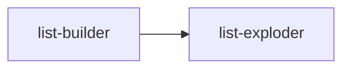
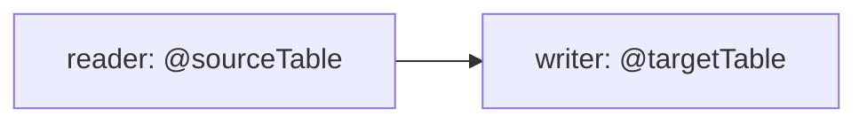
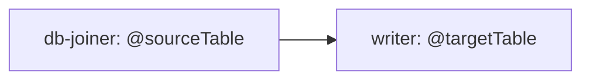
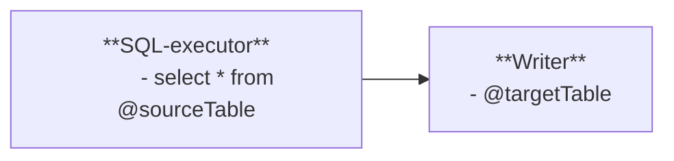
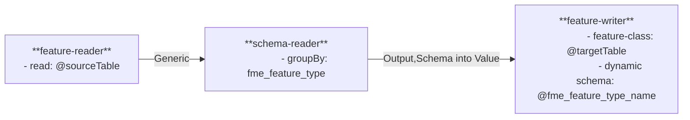

# FME

## Concepts

- **workbench** aka **FME form**: your IDE
- **Workflow** aka **workspace**: *.fmw file; an executable script
  - user parameters
    - a subset of which are "published parameters", that will be prompted for upon running
  - readers
  - transformers
  - writers
- **Workspace**:
- **fme flow**: server-side platform, like a webserver + scheduler
  - **project**s contain:
    - workflows
    - connections: to db's, buckets, api's; with securely stored credentials
    - apps = workflow + frontend
    - automation: event driven

## Publishing

- write your workflow
- publish parameters
- register with fme-flow, either as:
  - data streaming (client sends REST, then gets JSON/HTML response)
  - data download  (client sends REST, then gets link to download file)
  - job submit     (client sends REST, gets job-id for polling, but no results shown on complete, only success, cancelled or failure)
- optionally, create a webhook (not like a standard webhook, but much rather just a simple API endpoint. )

## Idiomatic design patterns

### Semaphore

- FME parallelized eagerly
- This works because FME assumes that you only write to db at the end, through a "writer"
- But: sql-executor breaks that promise, opening the door for race conditions.



### Dynamic data-sources and -sinks

> Approach 1: sql-executor

- sql-executor
  - insert into @Value(targetTable) select * from @Value(sourceTable)

Drawback: if target is an ESRI feature-class, ESRI metadata isn't updated.
_Could_ potentially be repaired with python processor:

```python
    arcpy.management.RecalculateFeatureClassExtent(feature_class)
    arcpy.management.RebuildIndexes(feature_class, "NO_OVERWRITE")
    arcpy.management.Analyze(feature_class, "BUSINESS")
```

> Approach 2: Reader + writer



Won't work: we don't know source beforehand.

> Approach 3: DB-joiner + writer



Won't work: db-joiner doesn't take variables as table-argument.

> Approach 4: SQL-executor for select + writer



Won't work: to write into a writer, the previous node needs to expose the feature-properties.
Our sql-executor doesn't know the feature-properties beforehand.

> Approach 5: feature-reader and feature-writer

Works! <https://www.youtube.com/watch?v=C56kWp0nuvk>



### Embedding db-connections

- often we want to use db-connections that are not visible to anyone on the fme-flow server.

### Ensuring right python version is used

-

## Besprechung Milena

- publishing: rights for publishing?
  - @Avinash: muss in fme test
- test- vs prod  connection: haben 2 verschiedene server
  
- publishing: I've got a target-fgdb. Will it be published along with the worfklow?
  - manuell fgdb in data-verzeichnis kopieren, in workflow, auf server, den pfad anpassen
    - Checke dass voständig
  - config-json als userparameter mit angeben
  - ODER: verwende "Deployment parameters"
- publishing: how do I expose my user-parameters?
- data download  (client sends REST, then gets link to download file)
  - <-- kann auch polling
- async: notify on complete?
  - possible with all 3 variants
  - pubslish > subsc to notification service
  - in fme flow: new channesl in mq
  - lausche, sende email
  - body text placeholder {downloadURL}
  - <https://fmetest-sl.stromnetzdc.com/fmeserver/help/ReferenceManual/Email_Templates.htm>
  - recipietn: opt_requesteremail: <https://fmetest-sl.stromnetzdc.com/fmeserver/help/ReferenceManual/service_datadownload.htm>
- async: target-output-path (what before complete?)
